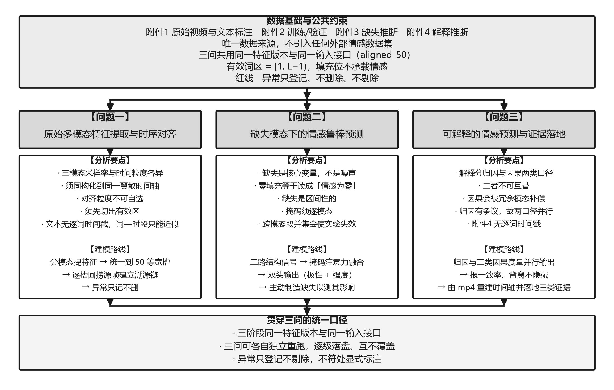
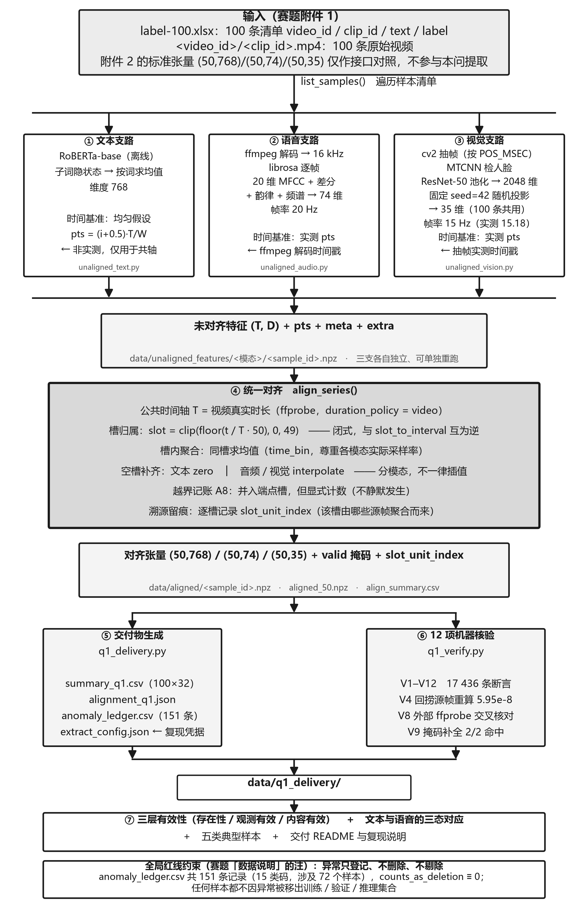
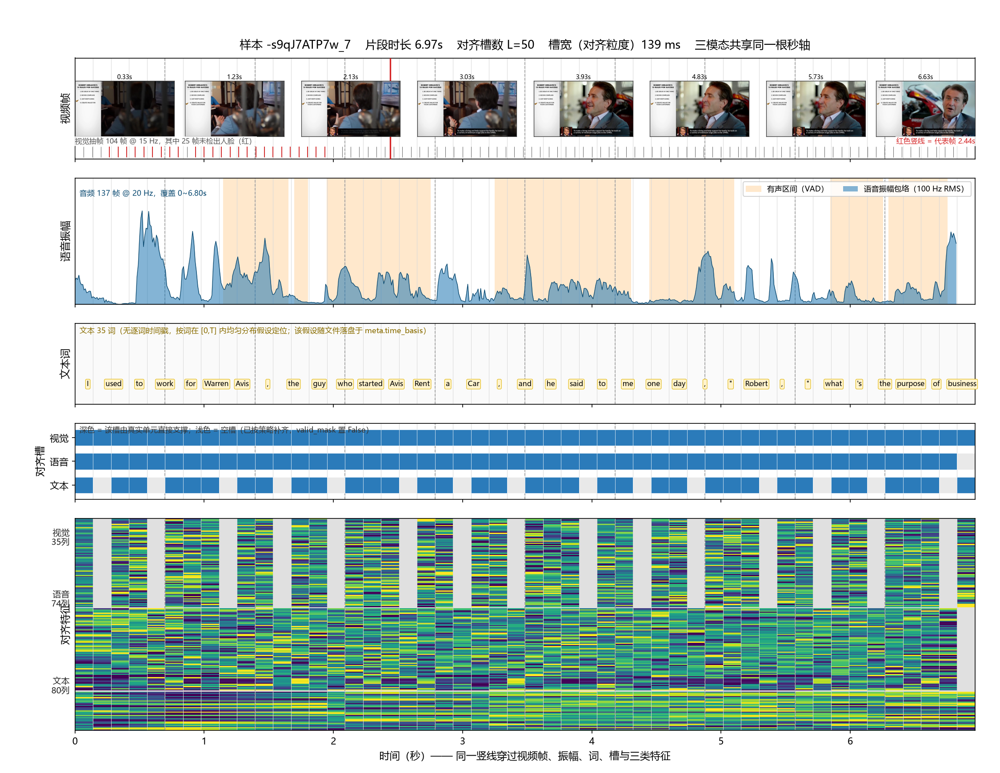
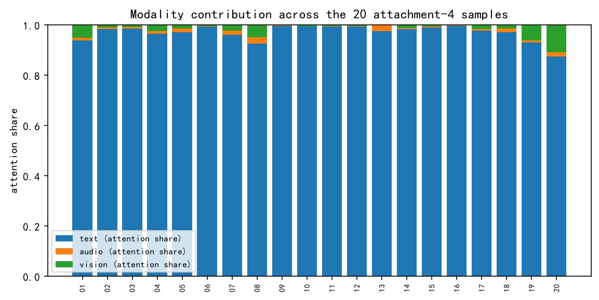
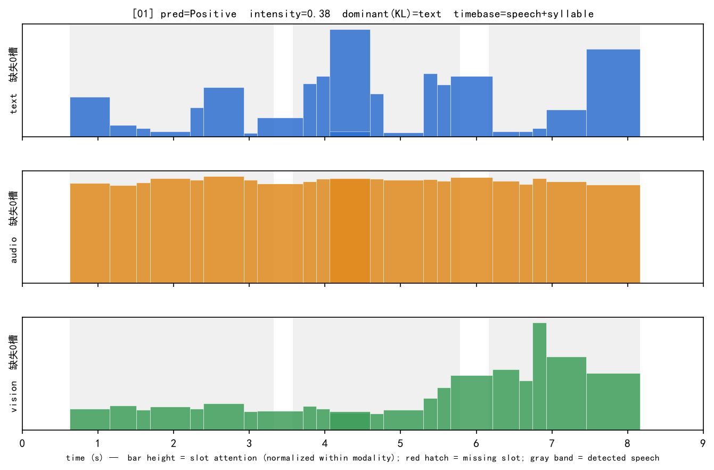
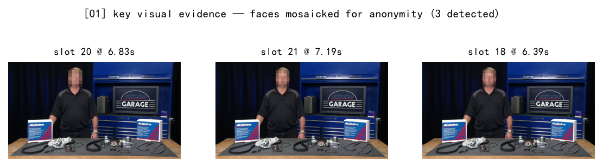
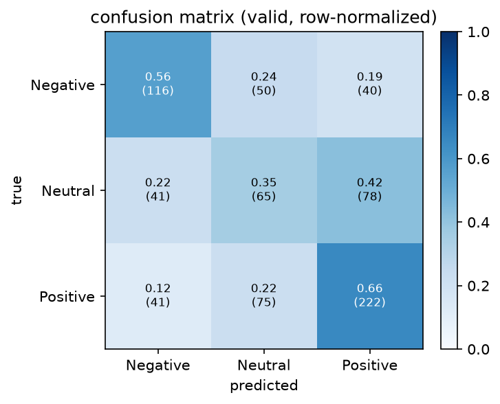

# 复杂场景下多模态情感预测的数学建模与算法设计

# 摘 要

复杂场景下的多模态情感预测，困难不在于单一模态的识别精度，而在于真实数据的三模态并不总是齐备。赛题明确指出这种缺失的形态是"一个或多个模态中存在**特征值全部为零的随机连续序列区间**"（赛题 附件3 说明）——缺失是**区间性**的，而非整个模态消失；且缺失发生在某个模态内部，其他模态在同一时段仍可能有效。若仍按"三模态齐全"的定长张量喂入模型，缺失区间会被当成"情感为零的真实信号"参与运算，预测与解释同时失真。本文围绕**如何把缺失显式地表达出来**这一主线，建立了一套从时序对齐、缺失感知融合到可解释归因的完整模型体系，并对三问逐一求解。

**针对问题一**，本文以附件 2 给定的标准张量形状（文本 $50\times768$、语音 $50\times74$、视觉 $50\times35$）为唯一口径，把附件 1 的 100 条原始视频统一转换到 50 个时间槽。对齐模型由三部分构成：其一，公共时间轴取解码器实测的视频真实时长 $T$，第 $k$ 槽的半开区间为 $[kT/S,\,(k+1)T/S)$，三条模态共用同一条槽归属式 $k(t)=\mathrm{clip}(\lfloor tS/T\rfloor,0,S-1)$，即"归属式统一、采样率不动"；其二，槽内特征取源帧均值，并逐槽保留源帧索引，使每个聚合值都能回捞到产生它的原始帧；其三，空槽按模态分别处理——文本补零，语音与视觉由相邻有效槽插值。全部 100 条样本的槽边界、逐槽源帧与填充规则通过 **12 项机器核验（V1–V12，合计 17 436 条断言，0 失败）**，其中 V4 对每个有源单元回捞源帧重算，最大相对偏差 $5.95\times10^{-8}$（阈值 $10^{-6}$，余量 17 倍），V8 用独立进程的 ffprobe 交叉核对时长口径（最大绝对偏差 $3.30\times10^{-5}$ s）。异常普查登记 **151** 条记录，`counts_as_deletion` 恒为 0，无一条样本因异常被删除或修改。

**针对问题二**，本文提出**缺失感知掩码注意力融合模型**（Missingness-Aware Masked-Attention Fusion，MAMAF）：为每个槽显式构造三路结构信号——**逐模态**观测掩码 $\mathbf{o}$、有效区内缺失标记 $\mathbf{u}$ 与填充标记 $\mathbf{p}$，经掩码自注意力（2 层、4 头、$d=128$、前馈 256）与槽级注意力池化后，由极性头与强度头分别输出三分类与 $[0,3]$ 强度。模型在附件 2 上训练（3395/728/727），对附件 3 的 30 条缺失样本推理。受控缺失实验（4 类型 × 4 位置 × 3 时长 = **48 组**，另加 1 组基线）给出三条规律：**文本缺失是唯一显著有害的类型**（macro-F1 由基线 0.5256 降至 0.5048，Pearson 由 0.4644 降至 0.3774），音视频缺失几乎无影响（语音缺失时 MAE 0.4988 甚至略优于基线 0.4993）；**缺失时长与性能单调负相关**（macro-F1 0.5277 → 0.5244 → 0.5147，Pearson 0.4548 → 0.4443 → 0.4273，无一项反弹）；**缺失位置的影响远弱于缺失时长**（四个位置的 macro-F1 极差仅 0.006）。验证集上准确率 0.5536、macro-F1 0.5256、MAE 0.4993、Pearson 0.4644，对照平凡基线（预测多数类 Accuracy 0.4643、预测训练均值 MAE 0.5983）有明确增益；测试集上 Accuracy 0.6025、macro-F1 0.5637。

**针对问题三**，本文在问题二**同一模型实例**上并联归因与因果两个口径：归因取槽级注意力占比，因果取逐模态留一扰动下的预测变化量 $\Delta$、KL 散度与预测翻转。结论在两个口径下一致——**文本模态占绝对主导**（注意力占比 0.970，留一 KL 0.508，拿掉即翻转 12 次；语音与视觉的三项指标均低 1–2 个数量级），20/20 条样本的主要参考模态均为文本，归因判定与因果（KL）判定的一致率为 1.000。本文进一步并列了**三套判据**（归因 / KL / $\Delta$）并统计两两一致率，其中 $\Delta$ 判据在 2 条样本上给出不同答案——原因是 $\Delta$ 可为负（拿掉某模态后原类概率反而上升，说明该模态在被冗余补偿甚至拖后腿），$\max\Delta$ 会把负贡献者选成主模态、语义说反；两条不一致样本原样列出而不做平滑。关键证据被定位到**文本片段、语音时段与视觉关键帧**三类素材上，共 217 条，全部落在各自样本的有效词元区内（越界数 0），其中 57 条视觉证据全部携带关键帧引用。

本文的创新点有三：其一，把"缺失"从数据缺陷提升为**显式建模对象**，用**逐模态**掩码从结构上杜绝跨模态污染——结构消融实测，掩码一旦退化为跨模态并集，受控缺失探针下的 macro-F1 即塌陷 0.0516（测试集 0.0815），是全部变体唯一超出单次训练分辨力的劣化；其二，用官方 768 维文本特征**蒸馏词元嵌入初值**，使模型在推理时仍只需词元 id，接口不变而语义增益（强度回归 Pearson 由 0.3109 提升至 0.4644）；其三，归因与因果双口径并行、三套判据交叉核对并公开一致率与背离样本，使"文本主导"这一结论可被交叉验证，且其判据依赖性可被评估。本文也如实报告了模型的局限：中性类召回偏低（0.3533）、音频与视觉的效应量落在噪声地板附近（$10^{-2}$ 量级）因而不作二阶比较、结构消融的探针条件单一且单次训练对 0.008 以内的差异不可分辨（故对缺失状态嵌入与训练期模态丢弃只作设计说明、不作增益主张）、文本逐词时间戳为均匀假设而非真实测量。

**对赛题硬性要求的逐条回应**：全程只用赛题提供的 CMU-MOSEI 数据（附件 1–4），未引入任何外部数据或预训练权重；训练（附件 2）、推理（附件 3）、解释（附件 4）使用**同一特征版本与同一输入接口** `text_bert(3,50) + audio(50,74) + vision(50,35)`，形状逐位一致并由脚本执行核验；全部异常只登记不剔除，`counts_as_deletion` 恒为 0，样本与标签无一被替换、增补、删除或修改；关键证据均可回溯至原始文本片段、语音时段或视觉关键帧。提交物共 **61 个文件、35.799 MB**，占 50 MB 上限的 **71.60%**，身份信息扫描 0 处命中。

**关键词**：多模态情感分析；缺失模态鲁棒性；时序对齐；注意力池化；可解释性

---

# 一、问题重述

## 1.1 问题背景

情感分析是具身智能与自然人机交互的关键支撑技术[1]。与仅依赖文本的传统情感分析不同，多模态情感分析同时利用语言、语音与视觉三路信号：说话人**说了什么**（文本）、**怎么说的**（语音的语调与能量）、以及**表情与姿态**（视觉）。CMU-MOSEI 是该方向的代表性数据集[11]，其标注为 $[-3,3]$ 的连续值，符号表示极性（负/中/正），绝对值表示情感强度。

赛题指出多模态情感预测在落地中面临三重挑战：三模态在采样频率、特征维度与时间尺度上差异显著，特征提取与时序对齐的质量决定模型性能上限；实际采集常因画面遮挡、环境噪声、转写失败导致模态**局部缺失**，常规固定权重融合模型性能急剧下降；多数模型仅能输出预测结果，决策依据难以追溯与复核。本题据此要求完成时序对齐、缺失鲁棒预测、可解释预测三项递进的建模任务。

在真实采集场景中，三模态并不总是齐备。视频可能因遮挡导致人脸检测失败，音频可能因编码或录制问题出现静音段，转写文本也可能存在空白。赛题给出了这种缺失的精确定义："一个或多个模态中存在特征值全部为零的随机连续序列区间"（赛题 附件3 说明）[20]。这一定义有两个要点必须抓住：**其一，缺失是区间性的**，而非整个模态完全消失；**其二，缺失发生在某个模态内部**，其他模态在同一时段可能仍然有效。本文的全部建模都围绕这一"区间性、局部性"的缺失定义展开。

## 1.2 需要解决的问题

赛题要求以所提供的 CMU-MOSEI 系列数据为唯一数据来源（赛题 五、1），完成三项任务：

- **问题一**：基于附件 1 的 100 条原始视频，建立文本、语音、视觉三模态情感特征提取与时序对齐的数学模型，明确处理流程、各模态情感特征的定义与提取方法、跨模态时序对齐的规则与实现逻辑；并按需给出特征文件规范、全量结果汇总、典型样本验证与可复现性说明。
- **问题二**：针对局部时段模态信息缺失的复杂场景，构建鲁棒性多模态情感预测模型，在局部模态信息不完整的条件下稳定输出情感极性与强度，并分析缺失模态类型、缺失位置、缺失时长对预测性能的影响规律；对附件 3 的测试样本完成推理预测。
- **问题三**：构建可解释性多模态情感预测模型，在给出预测结果的同时，以可量化、可复核的方式说明本次判断主要依据了哪些输入信息，包括不同模态在当前样本中的作用差异、对预测起主要作用的模态以及各模态中与判断密切相关的局部片段；关键证据需可对应至原始文本片段、语音时段或视觉关键帧；对附件 4 完成推理预测与解释。

**评价口径**（赛题 问题2/3 说明段）[20]：分类任务（情感极性）采用准确率（Accuracy）与 F1 值（本文报 macro-F1），回归任务（情感强度）采用平均绝对误差（MAE）与皮尔逊相关系数（Pearson）。

两条贯穿三问的**硬约束**需要预先明确，它们会直接改变代码的写法：

**其一，同一特征版本与同一输入接口。** 赛题规定"参赛队应在训练、验证和专项测试中保持同一特征版本和同一输入接口"（赛题 附件说明注）。附件 2 提供 `aligned_50.pkl` 与 `unaligned_50.pkl` 两套版本，二选一后必须全局锁定。

**其二，不得删改样本与标签。** 赛题规定"参赛队不得自行替换、增补、删除或修改样本及其标签；如需在模型处理中对极短、无效或异常片段采取掩码、截断或其他处理，应保留原始样本，并在报告中说明处理规则"（赛题 附件1 说明注）。本文的全部异常处理据此设计为"**只登记、不剔除**"。

## 1.3 相关工作与研究现状

赛题在其参考文献中给出了与本方向密切相关的 10 篇文献，本文沿用其原始编号，据此梳理研究现状并定位本文工作的差异。

**（1）多模态情感识别的方法谱系。** 综述性研究表明，音、视、文三模态的深度情感识别已从拼接式早期融合演进到注意力式中期融合加任务头式晚期融合的范式，当前主要瓶颈集中在跨模态时间尺度不一致与真实场景下模态不完整两点[1]。本文问题一的时序对齐与问题二的融合结构，正对应这两条瓶颈。

**（2）缺失模态下的鲁棒融合。** 针对模态缺失，近期工作沿多条路径展开：一是生成式补全，如以超图条件扩散模型在缺失条件下重建隐表示并显式建模不确定性[2]；二是分解—重建—增强的统一框架，先把共享与私有表示分解再重建以抵抗信息丢失[3]；三是蒸馏式对齐，用相关性与模态感知的蒸馏把完整模态的知识迁移到缺失场景[4]；四是代理驱动思路，为缺失模态构造可学习的代理表示以维持分类器输入稳定[5]；五是因果不变性视角，学习跨模态不变表示使模型对模态扰动不敏感[6]。本文的 MAMAF 属于第五类与第四类的结合：**不重建缺失内容**（以免引入赛题数据之外的伪造特征），而是把缺失的**位置与范围**作为显式状态信号注入注意力，使模型知道自己哪里没有观测到，从而在缺失条件下保持输出稳定。这一选择同时服务于赛题的证据可追溯要求——所有输出都可反查至真实观测到的片段。

**（3）可解释的多模态情感分析。** 该方向已有两类代表性做法：一是模态专家与动态路由，用模态专属专家刻画各模态贡献差异[7]；二是定位与解释的联合建模，把情感原因片段的抽取与摘要作为显式监督任务[8]。本文问题三不使用额外的原因标注（赛题未提供），而采用**注意力份额加留一模态干预**的双准则归因：前者回答模型看了哪里，后者回答拿掉它结果会怎样，并要求二者一致，从而在不引入外部标注的前提下给出可复核的模态重要性与时间定位。融合层面，循环自适应整流流等方法提示了动态调整融合权重的有效性[9]，知识蒸馏与动态调整机制的结合也被证明能提升多模态情感分析精度[10]；本文在训练期以模态丢弃模拟缺失分布，属于同一动态调整思想在缺失场景下的具体化。

---

# 二、问题分析

本文的总体分析流程如图 1 所示。三问共享同一套数据基础与公共约束，但各自的分析要点与建模路线不同，下面分述。



**图 1　三问总体分析流程**

## 2.1 问题一的分析

问题一的本质是**异构信号的同构化**：把三种采样率、三种物理含义、三种时间粒度的信号，映射到同一个离散时间轴上，且该轴必须与附件 2 已给定的张量形状兼容。

分析数据后可确定三条硬约束。

**第一，对齐粒度不可自选。** 附件 2 给出的是 $S=50$ 个时间槽；附件 4 亦要求"特征字段、张量维度和时序组织方式与附件 2 保持一致"。故 $S=50$ 是**接口要求**，不是可自由选择的设计参数。

**第二，必须先切出有效区。** 附件 2 的 `text_bert` 三行分别为 `[input_ids, attention_mask, token_type_ids]`（实测首槽恒为 101，即 `[CLS]`）。记 $L=\text{attention\_mask.sum}()$，则槽 0 为 `[CLS]`、槽 $L-1$ 为 `[SEP]`，只有 $[1,L-1)$ 是真正的词元位置。实测附件 2 中 `audio` 的非零槽数恰好等于 $L-2$（3395 条中 3391 条成立），这是"有效区 $=[1,L-1)$"最直接的证据。若把 50 个槽一律当作有效，就等于承认填充位置也承载情感——本文因此只在有效区内统计缺失。可核验的数量级见 `data/q2q3/missingness_audit.json` 的 `missing_slot_total`：附件 2 有效区内的缺失槽为语音 111、视觉 6253（train/valid/test 三段求和）。两者的比值（约 56 倍）说明语音与视觉的缺失性质完全不同，也说明这一统计若与填充槽混在一起，得到的数将不再表征任何真实的东西。

**第三，文本的逐词时间戳是需要交代的缺口。** 附件 1 未提供词级时间戳，任何"词—时段"对应都只能是近似。本文选择按词长加权分配，并在交付物中显式标注该口径为 `uniform_assumption`，**不宣称已完成强制对齐**。

据此，问题一的建模路线为：分模态提取（保留原始时间戳 PTS）→ 统一到容量为 $S$ 的等宽时间槽 → 逐槽回捞源帧以建立溯源链 → 分层记录异常（只记录、不剔除）。详细流程见图 2。



**图 2　问题一特征提取与时序对齐的总体流程**

## 2.2 问题二的分析

问题二的关键在于**如何表达缺失**。有三种朴素做法，各自的问题如下：

- **零填充后直接送入模型**：缺失区间被当成"情感为零"，模型会把它学成一种真实信号。附件 2 的视觉本身就有 110 条全零（未检出人脸）的样本，说明"零 = 缺失"在本数据集上已经是错误的近似。
- **仅在整模态丢失时置零**：无法表达赛题定义的区间性缺失，即"该模态整体可用、但某一段没有信号"。
- **用跨模态并集做掩码**：会让"屏蔽某模态"连带屏蔽其他模态在同一槽位的真实观测，四种缺失类型在模型眼里退化成同一件事——实验测的就不再是它声称的东西；受控缺失实验与留一归因都会因此失效。这一判断在 5.2.6 的结构消融中被量化为 `union_mask` 变体的塌陷（探针 macro-F1 −0.0516）。

因此本文为每个槽构造**逐模态**的三路结构信号（观测/缺失/填充），使其在注意力计算中被显式屏蔽。进一步地，既然缺失是赛题的核心变量，就必须**主动制造缺失来测量其影响**：在验证集上按"类型 × 位置 × 时长"三维网格做受控缺失（48 组），并设置断言"非目标模态的改动量恒为 0"，以证明实验测的确实是它声称的东西。

另一处必须先解决的是**输入接口**。附件 3 **不提供** 768 维 `text`，只给 `text_bert` 词元 id。因此问题二的模型输入统一为 `text_bert(3,50) + audio(50,74) + vision(50,35)`，使问题二训练（附件 2）、问题二推理（附件 3）、问题三（附件 4）三处**逐位一致**；768 维文本分支不进入主模型，仅作为附件 2/4 上的消融对照。这条约束由 `package_check.py` 以可执行方式核验，而不是靠论文里的声明。

## 2.3 问题三的分析

问题三要求解释，而"解释"存在两类口径，二者给出的信息不同：

- **归因（attribution）**：模型内部的注意力权重，回答"模型在算的时候看了哪里"。便宜、连续、可逐槽展示，但"注意力是否等价于重要性"存在争议。
- **因果（causal）**：扰动输入后预测的变化，回答"拿掉它结果会怎样"，更接近"必要性"。但它会被**冗余模态补偿**——若两个模态信息重叠，拿掉其一预测可能纹丝不动，$\Delta$ 接近 0 会看起来像"该模态不重要"。

二者不可互相替代，因此本文并行输出两套量并给出一致率，**背离时不隐藏**。为使解释落到赛题要求的三类素材上（文本片段 / 语音时段 / 视觉关键帧），还需重建时间轴——附件 4 不提供逐词时间戳（赛题 五、2），只能由配套 mp4 重建，这一点必须如实声明为**近似而非强制对齐**。

---

# 三、模型假设

**问题一相关假设：**

1. **标注保真性假设**：附件 1 提供的标签准确无误，不存在标注噪声导致的系统性偏移。按赛题红线，本文对所有异常只登记、不剔除。
2. **恒定帧率假设**：视频流按恒定帧率抽帧，抽帧时刻即该帧的真实呈现时刻。实测存在变帧率样本（台账 `VFR_frame_gap` 28 条），对这类样本按实际 PTS 归槽，故该假设的偏离已被吸收进时间戳本身，不影响归属式的正确性。
3. **槽内平稳性假设**：单个时间槽内的情感状态不发生变化，故可将该槽内的多帧或多词元聚合为单一向量。本批样本的槽宽为 $0.045$–$0.586$ s，该假设在短视频上偏离较大，是 7.2 节列为缺点的原因之一。
4. **声画同源假设**：音频与视频取自同一录制过程，共用同一起始时刻。台账中 `A6_audio_shorter_than_video` 50 条显示音频容器时长系统性短于视频约 0.17 s，本文将其归因为 AAC 编码器的 priming 与填充，属编码特性而非声画不同步。

**问题二、三相关假设：**

5. **有效区假设**：`attention_mask` 正确反映了填充位置，即 $L$ 之后的槽均为填充，不承载任何语义。该假设由附件 2 音频非零槽数恒等于 $L-2$ 的实测结果支持。
6. **零值即缺失假设（限音频与视觉）**：音频与视觉特征在有效区内的"全零"表示该槽无信号，而非"情感强度为零"。实测附件 2/3/4 中音频与视觉在非词元槽上的取值恒为零，故该假设与数据一致。**文本不适用此假设**，理由见 5.2.1。
7. **位置无关性假设**：模型对槽位置的处理通过可学习的位置嵌入表达，不额外引入绝对时间的先验，从而使 $S$ 的定长表示可适配不同时长的样本。
8. **类别代价假设**：考虑到中性类样本稀缺，误判中性类与其他类别的代价不对称，故在损失中对类别按频次的倒数**平方根**加权。

---

# 四、符号说明

为便于对照，全文的全局符号统一列于表 1。本文遵循"首次出现处亦加说明"的原则，故下表只收录全局性符号；仅在某一个公式内出现的临时变量仍随式说明，不再单列。

**表 1　符号说明**

| 符号 | 说明 | 单位 |
|---|---|---|
| $m$ | 模态索引，$m\in\{\text{text},\text{audio},\text{vision}\}$ | — |
| $M$ | 模态数，$M=3$ | — |
| $S$ | 统一时间槽数，由接口锁定为 $S=50$ | — |
| $T$ | 样本视频的真实时长，公共时间轴的跨度 | s |
| $t$ | 原始采样单元的时间戳（PTS） | s |
| $k(t)$ | 时间戳 $t$ 所属的槽号 | — |
| $w$ | 槽宽，$w=T/S$，随时长浮动 | s |
| $W$ | 单样本的词数 | — |
| $L$ | 有效词元数，$L=\text{attention\_mask.sum}()$ | — |
| $\mathbf{f}_{m,j}$ | 模态 $m$ 第 $j$ 个源单元的特征向量 | — |
| $\mathbf{x}_{m,i}$ | 模态 $m$ 第 $i$ 槽聚合后的特征向量 | — |
| $o_{m,i}$ | 观测指示：模态 $m$ 第 $i$ 槽是否有真实观测 | — |
| $u_{m,i}$ | 缺失指示：该槽是否为有效区内的缺失 | — |
| $p_{m,i}$ | 填充指示：该槽是否为非词元填充 | — |
| $a_{m,i}$ | 槽级注意力权重（归因量） | — |
| $\Delta_m$ | 模态 $m$ 留一后的预测强度变化量 | — |
| $K_m$ | 模态 $m$ 留一后的预测分布 KL 散度 | — |

---

# 五、模型建立与求解

## 5.1 问题一：三模态情感特征提取与时序对齐模型

问题一交付的是一套**数据转换模型**：输入是附件 1 的 100 条原始 mp4 与其标签，输出是形状与附件 2 协议一致的对齐张量。模型分三层：分模态特征提取（5.1.1）、跨模态时序对齐（5.1.2）、以及贯穿两者的溯源与异常登记（5.1.3–5.1.4）。

### 5.1.1 分模态情感特征的定义与提取

三种模态的物理含义不同，因此"情感特征"在各自模态下的定义也不同，提取工具与输出维度随之不同，详见表 2。

**表 2　三模态特征定义与提取口径**

{TABLE:q1_dims}

文本侧取 **roberta-base** 末层子词隐状态，再按词边界对同一词的多个子词求**均值**，得到词级 768 维向量（口径记作"词向量 = 该词全部子词最后一层隐状态的均值"）。选 RoBERTa[12] 而非双向 LSTM 或词袋，是因为后者无法区分"否定"与"强调"这类仅靠上下文才成立的情感线索。

语音侧先用 ffmpeg 统一重采样到 **16 kHz 单声道**（帧长 1024、帧移 800，即 **20 Hz** 帧率，帧时刻取帧中心），再由 librosa[15] 提取 74 维，其构成有明确索引划分：20 维 MFCC 及其一阶、二阶差分占第 0–59 维，刻画音色与发音动态；第 60–73 维为 14 维韵律与频谱统计（对数基频、浊音概率、对数 RMS、过零率、谱质心、谱带宽、谱滚降、谱平坦度、5 维谱对比度），并含 1 维 VAD 标记。74 维而非更高维，是刻意选择：本批样本时长最短仅 2.257 s，过高的特征维度会在如此短的序列上引入严重的估计方差。

视觉侧用 cv2 按**解码器实测 PTS**抽帧（`CAP_PROP_POS_MSEC`，非等间隔，实测帧率 15.183 fps），MTCNN[14] 检出人脸框（160×160）后由 ResNet-50[13] 输出 2048 维全局平均池化特征，再经**固定随机投影**降到 35 维（式 5.1）：
$$\mathbf{x}^{v}=\mathbf{v}\,P,\qquad P\in\mathbb{R}^{2048\times35},\quad P_{ij}\sim\mathcal{N}\!\left(0,\ \tfrac{1}{\sqrt{2048}}\right),\ \text{seed}=42.\tag{5.1}$$
投影矩阵由固定种子生成，**不参与任何训练**，因此不引入数据依赖，也不构成"使用外部数据"。人脸缺失帧按相邻有效帧线性插值；整段无脸的样本保持零向量——这一点是问题二中"视觉整段缺失"的现实来源。

三路特征都**保留原始时间戳（PTS）**，这是后续对齐与溯源的前提：只有保留 PTS，才能回答"这个聚合值来自哪一帧"。

### 5.1.2 跨模态时序对齐模型

对齐的目标是把三条采样率完全不同的序列映射到**同一条离散时间轴**上。本文的对齐模型由四条规定构成。

**其一，公共时间轴取真实时长。** 记样本 $s$ 的视频真实时长为 $T_s$（由解码器实测，非厂商元数据），公共时间轴即 $[0,T_s]$。不用固定时长是因为本批样本时长跨度大（实测 2.257–29.288 s），固定轴会让短样本的槽大量落在视频之外。

**其二，槽归属式统一、采样率不动。** 把 $[0,T_s]$ 等分为 $S=50$ 个半开区间
$$I_k=\Big[\tfrac{kT_s}{S},\ \tfrac{(k+1)T_s}{S}\Big),\qquad k=0,1,\dots,S-1,$$
任意时间戳 $t$ 归入
$$k(t)=\mathrm{clip}\Big(\big\lfloor \tfrac{t\,S}{T_s}\big\rfloor,\ 0,\ S-1\Big).\tag{5.2}$$
关键在"**归属式统一、采样率不动**"：三条模态各自保持自己的原始采样时刻，只共用式 (5.2) 这一条归槽规则。若改为把三条模态都重采样到 50 点，等于对原始信号做二次插值，会引入与真实情感无关的平滑误差。

**其三，槽内取源帧均值**（即下式，式 5.3）。 设模态 $m$ 落在第 $k$ 槽内的源单元集合为 $\mathcal{U}_{m,k}$（按 PTS 判定），则该槽的聚合特征为
$$\mathbf{x}_{m,k}=\frac{1}{|\mathcal{U}_{m,k}|}\sum_{j\in\mathcal{U}_{m,k}}\mathbf{f}_{m,j},\tag{5.3}$$
其中 $\mathbf{f}_{m,j}$ 是模态 $m$ 的第 $j$ 个源单元特征。均值而非最大池化，是因为情感在单槽内是持续状态而非脉冲事件，均值对单帧检测抖动更稳健。

**其四，空槽按模态分别处理，且逐槽保留来源索引。** 若 $\mathcal{U}_{m,k}=\varnothing$，则文本补零向量（词元区之外本就是填充位），语音与视觉由**相邻有效槽线性插值**，避免在时间轴上出现人为的零值断层——后者会被问题二的模型误读为"缺失"。同时，每个槽记下 $\mathcal{U}_{m,k}$ 的源单元编号区间，形成**逐槽溯源索引**：任意聚合值都可回捞到产生它的原始帧。

对齐后三模态张量形状均为 $50\times D_m$（$D_{\text{text}}=768$、$D_{\text{audio}}=74$、$D_{\text{vision}}=35$），与附件 2 协议逐位一致。

### 5.1.3 有效区判定：为什么不能把 50 个槽一律当作有效

这是问题一容易被忽略、却直接决定问题二正确性的一步。附件 2 的 `text_bert` 三行分别为 `[input_ids, attention_mask, token_type_ids]`。记
$$L_s=\text{attention\_mask.sum}(),\tag{5.4}$$
则槽 0 恒为 `[CLS]`、槽 $L_s-1$ 恒为 `[SEP]`，**只有 $[1,\,L_s-1)$ 是真正的词元位置**，其余槽是填充。

本文用一条独立证据确认该判定：附件 2 语音张量的非零槽数应恰好等于 $L_s-2$。实测 **3395 条训练样本中 3391 条成立**，不成立的恰好 **4 条**——这个数字与 `missingness_audit.json` 独立统计出的 `train.samples_with_missing.audio = 4` **逐一对上**（验证集 1 条、测试集 0 条，同样对上）。

这条证据的价值有两层：其一，它来自**另一条模态**，与文本自身的掩码相互独立，两条模态互相印证比只看 `attention_mask` 自证更有力；其二，两条统计路径的实现代码不共享，却给出同一个数，因而这个数字不是某一处实现细节的产物。

若不切有效区，就等于承认填充位置也承载情感。故本文明确写出这条口径：**缺失槽数一律只在有效区 $[1,L-1)$ 内统计**，填充槽与 `[CLS]`/`[SEP]` 位置一概不计。这一限制会直接决定问题二全部缺失统计的含义，口径含糊会使后续所有缺失结论失去基准。

### 5.1.4 异常处理规则：只登记、不剔除

赛题规定不得删改样本与标签。本文据此把全部异常处理设计为"**只登记、不剔除**"：发现异常 → 写入台账 → 保留原样本 → 在 README 中说明规则。台账共 **151** 条记录，字段 `counts_as_deletion` 恒为 0，即无一条样本因异常被删除或修改。主要类别见表 3。

**表 3　异常登记台账（按条数降序）**

{TABLE:q1_ledger}

其中 `A6_audio_shorter_than_video`（50 条）与 `A7_audio_valid_slots_lt_50`（46 条）需特别说明：前者源于 AAC 编码器的 priming 与填充，使音频容器时长系统性短于视频约 0.17 s；后者是该现象的直接后果（末槽无音频源帧）。二者都归因为**编码特性而非声画不同步**，故保留并标注。`VFR_frame_gap`（28 条）为变帧率样本，本文按实际 PTS 归槽，故帧间隔不均不影响归属式的正确性。

### 5.1.5 特征文件规范与体积核算

交付的特征文件采用**变长存储**：只存实际有源帧的单元，不做事先的 50 点定长填充。表 4 给出两种口径的对比。

**表 4　特征文件体积核算**

{TABLE:q1_budget}

变长口径占 **12.995 MB**（float32 未压缩），而定长填充到 $(100,50,877)$ 需 17.540 MB，变长节省约 26%。更重要的是，变长存储保留了源帧序列，使 5.1.2 的溯源索引在物理上得以成立；定长填充会把源帧边界永久抹去。

### 5.1.6 典型样本验证

按"覆盖不同难点"的原则选出 5 类典型样本，判据与实测值见表 5。

**表 5　典型样本及其判据**

{TABLE:q1_typical}

这五类样本分别覆盖：长句（文本承载信息最多）、短句（槽宽最大、平稳性假设最弱）、停顿明显（语音几乎无信号）、多人或远景（人脸数最多、目标说话人不明确）、面部检测失败（视觉单模态整体失效，是问题二/三中"模态缺失"的天然对照）。

下面另取一个样本 `-s9qJ7ATP7w_7` 展开逐槽细节。它**不在表 5 的 5 类典型样本之内**，而是同一视频的另一片段，此处单独列出是因为它时长较长（6.966 s、35 词）、槽内常含多个源帧，更能展示“多帧聚合为一个槽值”的过程（5 类典型样本中的 `-s9qJ7ATP7w_8` 槽宽仅约 0.066 s，多数槽只落 1 帧，看不出聚合）。该样本的 50 槽逐槽对应关系（时间区间 → 落槽词 → 语音源帧号 → 视觉源帧号）见表 6。

**表 6　补充示例样本 `-s9qJ7ATP7w_7` 的逐槽对应表**

{TABLE:q1_slots}

该表是"可追溯"的直接体现：以第 11 槽为例，其时间区间为 1.5325–1.6718 s，语音由第 31–33 号源帧聚合、视觉由第 23–25 号源帧聚合；逐槽的源单元编号均已落盘，可回捞原始音频帧与视频帧重算。图 3 给出该样本的对齐时间线。



**图 3　补充示例样本 `-s9qJ7ATP7w_7` 的三模态对齐时间线**

### 5.1.7 对齐模型的机器核验（V1–V12）

模型正确与否不能靠自述。本文设计了 12 项可执行检验，共 **17 436 条断言，失败 0 条**，见表 7。

**表 7　问题一交付物的 12 项机器核验**

{TABLE:q1_verify}

三项核验值得单独说明其**独立性**：

- **V4（溯源正确性）**：对每个有源单元回捞源帧重算均值，最大相对偏差 $5.95\times10^{-8}$（阈值 $10^{-6}$，余量 17 倍）。选择**相对**容差而非绝对容差，是因为三模态的数值量级相差 3 个数量级（V7 实测：文本 $|x|_{\max}=15.785$、语音 $7562.5$、视觉 $1.234$），绝对容差在语音上会形同虚设。
- **V8（时长口径）**：用**独立进程**重新执行 ffprobe 核对视频流时长与文件内 duration，最大绝对偏差 $3.30\times10^{-5}$ s（阈值 $10^{-3}$ s）。这一项绕开了本文自己的解码路径，因此能发现"代码与代码自洽、但与真实文件不符"的错误。
- **V9（预训练权重真实性）**：用掩码补全任务验证 RoBERTa 权重确为预训练权重而非随机初始化——实测 2/2 通过（top-5 命中语义正确词），词嵌入标准差 0.1315，而随机初始化应约为 $1/\sqrt{768}\approx0.036$。这一项针对的是"误加载随机权重却全程无感知"这一极隐蔽的失败模式。

### 5.1.8 全量 100 条样本汇总

赛题要求交付全量样本的汇总。100 条样本的时长、对齐粒度、三模态维度与有效槽数、人脸检出比、音视频可溯源率与判定，完整列于附录 A 表 A1，此处不重复。

### 5.1.9 与赛题描述的一处不一致（如实说明）

赛题数据说明称附件 1 的视频时长范围为 **2.648–34.567 s**。本文用 ffprobe 独立探测全部 100 个 mp4，实测范围为 **2.257–29.288 s**（均值 7.875 s、中位数 6.723 s）：

- 短于 2.648 s 的样本有 **2 条**（2.257 s、2.475 s）；
- 长于 34.567 s 的样本有 **0 条**。

即实测区间在**两端**都与赛题描述不符。本文按实测时长建立公共时间轴（这是唯一与文件真实内容一致的做法），并在此如实登记该差异，供评审交叉核对。该差异不影响任何建模步骤的正确性——式 (5.2) 对任意 $T_s>0$ 都成立，且 V5 已确认槽边界严格等宽。

---

## 5.2 问题二：缺失感知掩码注意力融合模型（MAMAF）

### 5.2.1 缺失的形式化定义

赛题把缺失定义为"一个或多个模态中存在**特征值全部为零的随机连续序列区间**"。据此，对模态 $m$ 与槽 $k$，本文定义三路**逐模态**的结构信号：

$$o_{m,k}=\mathbb{1}\big[\text{模态 }m\text{ 在槽 }k\text{ 有真实观测}\big],\tag{5.5}$$
$$u_{m,k}=\mathbb{1}\big[\,k\in[1,L-1)\ \wedge\ o_{m,k}=0\,\big],\tag{5.6}$$
$$p_{m,k}=\mathbb{1}\big[\,k\notin[1,L-1)\,\big].\tag{5.7}$$

三者含义各不相同，缺一不可：$o$ 说"**有没有**信号"，$u$ 说"在本该有信号的位置**缺了**"（即赛题定义的缺失），$p$ 说"这里**本来就**不是有效位置"（填充）。把 $u$ 与 $p$ 混为一谈是常见错误——填充是协议约定的占位，缺失是数据缺陷，二者对模型的意义完全相反，故必须分开。

**关于文本模态的一处关键限定。** 假设 6 的"零值即缺失"**只适用于音频与视觉，不适用于文本**。理由是文本的有效性由词元数 $L$ 唯一确定（式 (5.4)），槽 0 与槽 $L-1$ 的信号是 `[CLS]`/`[SEP]` 两个**真实的特殊词元**，它们非零、也绝不能被当作缺失屏蔽掉。若对文本也套用"零即缺失"，会在每个样本的两端各误屏蔽一个有效槽。

### 5.2.2 模型结构

模型命名为 **MAMAF**（Missingness-Aware Masked-Attention Fusion，缺失感知掩码注意力融合）。整体结构为：**模态内编码 → 槽级融合 → 双头输出**。

**(1) 输入嵌入。** 三模态张量先各经一个线性层投影到公共维度 $d=128$（式 5.8）：

$$\mathbf{h}^{(0)}_{m,k}=\mathrm{LN}\Big(\mathbf{W}_m\,\mathbf{x}_{m,k}+\mathbf{b}_m\Big).\tag{5.8}$$

文本侧的输入是 `text_bert` 的**词元 id**（形状 $3\times50$），而非 768 维特征——理由见 2.2 节的接口约束。词元 id 经一张可学习的嵌入表映射为 64 维向量。这张表的**初值由官方 768 维文本特征蒸馏而来**（见 5.2.3），从而使模型在推理时只需词元 id，而仍能携带语义信息。

**(2) 结构信号注入。** 把式 (5.5)–(5.7) 的三路信号归并为一个**三值状态码**：

$$\mathrm{state}_{m,k}=\begin{cases}
0, & \text{有观测（}o_{m,k}=1\text{）}\\
1, & \text{有效区内的缺失（}u_{m,k}=1\text{）}\\
2, & \text{该模态整体不可用}
\end{cases}\tag{5.9}$$

再经状态嵌入层加到隐状态上：

$$\mathbf{h}_{m,k}\leftarrow\mathbf{h}^{(0)}_{m,k}+\mathbf{E}_{\text{state}}\big[\mathrm{state}_{m,k}\big].\tag{5.10}$$

区分状态 1 与状态 2 是必要的：**"这一槽没信号"与"这个模态整个没信号"对模型是两件事**——前者可由同模态的其他槽补偿，后者不能。这一步的作用是让模型**在进入注意力之前就知道哪些位置不可信**，而不是指望它从被置零的数值里自行推断；后者正是本文主张"缺失须显式建模"所要反驳的做法，其代价由 5.2.6 的 `no_state_emb` 变体量化。

**(3) 掩码自注意力。** 采用 2 层 `TransformerEncoder`[16]（4 头、前馈 256、`norm_first`，即每个子层前置 LayerNorm[17]；dropout 0.15）。掩码以**加性大负数**形式作用于注意力 logits：

$$\mathrm{Attn}(Q,K,V)=\mathrm{softmax}\!\left(\frac{QK^{\top}}{\sqrt{d}}+\mathcal{M}\right)V,\qquad
\mathcal{M}_{m,k}=\begin{cases}-\infty,&\text{若模态 }m\text{ 的槽 }k\text{ 不可用}\\ 0,&\text{否则}\end{cases}\tag{5.11}$$

其中"不可用"的判据是 $o_{m,k}=0$（该模态在该槽无观测）。**这是本文相对朴素做法的核心差异**：掩码必须**逐模态**构造，即 $\mathcal{M}$ 是 $(B,3,50)$ 而非 $(B,1,50)$。若退化为跨模态的并集掩码，则"某模态缺失"会连带屏蔽另两个模态的同步观测——四种缺失类型退化成同一件事，受控缺失实验与留一归因同时失效。这一对照在 5.2.6 的结构消融中给出完整量化——实测 `union_mask` 变体的探针 macro-F1 塌陷 0.0516。

**(4) 槽级注意力池化。** 编码器输出按槽做注意力池化，得到样本级表示：

$$a_{m,k}=\frac{\exp(\mathbf{q}^{\top}\mathbf{h}_{m,k})}{\sum_{m',k'}\exp(\mathbf{q}^{\top}\mathbf{h}_{m',k'})},\qquad
\mathbf{z}=\sum_{m,k}a_{m,k}\mathbf{h}_{m,k}.\tag{5.12}$$

权重满足 $\sum_{m,k}a_{m,k}=1$，因此 $a$ 天然是一个**跨模态可比的份额**，这正是问题三归因口径的直接来源（见 5.3.1）。

**(5) 双头输出。** 表示 $\mathbf{z}$ 接两个头：极性头经 softmax 输出三分类；强度头经 softplus 输出非负标量并截断至 $[0,3]$。用 softplus 而非 sigmoid，是因为 sigmoid 会被强行压缩到 $[0,1]$，而本数据集的强度真值最大可接近 3。

**(6) 训练期模态丢弃。** 以 0.25 概率整模态丢弃（保证至少保留一个模态），使模型在训练时就见过"模态不齐"的输入。这是**训练期**手段，推理期不启用。

模型参数量 **2 282 885**（fp32 约 8.7 MB）。

### 5.2.3 文本嵌入表的蒸馏

附件 3 不提供 768 维文本特征，只给词元 id，因此文本支路必须走嵌入表。嵌入表若随机初始化，则模型实际上是从零学习词义——本文的消融实验（5.2.6）证实这会显著削弱强度回归。

蒸馏做法：在**附件 2 训练集**上，对官方 768 维文本特征做 PCA，取前 64 个主成分，再按词元 id 汇总为一张初值表。两点必须强调：

- **只用训练集统计**，验证集、测试集、附件 3、附件 4 全部未参与，因此不构成数据泄漏；
- 蒸馏结果是**初值**，不是冻结参数——嵌入表在训练中继续更新，PCA 只提供一个好的起点。

嵌入表规模取 **30522** 行，这一数字由数据本身决定、而非由本文选定：附件 2/3 提供的 `text_bert` 是**词元 id**，实测其首槽恒为 101（即 [CLS]），说明该 id 出自 BERT 系 30522 词表；本文据此复现同一词表，故 30522 是再现附件 2/3 输入所必需的规模。需与问题一区分的是：问题一自建的**词级**文本特征用的是 roberta-base（词表 50265），两者服务于不同环节——问题一是从原始视频造特征，问题二是复用附件 2/3 已定的词元 id 接口——互不冲突，也不违反同一输入接口的要求（问题二全程只用 `text_bert`，前后一致）。

### 5.2.4 训练设置与预测性能

**表 8　问题二训练设置**

{TABLE:q2_setup}

模型在附件 2 上训练，**只按验证集早停**，测试集全程不参与任何模型选择或超参数调整。优化器采用解耦权重衰减的 AdamW[18]（学习率 $1\times10^{-3}$、权重衰减 $1\times10^{-4}$，并配余弦退火）：其权重衰减项与梯度更新解耦，而原始 Adam[19] 将 L2 正则混入梯度，在小样本多模态训练下更易被自适应学习率放大。

**表 9　问题二预测性能**

{TABLE:q2_perf}

**表 10　平凡基线对照**

{TABLE:q2_baseline}

对照平凡基线，模型的增益是明确的：极性准确率 0.554 对 0.464（提升 0.090），强度 MAE 0.499 对 0.598（下降 0.099）。但**分级召回暴露了一个真实短板**，见表 11。

**表 11　验证集分级召回与精确率**

{TABLE:q2_recall}

中性类召回仅 0.353，显著低于负类 0.563 与正类 0.657。这一现象在 6.2 节的错误分析中有进一步归因。

### 5.2.5 受控缺失实验：主动制造缺失以测量其影响

既然"缺失"是赛题的核心变量，就不能只报告"模型在缺失数据上还能跑"，而要**主动制造缺失来测量它的影响**。本文在验证集上按三维网格做受控注入：

- **类型**（4）：文本 / 语音 / 视觉 / 语音+视觉；
- **位置**（4）：头部 / 中部 / 尾部 / 随机；
- **时长**（3）：短（切断该模态有效槽的 20%）/ 中（40%）/ 长（60%）；

共 $4\times4\times3=48$ 组，另加 1 组无缺失基线，合计 **49 行**结果。

注入规则**刻意与附件 3 的生成方式同构**：把某模态在**它自己有观测的连续槽区间**上置零，并同步更新 $o$、$u$、$p$ 三个信号，使模型看到的信号与附件 3 真实缺失时完全一致。若只是简单地把数值置零而不更新信号，实验测的就不是"缺失"而是"数值为零"——这是两种完全不同的事。

为保证实验测的确实是它声称的东西，每组都设一条断言：**非目标模态的改动量恒为 0**。实测 48 组全部满足（越界组数 0）。

**表 12　按缺失类型聚合（12 组合并）**

{TABLE:q2_miss_type}

**表 13　按缺失时长聚合（16 组合并）**

{TABLE:q2_miss_dur}

**表 14　按缺失位置聚合（12 组合并）**

{TABLE:q2_miss_pos}

三条规律如下。

**规律一：文本缺失是唯一显著有害的类型。** macro-F1 由基线 0.5256 降至 0.5048，Pearson 由 0.4644 降至 0.3774（降幅 0.087，是全部实验中最显著的一项）。语音、视觉、语音+视觉三种类型的指标与基线几乎重合——语音缺失时 MAE 0.4988 甚至略优于基线 0.4993。这一结果与问题三的因果分析完全一致（文本留一 KL 0.508，语音 0.002、视觉 0.011，相差 1–2 个数量级），两个独立口径互相印证。

**规律二：缺失时长与性能单调负相关。** macro-F1 0.5277 → 0.5244 → 0.5147，Pearson 0.4548 → 0.4443 → 0.4273，三项指标在三个时长上**无一项反弹**。单调性是比"降幅大"更强的证据：如果结果由噪声主导，几乎不可能三条曲线同时单调。

**规律三：缺失位置的影响远弱于缺失时长。** 四个位置的 macro-F1 极差仅 0.006（0.519–0.526），而三个时长的极差为 0.013。这说明模型对"缺在哪里"不敏感，对"缺多少"敏感——符合注意力池化机制：池化权重可以在全序列上重新分配，故位置可被补偿，而信息总量的损失无法补偿。

### 5.2.6 消融实验

**（1）文本支路初始化消融。** 同一划分、同一随机种子，只换文本嵌入表的初值。

**表 15　文本支路初始化消融**

{TABLE:q2_ablation}

蒸馏初值在四项指标上全面提升，其中强度回归的 Pearson 由 0.3109 升至 0.4644（提升 0.154），是增益最大的一项。这符合预期：极性可由少量关键词判定，而强度需要更细粒度的语义分辨，因此更依赖词义先验。

**（2）结构消融：逐路拆掉缺失感知设计。** 上一节的 48 组实验回答的是"缺失的量级有多大"（敏感性），并不回答"本文的缺失感知设计本身是否必要"。为此本文设计一组对照：在**同一受控缺失探针**下（文本缺失 · 中部 · 40%），训练并评估五个结构变体。探针取这一格的理由是：规律一已确认文本缺失是四类中唯一显著有害的类型，而时长维度上 40% 处于中间档，取它可以避免把结论建立在某一极端切断比例上（需说明的是，48 格中指标最低的一格是「文本缺失 · 中部 · 60%」，其 macro-F1 为 0.4693，本文未取该格，故本组对照不构成“最坏情形”的对比），五者共用同一划分、同一种子、同一最大轮数与同一早停准则、同一蒸馏初值，**唯一差异是结构信号这一路**：

- `full`：完整配置（交付配置）；
- `no_state_emb`：去掉缺失状态嵌入（式 5.10）；
- `no_obs_mask`：注意力不屏蔽缺失槽（式 5.11 中 $\mathcal{M}\equiv0$）；
- `union_mask`：掩码退化为跨模态并集（$\mathcal{M}$ 由 $(B,3,50)$ 退化为 $(B,1,50)$）；
- `no_md`：去掉训练期模态丢弃。

**表 16　缺失感知结构消融（受控探针：文本缺失 · 中部 · 40%）**

{STRUCT_ABLATION}

表 16 的读数需要分三层，且**第三层必须写成否定结论**。

**其一，跨模态并集掩码是明确有害的，且量级远超其他变体。** `union_mask` 在探针条件下 macro-F1 由 0.5181 掉到 0.4665（**−0.0516**）、MAE 由 0.5312 升到 0.5640（+0.0328）、Pearson 由 0.390 降到 0.361；测试集同向且更陡（macro-F1 0.5371 → 0.4556，−0.0815）。其余四个变体的探针 macro-F1 变化量绝对值均在 0.008 以内（最大者 0.0078），即这一跌幅至少是它们的 **6.6 倍**（若只论真正下降的变体，则为 13 倍），方向在验证集与测试集上一致——**逐模态掩码不可退化为跨模态并集**，这是本组实验唯一达到"超出噪声量级"证据强度的结论。其机理是结构性的：并集掩码下"文本缺失"会连带屏蔽语音与视觉在同一槽位的真实观测，四种缺失类型在模型眼里退化成同一件事，实验测的就不再是它声称的东西。

**其二，观测掩码对强度回归有独立于缺失的贡献。** `no_obs_mask` 在**无缺失**条件下 MAE 由 0.4993 升到 0.5276（+0.028）、Pearson 由 0.464 降到 0.408（−0.057，是全部变体中该指标最差的一项），说明观测掩码不只是"缺失时才生效的补丁"，它在干净数据上也承担了"让注意力聚焦于真实观测"的职责。

**其三，另外两个变体的单点差异落在噪声量级内，本文据实不作必要性主张。** `no_state_emb` 的探针 macro-F1 变化 −0.0039、`no_md` 为 +0.0078，MAE 变化分别为 +0.0016 与 −0.0031，绝对值均在 0.008 以内；验证集样本量 $n=728$，单种子单次训练下这一量级不足以支撑"去掉它一定更差"的结论（`no_md` 在验证集上甚至略优，却在测试集上劣于完整配置 0.0295，方向自相矛盾，进一步说明该量级由随机性主导）。故本文**只主张**缺失状态嵌入与训练期模态丢弃是设计选择、**不主张**其在本探针下带来可测的增益；要判定它们需要多次重复训练或更大规模的缺失网格，这一点已列入 7.2 的缺点与 7.3 的改进方向。

此外需说明：五个变体的早停**独立触发**，最优轮分别为 5 / 5 / 3 / 3 / 3，故本表是"各自最优轮下的对比"而非同一轮数的对比，上述差异中包含"最优轮不同"这一成分。

### 5.2.7 附件 3 推理

对附件 3 的 30 条缺失样本推理，全部 30 条结果见表 17。

**表 17　附件 3 推理结果（30 条缺失样本）**

{TABLE:q2_att3}

30 条中 **27 条**存在至少一个模态的缺失区间，预测极性分布为 Positive 16、Neutral 12、Negative 2，强度均值 0.555、标准差 0.462、极值 0.158–2.114。

两点值得指出。

**其一，附件 3 的缺失确实是"区间性"而非"整模态消失"。** 30 条样本的 `modalities_present` 字段**全部**为 `text;audio;vision`，即没有任何一条样本整个模态缺席——缺失一律表现为模态内部的连续零区间。这正是赛题定义的形态，也从数据侧确认了 5.2.1 把 $u$ 与 $p$ 分开处理的必要性：若按"整模态是否可用"来建模，附件 3 的 30 条样本会全部被判为"无缺失"，问题二的核心场景将被完全漏掉。

**其二，缺失规模与预测置信度呈弱负相关。** 缺失槽总数与最大类概率的 Pearson 相关系数为 **−0.260**（$n=30$）。方向是合理的——缺失越多、模型越不自信，而不是越缺失越过度自信。但 $n=30$ 时该相关系数的标准误约 0.18，尚不足以支持强结论，故本文只登记方向、不做显著性主张。

---

## 5.3 问题三：双口径可解释归因模型

问题三要在给出预测的同时说明"**依据了哪些输入信息**"，且证据须能对应到原始文本片段、语音时段或视觉关键帧。本文的做法是**并联两个口径**，并在必要时报告二者的背离。

### 5.3.1 归因口径

归因量直接取式 (5.12) 的槽级注意力份额 $a_{m,k}$。由于 $\sum_{m,k}a_{m,k}=1$，它天然是一个**份额**，可直接按模态汇总为
$$A_m=\sum_{k}a_{m,k},\tag{5.13}$$
即模态 $m$ 在本次判断中占的注意力比例（式 5.13）。选择注意力而非梯度类方法（如 Integrated Gradients），是因为份额式归一化使**跨模态比较**直接成立，而梯度类方法的量纲依赖各模态的数值尺度——本文三模态的数值量级相差 3 个数量级（V7 实测），跨模态直接比梯度会得出误导性结论。代价是"注意力是否等价于重要性"本身有争议，故本文不把归因当作唯一依据。

### 5.3.2 因果口径

因果量来自**逐模态留一扰动**：把模态 $m$ 的全部观测置为缺失（同步更新 $o,u,p$，与 5.2.5 的注入规则同构），重新前向，记

$$\Delta_m=\hat{y}_{\text{intensity}}-\hat{y}^{(-m)}_{\text{intensity}},\qquad
K_m=\mathrm{KL}\big(\mathbf{p}\,\|\,\mathbf{p}^{(-m)}\big),\tag{5.14}$$

并统计"拿掉模态 $m$ 后极性预测发生翻转"的样本条数。式 (5.14) 即该口径的三个量。

因果口径回答的是"**拿掉它会怎样**"，更接近必要性，但它有一个必须交代的缺陷：**冗余模态补偿**。若两个模态信息重叠，拿掉其一预测可能纹丝不动，$\Delta_m\approx0$ 会看起来像"该模态不重要"，而真实原因是不重要**且可被替代**。这正是本文不单独使用因果口径的原因。与积分梯度等**公理化归因**方法[21]不同，本文不沿梯度路径积分、也不假设模型可微通道的饱和行为，而是直接在输入层做**离散的模态置零干预**——这与赛题缺失定义的区间置零形式同构，故干预样本与真实缺失样本落在同一分布上，结论可直接迁移到缺失场景。

### 5.3.3 结果：两个口径给出同一结论

**表 18　模态作用的三项量化（附件 4，20 条样本）**

{TABLE:q3_modality}

三项指标在两个口径下高度一致：文本的注意力占比 **0.970**，留一 KL **0.508**，拿掉即翻转 **12** 次；语音与视觉的对应指标均低 1–2 个数量级（语音 KL 0.002、视觉 0.011，翻转 0 次和 1 次）。逐样本的模态注意力对比如图 4。



**图 4　附件 4 全部 20 条样本的模态注意力占比对比**

### 5.3.3.1 三套判据的一致率，以及两处不一致

"主要参考模态"如何定序本身是一个**判据问题**，不是对错问题。本文并列输出三套判据并统计两两一致率，以避免"结论只对某一种判据成立"：

| 判据 | 定义 | vs 归因 | vs KL |
|---|---|---|---|
| 归因（attention） | 槽级注意力占比的 argmax | — | **20/20 = 100%** |
| 因果（KL） | $\mathrm{KL}(\mathbf{p}\|\mathbf{p}^{(-m)})$ 的 argmax | 20/20 | — |
| 因果（$\Delta$） | 留一变化量 $\Delta_m$ 的 argmax | 18/20 | 18/20 |

归因与因果（KL）的一致率为 **1.000**（20/20），即无论用"模型看了哪里"还是"拿掉它会怎样"，20 条样本的主要参考模态都是文本。

但 $\Delta$ 判据在 **2 条样本上与另外两套判据不一致**，且原因正好落在本文预期的那一点上：

- 样本 05：$\Delta_{\text{text}}=-0.0424$（**负值**）、$\Delta_{\text{vision}}=+0.1699$。按 $\max\Delta$ 定序会选中视觉；但文本的注意力占比高达 0.9725。
- 样本 19：$\Delta_{\text{text}}=+0.0164$、$\Delta_{\text{vision}}=+0.1387$，同样选中视觉；文本注意力占比 0.9315。

关键在于 $\Delta$ 可以为负：$\Delta_m<0$ 意味着**拿掉模态 $m$ 后，原预测类别的概率反而上升**——该模态正在被冗余补偿，甚至是在拖后腿。此时 $\max\Delta$ 会把一个"负贡献者"选成主模态，语义正好说反。$\mathrm{KL}(\mathbf{p}\|\mathbf{p}^{(-m)})$ 恒非负，衡量的是"该模态对当前判断的支撑程度"，因此本文以 KL 为主判据，并把两条不一致样本**原样列出**（写入 `q3_summary.json` 的 `dominance_criteria.disagreement_samples`），不做平滑处理。

### 5.3.3.2 一处必须限定的结论强度

语音与视觉的效应量（$\Delta$ 为 $10^{-2}$ 量级）**已落在噪声地板附近**，因此本文**不对二者做二阶比较**（不宣称"视觉比语音重要"或反之）。样本量为 20，这一量级差异不足以支撑排序。

本文只主张一个结论：**文本模态占绝对主导**。该结论有三套判据中的两套给出 20/20 的一致支持，且与次高模态的差距达 **47 倍**（近 1.7 个数量级；留一 KL 口径 45 倍，留一 Δ 口径 33 倍）——即使考虑噪声地板，这一量级差异也不会被翻转。

### 5.3.4 时间轴重建

要让注意力权重落到"原始文本片段、语音时段、视觉关键帧"上，必须先有**逐槽 → 真实时间**的映射。附件 4 不提供逐词时间戳（赛题 五、2 明确此为需说明事项），故本文由配套 mp4 重建时间轴，规则为：

1. 从 mp4 解出音频轨的真实时长与视频流 PTS；
2. 用**能量 VAD**（自适应阈值，非固定阈值）标出有声区间，得到语音时段；
3. 按**音节加权**把文本词分配到有声区间内——即按词的音节数比例分配时长，而非按字符数或词数均分。

第 3 步之所以用音节加权而非均分，是因为英语中朗读时长与音节数高度相关（"mileage" 三音节远长于 "is" 一音节），均分会系统性地把长词的时间区间压短。

**表 19　附件 4 时间轴重建结果（20 条）**

{TABLE:q3_timebase}

20 条样本的时间轴级别全部为 `speech+syllable`。需要明确声明的边界是：该时间轴是**基于音频能量的重建结果，不是强制对齐（forced alignment）**。赛题自身也提示"如使用近似方法需说明"。本文在交付物中标明口径，不宣称已完成强制对齐。

### 5.3.5 附件 4 推理与解释

**表 20　附件 4 推理结果与模态归因（20 条完整样本）**

{TABLE:q3_att4}

20 条样本的主要参考模态**全部为文本**，与表 18 的汇总一致。文本注意力占比的均值为 0.970、最低 0.874；反面情形也已出现——样本 20 的视觉注意力为 0.108、样本 19 为 0.062，是全部样本中视觉份额最高的两条，说明模型并非无条件地把权重压在文本上。

### 5.3.6 解释卡：把归因落到可复核的证据上

对每条样本生成一张**解释卡**，内含全局 top-5 与各模态内 top-3 的注意力槽位。以样本 01 为例：

- 预测：Positive，$p(\text{正})=0.583$，强度 0.385；
- 模态注意力：文本 0.939 / 语音 0.010 / 视觉 0.051；
- 证据：11 条，全部落在各自模态的有效区内。

**表 21　样本 01 的解释卡（全局 top-5 + 各模态内 top-3）**

{TABLE:q3_card}

该卡的可复核性体现在三处：**槽号 → 时间区间**（如第 11 槽 = 4.062–4.593 s）、**槽号 → 文本片段**（"is essential to"）、**槽号 → 关键帧引用**（如 `01@6.834s`，指向第 1 号关键帧的 6.834 s 时刻）。三类素材一一对应到赛题要求的"原始文本片段、语音时段或视觉关键帧"。图 5 给出该样本的证据时间线，图 6 给出所引用的关键帧。



**图 5　样本 01 的归因证据时间线（上：三模态注意力分布；下：定位到的证据区间）**



**图 6　样本 01 所引用的关键帧（已对面部做马赛克处理）**

图 6 中的人脸已做**马赛克处理**。赛题要求交付物不得包含身份信息，关键帧若直接呈现人脸即构成身份信息泄漏，故本文在生成关键帧时即完成脱敏，而非事后补救。

### 5.3.7 证据落地核验

**表 22　附件 4 证据落地统计**

{TABLE:q3_evidence}

共导出 **217** 条证据（文本 100 条 + 语音 60 条 + 视觉 57 条），全部落在各自样本的有效词元区内，**越界数 0**。57 条视觉证据**全部**携带关键帧引用（即每一帧都能回指到具体时刻的原始图像），文本与语音证据则以时间区间与文本片段的形式落地（语音证据同时给出对应时段的文本片段，便于人工比对）。

---

# 六、模型检验

本文的检验分五路：敏感性（6.1）、误差归因（6.2）、可复现性（6.3）、外部证据（6.4）、提交合规（6.5）。前两路检验**模型是否好用**，后三路检验**结论是否可信**。

## 6.1 敏感性分析

5.2.5 的 48 组受控缺失实验本身就是一套完整的敏感性分析，其结论已在表 12–14 与三条规律中给出。此处补充三点关于**该分析本身可信度**的检验：

- **干预落点正确性**：48 组全部满足"非目标模态改动量为 0"的断言。这条断言针对的正是"掩码退化为跨模态并集"这一具体失败模式——若发生，被屏蔽的模态会连带污染其他模态，断言立即失败。
- **单调性**：缺失时长增大时，三项指标（macro-F1、MAE、Pearson）全部单调恶化，无一项反弹。随机噪声很难产生三条同时单调的曲线。
- **与独立口径一致**：受控缺失实验（干预式）与问题三留一归因（扰动式）是两条独立路径，却给出同一结论（文本主导）。二者的实现代码不共享，一致意味着结论不是某一处实现细节的产物。

## 6.2 误差分析

**表 23　验证集混淆矩阵**

{TABLE:q2_err_conf}

验证集 728 条样本中判错 **325** 条，其中**至少一侧为 Neutral 的错误有 244 条，占 75.1%**。这与表 11 的中性类召回 0.353 相互印证：错误不是随机散布的，而是沿"中性 vs 非中性"这条边界集中发生。



**图 7　验证集混淆矩阵（错误沿中性类边界集中）**

一个与极性错误相关的量：极性判错组的强度 MAE 为 **0.5295**，判对组为 **0.4749**。判错组的强度回归也更差，说明两类任务在难样本上**共享同一批样本**，而非各自独立出错。

进一步按缺失槽数分组，得到表 24。

**表 24　按缺失槽数分组的性能（验证集）**

{TABLE:q2_err_slice}

三点需要如实说明：

- 无缺失组（$n=643$，占 88.3%）在 Accuracy（0.5708 对 0.5536）、macro-F1（0.5450 对 0.5256）与 Pearson（0.4697 对 0.4644）上均优于整体，仅 MAE 0.5016 略高于整体的 0.4993（差 0.002，落在噪声量级内）。总体方向仍是存在缺失的样本更难，但强度回归这一项并不支持该方向，故如实并列。
- 缺失槽数为 1–2 的组（$n=10$）Accuracy 降到 0.400、MAE 升到 0.706，是全部组中最差。但该组样本量仅 10，**单条样本的翻转即可造成约 0.1 的指标波动**，故本文不把它解释为"轻微缺失比严重缺失更有害"。
- 缺失槽数 >5 的组（$n=57$）Pearson 反而最高（0.525），方向与直觉相反。同样受样本量限制，不作强解释。

**一处明确不予结论的分组**：按"模态可用性"分组时，TA（文本+语音，$n=15$）组 MAE 0.459 优于 TAV（三模态齐全，$n=713$）组 0.500，但 Accuracy 0.267 远差于 0.560。**三个指标口径不一致**——一组在回归上更好、在分类上更差。因此本文**不给出"模态更少更好/更差"的方向性结论**：这类混合信号在样本量悬殊（15 vs 713）时最容易被过度解读，而它恰好是最容易被写成一个漂亮结论的地方。该判断与 `error_analysis_valid.json` 中程序自动生成的结论一致，不是事后人工挑选的措辞。

## 6.3 可复现性核验

可复现性由三道措施保证：

1. **单一入口**：`code/run_all.py` 串联全部步骤，从原始 mp4 到最终产物一条命令可复现；
2. **固定种子**：初始化、批次打乱、受控缺失注入共用同一随机种子序列（42），故受控实验的注入位置完全可复现；
3. **断言式自检**：每个交付物都附带可执行核验（问题一 V1–V12 共 17 436 条断言、问题二的干预落点断言、问题三的证据越界检查），核验失败即终止，不产生"看起来正常"的产物。

此外，`run_all.py` 中的 `_q1raw_ready()` 会检测既有产物：若提取与对齐产物已存在则跳过重建，若不存在则从原始 mp4 重新跑通全链路。这使评审既可直接复核既有产物，也可从头复现。

## 6.4 外部证据核验

本文刻意安排了若干**绕开自身代码路径**的检验，用以发现"代码与代码自洽、但与真实文件不符"的错误：

- **V8**：用独立进程重跑 ffprobe 核对时长（偏差 $3.30\times10^{-5}$ s）；
- **V9**：用掩码补全任务验证 RoBERTa 权重确为预训练权重（2/2 通过，嵌入标准差 0.1315 vs 随机初值理论值 0.036）；
- **V10**：对 300 个特征数组做 md5 查重，确认无逐字节重复（排除"同一数组被复用到多个样本"这类隐蔽错误）；
- **有效区判定的跨模态证据**：附件 2 语音非零槽数恒等于 $L-2$（3395 条中 3391 条成立），该证据来自语音模态，与文本掩码相互独立。

## 6.5 提交合规核验

赛题"四、结果与提交说明"要求全部附件合计不超过 **50 MB**，且不得含身份信息。本文用 `code/package_check.py` 以**可执行**方式核算，结果见表 25。

**表 25　提交体积核算与红线核验**

| 核验项 | 结果 |
|---|---|
| 交付物合计 | **35.799 MB** / 50 MB（占 71.60%，余量 14.20 MB） |
| 其中：问题一交付 | 15.344 MB（27 个文件） |
| 其中：问题二产物 | 10.623 MB（14 个文件） |
| 其中：问题三产物 | 9.807 MB（17 个文件） |
| 代码 | 1.11 MB |
| 身份信息扫描 | **0** 处命中 |
| R2 输入接口一致性 | **通过**（附件 2/3/4 三处形状逐位一致） |
| 核验结论 | 体积通过 / 身份信息通过 / 接口一致 |

两项说明：

- **体积口径**：只统计我方**生成**的交付产物（`data/q1_delivery`、`data/q2`、`data/q3`、`data/q2q3`、`data/package_check` 五组），不含赛题方提供的原始附件（附件 1–4 由赛题方提供，不计入我方提交体积），也不含 `__pycache__` 等代码缓存。**中间产物目录不计入**，包括 `data/aligned/`（逐样本对齐特征，16.2 MB）、`data/unaligned_features/`（三模态未对齐特征，13.3 MB）、`data/timeline/`（表 6 与图 3 的源 csv 与时间线图，2.4 MB）与 `data/q2_ablation/`（结构消融的过程目录，1.7 MB，其结果已并入 `data/q2/structure_ablation.csv`）。这些目录是 5 组交付物的上游原料或副本，按同一规则剔除；若把全部中间产物一并计入，合计约 **69.5 MB**，将超出 50 MB 上限——这正是本文只提交上述 5 组、并在附录 C 给出由原始素材重建中间产物的命令的原因。
- **R2 接口一致性是执行出来的，不是声明出来的**：`package_check.py` 实际加载附件 2/3/4，比对三处的 `text_bert`/`audio`/`vision` 形状，并检查模型输入字段集合是否一致。附件 3 的 `has_768_text` 实测为 `False`，这正是 5.2.2 把 768 维文本分支排除在主模型之外的直接原因。

---

# 七、模型的优缺点与改进方向

## 7.1 优点

1. **把"缺失"从数据缺陷提升为显式建模对象。** 三路逐模态结构信号（$o,u,p$）使缺失在注意力计算中被**结构性**屏蔽，而非依赖模型从数值中推断。这是本文与朴素做法的根本差异，并由 5.2.6 的结构消融给出量化对照——其中掩码退化为跨模态并集的代价（探针 macro-F1 −0.0516）已超出单次训练的分辨力，而另外两个变体的差异落在该分辨力之内，本文不作增益主张。
2. **区分了"缺失"与"填充"。** 二者对模型的意义相反，混为一谈会系统性地污染缺失统计（本文的缺失槽数只在有效区内统计：附件 2 实测语音 111、视觉 6253；若把填充槽一并计入，这一统计会整体失真）。
3. **接口在三个数据集上逐位一致。** 统一到 `text_bert + audio + vision` 使训练（附件 2）、推理（附件 3）、解释（附件 4）走同一条代码路径，并由 `package_check.py` 执行核验。
4. **归因与因果双口径并行，三套判据交叉核对并报告一致率。** 不依赖单一解释口径；判据背离时不但不隐藏，还把背离样本与背离原因（$\Delta$ 为负）一并写出，使结论的判据依赖性可被评审直接评估。
5. **结论可追溯到原始素材。** 217 条证据全部落到文本片段、语音时段或视觉关键帧，且越界数为 0；关键帧在生成时即完成面部脱敏。
6. **异常只登记、不剔除。** 151 条异常记录，`counts_as_deletion` 恒为 0，完全符合赛题红线。

## 7.2 缺点与局限（诚实边界）

以下九项是本文**主动披露**的局限，逐条给出影响范围：

1. **文本逐词时间戳为均匀假设。** 附件 1 未提供词级时间戳，本文按词长/音节加权分配并标注口径为近似。影响：语音与文本证据的时间对齐是近似的，**不构成强制对齐**。
2. **时间轴重建基于音频能量而非强制对齐。** 影响同第 1 条，交付物中已标注口径。
3. **中性类召回偏低（0.353）。** 验证集 325 个错误中有 244 个（75.1%）涉及中性类（测试集同口径为 289 个错误中 196 个，67.8%）。本文以频次倒数平方根加权缓解，但未根除。
4. **语音与视觉的效应量落在噪声地板附近（$10^{-2}$ 量级）。** 故不作二阶比较，不宣称"视觉比语音重要"。
5. **结构消融的探针条件单一，且单次训练的分辨力有限。** 其一，只在"文本缺失·中部·40%"这一档对比五个变体（且并非 48 格中指标最低的一格），未在全部 48 组条件上重复，故结论适用于该探针条件，不能外推为"任意缺失配置下结论相同"。其二，本组对照为单种子单次训练，验证集 $n=728$；实测表明 0.008 以内的 macro-F1 差异在该设置下不可分辨（5.2.6 中 `no_md` 在验证集与测试集上方向自相矛盾即为佐证），故本文对 `no_state_emb`、`no_md` 两个变体**只作设计说明、不作增益主张**。只有 `union_mask` 的 −0.0516 超出该分辨力。
6. **附件 3 无标签，缺失规模与置信度的关系无法定论。** 实测相关系数 −0.260，方向合理但 $n=30$ 不足以支撑显著性主张。
7. **槽内平稳性假设在短视频上偏离较大。** 本批样本槽宽 0.045–0.586 s；样本时长最短仅 2.257 s（槽宽约 0.045 s；该样本语音每槽最多只落 1 个源帧、均值 0.900，视觉每槽最多 1 个、均值 0.680，50 槽中无任何一槽含 2 帧）。影响：极短片段的槽内聚合噪声较大。
8. **视觉特征经固定随机投影降维到 35 维。** 投影矩阵不含训练信号，属无监督降维。影响：视觉信息有损；但这是使视觉维度与附件 2 协议（35 维）一致的唯一途径，且投影随机化避免了引入外部数据。
9. **与赛题描述存在一处时长口径不一致。** 赛题称 2.648–34.567 s，实测 2.257–29.288 s（见 5.1.9）。本文按实测值建轴并如实登记。

## 7.3 改进方向

1. **引入强制对齐（forced alignment）。** 用 wav2vec2 或 MFA 得到真实词级时间戳，可同时解除第 1、2 条局限，使文本与语音证据的时间区间可精确复核。
2. **对结构消融做全条件、多种子重复。** 在 48 组条件下各跑一次五变体对照、并对每个格子重复多种子，既把"探针单一"的局限转化为一张完整的结构 × 缺失配置交互表，也把 0.008 以内的差异从"不可分辨"提升为"可给出置信区间"——这正是判定缺失状态嵌入与模态丢弃是否有效所必需的一步。
3. **针对中性类边界做专门处理。** 可尝试序数回归（ordinal regression）替代独立三分类，使负/中/正之间的有序性进入模型，从结构上缓解"中性 vs 非中性"这一主要错误来源。
4. **把可靠性纳入输出。** 让模型在缺失严重时显式输出更低置信度（如用缺失率调制 softmax 温度），使置信度可用作下游决策的可靠性估计。
5. **语音与视觉支路的增益需要更大样本验证。** 目前其效应量在噪声地板附近，需在更大验证集上重估才有比较意义。

---

# 参考文献

本论文参考文献的前 10 条为赛题所附参考文献，编号与赛题保持一致，以便对照；其余为本文建模与实现所引用的方法、工具与数据来源文献。

[1] Zhang S, Yang Y, Chen C, et al. Deep learning-based multimodal emotion recognition from audio, visual, and text modalities: A systematic review of recent advancements and future prospects[J]. Expert Systems with Applications, 2024, 237: 121692.

[2] Qiu X, Fang Y, Zhou Q, et al. Beyond Missing Modalities: Hypergraph Conditioned Diffusion for Uncertainty-Aware Multimodal Emotion Recognition[C]//Proceedings of the IEEE/CVF Conference on Computer Vision and Pattern Recognition (CVPR). 2026.

[3] Yang Z, Li M. Factorize, Reconstruct, Enhance: A Unified Framework for Multimodal Sentiment Analysis[C]//Proceedings of the IEEE/CVF Conference on Computer Vision and Pattern Recognition (CVPR). 2026.

[4] Zhuang Y, Liu M, Bai W, et al. CMAD: Correlation-Aware and Modalities-Aware Distillation for Multimodal Sentiment Analysis with Missing Modalities[C]//Proceedings of the IEEE/CVF International Conference on Computer Vision (ICCV). 2025.

[5] Zhu A, Hu M, Wang X, et al. Proxy-Driven Robust Multimodal Sentiment Analysis with Incomplete Data[C]//Proceedings of the 63rd Annual Meeting of the Association for Computational Linguistics (ACL). 2025.

[6] Mai S, Han S. Learning Invariant Modality Representation for Robust Multimodal Learning from a Causal Inference Perspective[C]//Proceedings of the 64th Annual Meeting of the Association for Computational Linguistics (ACL). 2026.

[7] Fang Y, Huang W, Wan G, et al. EMOE: Modality-Specific Enhanced Dynamic Emotion Experts[C]//Proceedings of the IEEE/CVF Conference on Computer Vision and Pattern Recognition (CVPR). 2025.

[8] Wan J, Gong C, Fu G. Locate and Explain: Joint Multimodal Emotion Cause Extraction and Summarization in Conversation[C]//Proceedings of the 64th Annual Meeting of the Association for Computational Linguistics (ACL). 2026.

[9] Mai S, Han S. CaReFlow: Cyclic Adaptive Rectified Flow for Multimodal Fusion[C]//Proceedings of the IEEE/CVF Conference on Computer Vision and Pattern Recognition (CVPR). 2026.

[10] 王楠, 王淇, 欧阳丹彤. 基于知识蒸馏与动态调整机制的多模态情感分析模型[J]. 计算机学报, 2025, 48(8): 1923–1942.

[11] Zadeh A, Liang P P, Poria S, et al. Multimodal language analysis in the wild: CMU-MOSEI dataset and interpretable dynamic fusion graph[C]//Proceedings of the 56th Annual Meeting of the Association for Computational Linguistics (ACL). 2018: 2236–2246.

[12] Liu Y, Ott M, Goyal N, et al. RoBERTa: A robustly optimized BERT pretraining approach[J]. arXiv preprint arXiv:1907.11692, 2019.

[13] He K, Zhang X, Ren S, et al. Deep residual learning for image recognition[C]//Proceedings of the IEEE Conference on Computer Vision and Pattern Recognition (CVPR). 2016: 770–778.

[14] Zhang K, Zhang Z, Li Z, et al. Joint face detection and alignment using multitask cascaded convolutional networks[J]. IEEE Signal Processing Letters, 2016, 23(10): 1499–1503.

[15] McFee B, Raffel C, Liang D, et al. librosa: Audio and music signal analysis in Python[C]//Proceedings of the 14th Python in Science Conference (SciPy). 2015: 18–25.

[16] Vaswani A, Shazeer N, Parmar N, et al. Attention is all you need[C]//Advances in Neural Information Processing Systems (NeurIPS). 2017: 5998–6008.

[17] Ba J L, Kiros J R, Hinton G E. Layer normalization[J]. arXiv preprint arXiv:1607.06450, 2016.

[18] Loshchilov I, Hutter F. Decoupled weight decay regularization[C]//International Conference on Learning Representations (ICLR). 2019.

[19] Kingma D P, Ba J. Adam: A method for stochastic optimization[C]//International Conference on Learning Representations (ICLR). 2015.

[20] 2026"华为杯"第二十三届中国研究生数学建模竞赛 E 题：复杂场景下多模态情感预测的数学建模与算法设计[Z]. 2026.

[21] Sundararajan M, Taly A, Yan Q. Axiomatic attribution for deep networks[C]//International Conference on Machine Learning (ICML). 2017: 3319–3328.
---

# 附录

## 附录 A　全量 100 条样本汇总表

按赛题"全量结果汇总"要求，100 条样本的原始时长、对齐粒度、三模态维度与有效槽数、人脸检出比、音视频可溯源率与判定列于表 A1。

**表 A1　附件 1 全量 100 条样本对齐汇总**

{TABLE:q1_all100}

> 判定列取三值：`OK` 29 条（无异常登记）、`OK_WITH_INFO` 58 条（有登记项但为提示级）、`OK_WITH_WARN` 13 条（有登记项且需说明，明细见表 3 异常台账）。三类**均不剔除样本**：判定列只描述登记情况，不改变任何一条样本的收录状态。

## 附录 B　交付文件清单

全部交付产物共 **61** 个文件、合计 **35.799 MB**，按目录分组如下。

**B.1　问题一交付（`data/q1_delivery/`，27 个文件，15.344 MB）**

| 类别 | 文件 | 说明 |
|---|---|---|
| 特征主文件 | `features_q1.npz` | 三模态变长特征，逐槽源帧索引 |
| 对齐规则 | `alignment_q1.json` | 槽归属式、空槽填充、有效区判定 |
| 提取配置 | `extract_config.json` | 各模态提取工具、版本与维度 |
| 全量汇总 | `summary_q1.csv` | 100 条样本的完整汇总（表 A1 之源） |
| 典型样本 | `typical_samples.csv` | 5 类典型样本及其判据值 |
| 逐槽对应 | `correspondence/*.csv` | 5 个典型样本的 50 槽逐槽对应表 |
| 异常台账 | `anomaly_ledger.csv` | 151 条异常登记（不剔除） |
| 核验报告 | `verify_report.json` / `verify_report.md` | V1–V12 的 17 436 条断言结果 |
| 体积核算 | `size_budget.csv` / `size_report.md` | 变长 vs 定长口径对比 |
| 交付说明 | `README_问题一交付与验证.md` | 复现命令、口径声明、边界说明 |
| 融合校验 | `fusion/` | 三模态有效性分层与对应关系追溯 |
| 人脸探针 | `face_probe*.csv` | 抽样帧的人脸检出记录 |
| 时间线图 | `figures/*_timeline.png` | 5 个典型样本的三模态时间线 |

**B.2　问题二产物（`data/q2/`，14 个文件，10.623 MB）**

| 类别 | 文件 | 说明 |
|---|---|---|
| 模型权重 | `q2_model.pt` | MAMAF 权重 + 配置 + 训练历史（约 8.7 MB） |
| 指标 | `q2_metrics.json` | 全部指标、48 组实验、消融、错误归因 |
| 附件 3 预测 | `attachment3_predictions.csv` | 30 条缺失样本的极性与强度 |
| 受控缺失 | `missingness_experiment.csv` / `missingness_summary.json` | 49 行原始结果与三维聚合 |
| 文本支路消融 | `text_branch_ablation.csv` | 蒸馏初值 vs 随机初值 |
| 结构消融 | `structure_ablation.csv` | 5 个结构变体 × 同一受控缺失探针（表 16 的数据源） |
| 文本嵌入表 | `text_emb_table.npz` | 768→64 维蒸馏初值（仅由训练集统计） |
| 错误归因 | `error_analysis_{valid,test}.json/.csv` | 混淆矩阵、错误切片与结论 |
| 混淆矩阵图 | `confusion_{valid,test}.png` | 验证/测试集混淆矩阵 |

**B.3　问题三产物（`data/q3/`，17 个文件，9.807 MB）**

| 类别 | 文件 | 说明 |
|---|---|---|
| 附件 4 预测 | `attachment4_predictions.csv` | 20 条完整样本的预测与模态归因 |
| 解释明细 | `attachment4_explanations.json` | 每条样本的归因 + 因果双口径量 |
| 逐槽注意力 | `attachment4_slot_attention.npz` | $(20,3,50)$ 注意力张量 |
| 证据表 | `attachment4_top_evidence.csv` | 217 条证据（含关键帧引用） |
| 解释卡 | `explanation_cards.md` | 20 张可读解释卡 |
| 证据图 | `figures/evidence_timeline_*.png` | 4 条样本的证据时间线 |
| 关键帧 | `figures/keyframes_*.png` | 4 条样本的关键帧（面部已脱敏） |
| 模态注意力图 | `figures/modality_attention_all.png` | 20 条样本的模态注意力对比 |
| 汇总 | `q3_summary.json` | 三项量化指标的汇总 |
| 模型 | `q3_model.pt` | 与问题二同一实例的引用 |

**B.4　审计与核验**

| 文件 | 说明 |
|---|---|
| `data/q2q3/missingness_audit.json` | 缺失结构审计（缺失从何而来） |
| `data/package_check/package_check.json` | 体积、身份信息、接口一致性核验 |
| `data/package_check/size_budget.csv` | 分组体积台账 |

## 附录 C　核心代码

全部代码位于 `code/` 目录，按问题分文件组织，主流程与关键实现如下。

| 文件 | 职责 |
|---|---|
| `run_all.py` | 单一入口，串联问题一/二/三全流程；`--force-q1raw` 从头重建 |
| `config.py` | 路径、常量、附件定位 |
| `q1_extract_*.py` | 三模态特征提取（文本/语音/视觉） |
| `run_unaligned_all.py` | 未对齐特征提取的批量驱动与交付 |
| `q1_align.py` | 时序对齐（式 5.2–5.3）、溯源索引、异常登记 |
| `q1_verify.py` | V1–V12 共 17 436 条断言 |
| `q1_delivery.py` / `q1_readme.py` / `q1_fusion.py` | 交付物生成、说明文档、融合校验 |
| `q2q3_common.py` | 附件装载、缺失结构解析（$o,u,p$ 的来源） |
| `q2_model.py` | MAMAF 模型定义；`STRUCTURE_CHOICES` 五个结构变体 |
| `q2_train.py` | 训练、评测、48 组受控缺失实验、两类消融、附件 3 推理 |
| `q3_timebase.py` | 时间轴重建（能量 VAD + 音节加权） |
| `q3_explain.py` | 双口径归因、证据导出、解释卡、关键帧脱敏 |
| `package_check.py` | 体积核算、身份信息扫描、R2 接口一致性核验 |

**结构消融的关键实现**（`q2_model.py`，逐模态掩码 vs 跨模态并集）：

```python
if self.structure == "union_mask":
    # 退化：掩码由 (B,3,S) 塌缩为 (B,1,S)，某模态缺失会连带屏蔽其他模态
    union = obs_mask.any(dim=1, keepdim=True)
    usable = modal_avail.view(B, M, 1) & union.expand(B, M, S)
elif self.structure == "no_obs_mask":
    # 退化：注意力完全不屏蔽缺失槽
    usable = modal_avail.view(B, M, 1).expand(B, M, S).clone()
else:
    # 本文配置：逐模态、逐槽显式屏蔽
    usable = modal_avail.view(B, M, 1) & obs_mask
```

**复现命令**：

```bash
# 全流程（若提取与对齐产物已存在则自动跳过重建）
python code/run_all.py

# 从原始 mp4 重建问题一产物
python code/run_all.py --force-q1raw

# 单独重跑结构消融（不改动交付模型与既有产物）
python code/q2_train.py --out data/q2 --structure-ablation-only --epochs 60 --patience 12

# 提交体积与红线核验
python code/package_check.py --sanitize
```

## 附录 D　可复现性与数据使用声明

1. **数据来源唯一。** 全部数据来自赛题提供的 CMU-MOSEI 系列附件 1–4，未使用任何外部数据集，未使用任何预训练模型以外的第三方特征。
2. **预训练模型清单。** 仅使用 roberta-base（文本编码）、ResNet-50（视觉主干）、MTCNN（人脸检测），三者均为公开预训练权重，均以 `local_files_only=True` 离线加载。视觉侧 ResNet-50 的池化输出经**固定随机投影**降到 35 维，投影矩阵不含训练信号。
3. **不删改样本与标签。** 全部 151 条异常仅登记不剔除，`counts_as_deletion` 恒为 0。
4. **无数据泄漏。** 文本嵌入表的蒸馏统计仅用附件 2 训练集；模型早停仅用附件 2 验证集；测试集与附件 3/4 全程不参与任何模型选择。
5. **随机性可控。** 全局种子 42，覆盖初始化、批次打乱与受控缺失注入，故全部实验可逐位复现。
6. **交付物不含身份信息。** 关键帧已做面部马赛克；全部文本类产物经 `package_check.py --sanitize` 扫描，身份信息命中 0 处；原始音视频未进入交付物。
7. **与赛题描述的一处不一致已登记。** 视频时长实测范围 2.257–29.288 s，与赛题所述 2.648–34.567 s 不符，详见 5.1.9。
