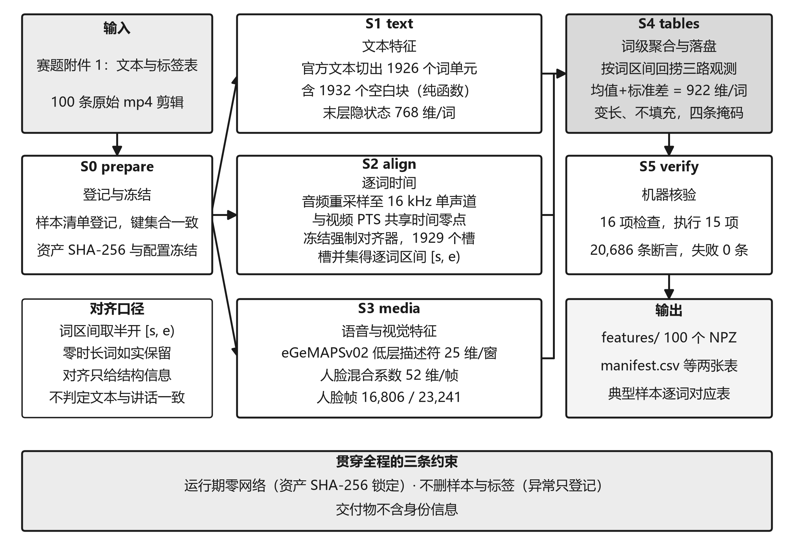
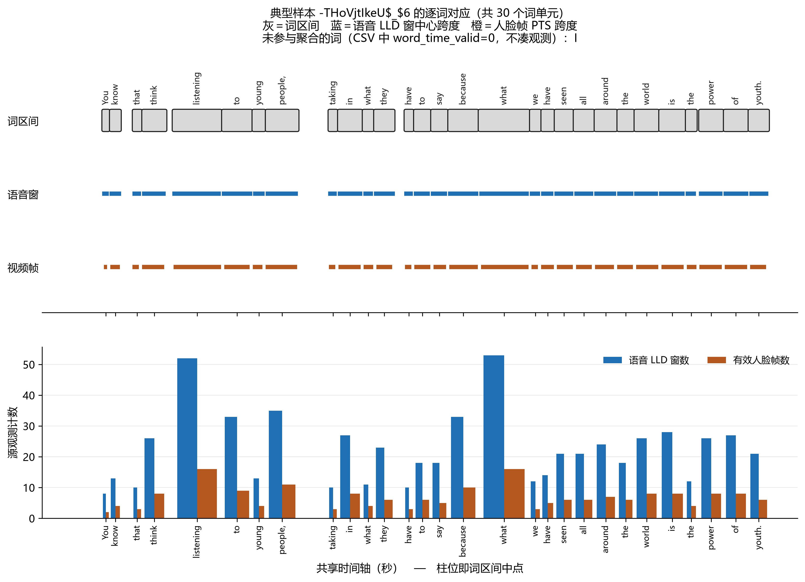

# 复杂场景下多模态情感识别：问题一 三模态特征提取与时序对齐

---

# 摘 要

附件 1 给出 100 条短视频片段及其英文转写文本，要求转换为时序可核验的三模态特征文件。三种模态的时间粒度互不相同：文本以词为单位，语音按定长分析窗计算，视觉以视频帧呈现，三者的观测时刻通常不重合。若归并到同一组等分时间槽，槽内会出现大量插值与零填充值，这些位置实际上没有观测。

本文按模态保留原始时间粒度，只在词这一级建立公共时间参照，并使每个有效位置都能回溯到具体的原始观测。具体做法为：以样本音频的呈现起点为共享时间零点 $t_0$，所有时间量表示为相对 $t_0$ 的半开区间；词单元由 `official_text` 切分，逐词区间取自冻结的 stable-ts 强制对齐结果，本批共 1926 个词单元、1932 个空白块；三模态各设一条词级有效掩码，互不代偿，共同有效词数取三条掩码的合取；各样本词级数组长度可变，不做填充，有效位置由掩码标记、长度由显式字段给出；对无法由程序判定的内容对应关系不加断言，`content_assertion` 全部取 0。

交付内容为 100 个 NPZ 特征文件（文本 768 维、语音 50 维、视觉 104 维，逐词合计 922 维）、两份各 100 行的汇总表、29 条异常记录和 3 个典型样本的逐词对应表。产物经 16 项机器核验（实际执行 15 项），共 20 686 条断言，无失败；交付体积 19 164 936 B；异常只登记不删除，100 个样本全部保留。

**关键词：** 多模态情感识别；时序对齐；词级聚合；变长表示；可复现性核验

---

# 一、问题重述

## 1.1 问题背景

附件 1 给出 100 条短视频片段及对应的英文转写文本（CMU-MOSEI 族数据集），标注表为 `label-100.xlsx`，100 个目录各含同名 `.mp4` 视频与 `.wav` 音频。附件 2 给出预处理后的定长槽表示张量 $(50,768)$、$(50,74)$、$(50,35)$，供问题二、三使用。问题一不生成该接口的输入，其任务是给出一套从原始素材到特征文件的完整方案，并提交相应产物。

## 1.2 问题一的要求

赛题对问题一提出四项要求：(1) 给出特征提取与时序对齐的整体方案；(2) 给出特征文件的格式规范，并提交一张覆盖全部 100 条样本的汇总表，表中包含样本编号、模态类型、原始有效时长、特征维度、对齐粒度；(3) 至少选取 1 个典型样本，展示文本片段、对应语音时段、视频帧段与三类特征的对应关系；(4) 说明方案的复现方式。此外，赛题在"时序组织可核验性"一条中要求产物记录序列位置、有效长度、填充规则与同原始素材的对应关系。

---

# 二、问题分析

## 2.1 时序组织的三条约束

第一，三种模态的时间粒度不能互相替代。语音的低层描述符按固定步长与窗长逐窗计算，视频帧带有各自的呈现时间戳，文本一次前向得到的是词元序列，本身不带时间信息，三者的观测时刻一般不重合。若统一重采样到等分网格，网格点上会出现大量插值值或零填充值。为此本文不采用等分槽方案，改在词这一级建立公共参照。

第二，对齐结论需要区分两个层次。"官方词区间在时间轴上是否合法"可以由程序判定；"官方文本内容是否与视频中实际讲话对应"只能由人工听辨判定。若把两者写在同一个字段中，就会出现将人工判断记为机器结论的情况。本文把两者分设为两个字段，其中内容对应一律记为 `not_asserted`。

第三，样本长度不一致是数据本身的性质。100 条样本的词数在 7 至 40 之间，若补齐到最长样本，会引入大量没有观测的位置；若把这些位置标为缺失，又会与真正未采集到的数据混淆。本文保留变长，用掩码标记有效位置，由 `valid_length` 给出长度。

由以上三点，本文确定两条取舍：文本侧采用强制对齐的实测词边界而非等分假设；不做跨模态重采样，以免把无观测位置表示为有观测。

## 2.2 建模路线

建模按六个阶段进行，依次为 `prepare`、`text`、`align`、`media`、`tables`、`verify`，流程见图 1。



**图 1　问题一总体流程（S0–S5 依次为 prepare、text、align、media、tables、verify）**

---

# 三、模型假设

假设 1：附件 1 给出的标签与官方转写文本准确无误。按赛题要求，检测出的异常一律登记，不作为删除样本或标签的依据。

假设 2：同一样本的音频与视频来自同一次录制，存在共同的呈现起点 $t_0$，本文逐样本记录并核验。

假设 3：词单元与空白块的切分只依赖 `official_text`，与音频、视频无关，因此词单元数是文本的确定函数，可以硬断言。

假设 4：在一个词的时间区间内，落入该区间的语音窗与视频帧可作为同一情感状态的采样，用均值与标准差概括。若区间内没有有效观测，该词在该模态上判为无效，不以邻近观测代替。

假设 5：若 int16 波形逐采样全为零，则该片段为数字静音，这是编码层面的事实，不需要听辨。本文只在这种情况下记录"无语音"，其余情况一律记为证据不足。

---

# 四、符号说明

主要符号列于表 1，仅在单个公式中出现的变量随式说明。

**表 1　符号说明**

| 符号 | 说明 | 单位 |
|---|---|---|
| $m$ | 模态索引，$m\in\{\text{text},\text{audio},\text{vision}\}$ | — |
| $L$ / $i$ | 该样本的词单元数（本批合计 1926） / 词单元索引 | — |
| $t_0$ | 该样本的共享时间零点（相对音频呈现起点） | s |
| $s_i,e_i$ | 第 $i$ 个词单元的起止时刻，构成半开区间 $[s_i,e_i)$ | s |
| $c_k$ | 第 $k$ 个原始观测（语音窗或视频帧）的时间标签 | s |
| $\mathbf{z}_{m,k}$ | 模态 $m$ 第 $k$ 个原始观测的特征向量 | — |
| $v^{(m)}_i$ / $\mathbf{x}^{(m)}_i$ | 模态 $m$ 第 $i$ 个词单元的有效掩码 / 聚合后的词级特征 | — |
| $\mathrm{valid\_length}$ / $\text{CSR}$ | 三模态共同有效的词数 / 词到原始观测的压缩稀疏行归属结构 | — |

---

# 五、模型的建立与求解

## 5.1 三模态特征提取与时序对齐方案

### 5.1.1 三模态特征的定义与提取

三种模态各自保留原始粒度，提取口径见表 2。

**表 2　三模态特征提取口径**

| 模态 | 词级特征形状 | 词级维度 | 原生观测 | 原生维度 | 提取工具与口径 |
|---|---|---|---|---|---|
| 文本 text | (L, 768) | 768 | RoBERTa 子词 | 768 | roberta-base 末层隐状态按词池化（子词归属见 roberta_word_token_*） |
| 语音 audio | (L, 50) | 50 | openSMILE LLD 窗 | 25 | eGeMAPSv02 LowLevelDescriptors，逐窗 25 维；词级取 [均值, 总体标准差(ddof=0)] |
| 视觉 vision | (L, 104) | 104 | MediaPipe blendshape 帧 | 52 | FaceLandmarker 逐帧 52 维 blendshape；词级取 [均值, 总体标准差(ddof=0)] |

文本取 `roberta-base` 末层隐状态。子词切分与官方词单元不一致，落盘的 `roberta_word_token_*` 记录各词单元对应哪些子词位置，词级特征取其均值。语音采用 openSMILE 的 `eGeMAPSv02 LowLevelDescriptors`，逐窗输出 25 维低层描述符。视觉采用 MediaPipe FaceLandmarker，逐帧输出 52 维 blendshape 系数；未检出人脸的帧记为无效，不参与聚合，也不以零向量代替。语音与视觉的特征名与枚举名顺序已冻结，由 V7 逐项比对。

### 5.1.2 共享时间轴与半开区间

所有时间量表示为相对共享时间零点 $t_0$ 的半开区间 $[s,e)$（式 5.1）。采用半开区间可使相邻区间首尾相接，既不重叠也不留空隙。

$$
[s_i,\,e_i),\qquad s_i < e_i,\qquad e_i \le s_{i+1}\quad(\text{相邻词})
\tag{5.1}
$$

一个原始观测是否属于第 $i$ 个词，取决于其时间标签 $c_k$ 是否落在该区间内（式 5.2）。语音取该窗的时间标签，视觉取该帧的呈现时间戳。词的时间区间与特征的时间标签属于两类不同的量，落盘字段中分别命名：`starts`/`ends` 表示词区间，`centers` 表示特征时刻。

$$
k \in \mathcal{K}_i \iff s_i \le c_k < e_i
\tag{5.2}
$$

### 5.1.3 逐词时间：冻结的强制对齐与结构闸门

逐词时间取自冻结的 stable-ts 强制对齐结果。本批共得到 1929 个词槽和 1926 个词单元，槽数略多于词数，原因是对齐器可能把一个官方词切分为两段。本文对每个词取其全部槽的并集 $[\min s,\max e]$，不丢失观测。核验显示 `mapping_fail` 与无槽词数均为 0，即官方文本中每个词均被覆盖。

对齐参数 `remove_instant_words` 取 `False`，即保留零时长的瞬时词。丢弃它们会使槽数少于官方词数，"每个官方词都有槽"的结构性质随之失效。保留的代价是说话人为空的片段会产生一批零时长词，本批共 207 个，分布在 53 个样本上，本文如实保留并记录。对齐结果只提供结构信息，不说明官方文本内容确实与视频中实际讲话一致，后者属于人工听辨结论，本文不作断言。

### 5.1.4 词级聚合与掩码

词级特征由落入该词的观测的均值与总体标准差拼接而成（式 5.3）。标准差采用总体口径（`ddof=0`），以避免单观测词出现 $0/0$。由此，逐词维度分别为文本 $768$、语音 $25\times2=50$、视觉 $52\times2=104$。

$$
\mathbf{x}^{(m)}_i=
\begin{cases}
\Big[\ \underset{k\in\mathcal{K}^{(m)}_i}{\mathrm{mean}}\ \mathbf{z}_{m,k}\ ,\ \ \underset{k\in\mathcal{K}^{(m)}_i}{\mathrm{std}_{0}}\ \mathbf{z}_{m,k}\ \Big], & \big|\mathcal{K}^{(m)}_i\big| \ge 1,\\[4pt]
\mathbf{0}, & \big|\mathcal{K}^{(m)}_i\big| = 0,
\end{cases}
\qquad
\mathrm{std}_0=\sqrt{\tfrac{1}{|\mathcal{K}|}\textstyle\sum_{k}(z_k-\bar z)^2}
\tag{5.3}
$$

以下三种情况该词在相应模态上判为无效，特征行全部置零，不以邻近观测代替，也不跳过该维度：词区间非法或时长为零；区间内没有有效观测；观测中存在非有限值。这三条也是 5.5.3 中 V4 的判据。

文本、语音、视觉各有一条词级有效掩码，三条掩码相互独立，不互相代偿。三模态共同有效的词数由三条掩码取合取得到，即 `valid_length`（式 5.4）。

$$
\mathrm{valid\_length}=\sum_{i=0}^{L-1}
\Big[\,v^{(\mathrm{text})}_i \wedge v^{(\mathrm{audio})}_i \wedge v^{(\mathrm{vision})}_i\,\Big]
\tag{5.4}
$$

本批 1926 个词单元中，有非零区间即结构合法的为 1719 个，零时长为 207 个。逐样本的共同有效词数见 `results_100.csv` 的 `valid_length` 列。

### 5.1.5 路由判定与两个独立字段

每个样本最终归入一个路由类别。类别词表共五类，本方案只产生其中三类，见表 3。

**表 3　路由类别、可判性与本批条数**（两类不产生类别的完整判据见 `metadata/route_policy.json` 的 `never_emitted`）

| 判定类别 | 机器可判 | 本批条数 | 判据 |
|---|---|---|---|
| TRI_MODAL_WORD_VALID | 否——含人工听辨结论 | 0 | 要求「已确认文本内容与讲话对应」，属人工听辨结论；机器只能判区间合法 |
| TRI_MODAL_WITH_AUDIO_CONTENT_INVALID | 是 | 2 | 时间轴可信且 int16 波形逐采样全零 |
| AV_VALID_TEXT_UNALIGNED | 否——含人工听辨结论 | 0 | 要求「已确认文字与讲话明显不对应」，属人工听辨结论；ASR 距离与对齐概率反推不出 |
| UNCERTAIN_REVIEW | 是 | 98 | 其余情况（兜底） |
| EXTRACTION_OR_TIMELINE_ANOMALY | 是 | 0 | 身份/解码/共享时间轴不可靠 |

不产生的两类为 `TRI_MODAL_WORD_VALID` 与 `AV_VALID_TEXT_UNALIGNED`，两者的成立条件都包含人工听辨结论。本方案只判定其中可由程序判定的部分，不代替人工给出内容结论，因此这两类均不产生，相应样本归入兜底类 `UNCERTAIN_REVIEW`。为使结构与内容两个层次分别可查，本文把它们分设为两个独立字段，见表 4。

**表 4　路由相关字段及其取值分布**

| 字段 | 取值分布（本批 100 条） | 语义 |
|---|---|---|
| alignment_granularity | word 97、clip 3 | 该样本的时序组织粒度（词级 / 片段级） |
| text_av_time_mapping_status | word_partial 50、word_valid 47、clip_only 3 | 结构闸门（机器可判）：官方词的时间区间够不够用 |
| text_audio_correspondence | not_asserted 98、no_speech 2 | 内容确认：文本与实际讲话是否对应；本套代码一律 not_asserted，唯一例外是位精确可证的数字静音 |
| word_time_basis | own_forced_alignment 97、none 3 | 词区间来源；own_forced_alignment = 至少一个词的区间来自本次冻结对齐运行 |
| content_assertion | 取 1 的条数 0 | uint8；1 仅当存在外部人工证据，本套恒为 0 |
| audio_speech_valid | -1 98、0 2 | 有语音的证据等级：0 = 已确认数字静音，−1 = 证据不足。**从不取 1** |

由表 4 可见，`text_av_time_mapping_status` 反映时间区间在结构上是否可用，属机器可判，本批为 `word_partial` 50 条、`word_valid` 47 条、`clip_only` 3 条；`text_audio_correspondence` 反映内容是否对应，本批全部为 `not_asserted`，仅 2 条位精确可证的数字静音记为 `no_speech`；`content_assertion` 为 uint8，取 1 的前提是存在外部人工证据，本方案全部取 0。据此，存在对齐区间只说明时间上给出了位置，并不说明该位置的文本内容已与语音对应。

### 5.1.6 异常处理

所有异常记入 `audit/anomaly_ledger.csv`，共 29 条，每条含异常类型、涉及样本、判据与是否计为删除，其中 `counts_as_deletion` 全部为 0（见 5.5.3 的 V10）。主要类型为未检出人脸（24 条样本）、词并集覆盖率偏低、零时长词占比偏高，相关样本全部保留。

## 5.2 特征文件规范与全量结果汇总

### 5.2.1 存储格式与读取方式

每个样本对应一个 `.npz` 文件，内部含 85 个字段，覆盖标量元信息、四条词级有效掩码与视觉帧级掩码、三模态词级特征数组 $(L,\cdot)$、原始观测序列（语音窗与视频帧的特征、时间标签及人脸有效掩码）以及记录词到观测归属的 CSR 溯源结构，规范摘要见表 5。文件统一以 `numpy.load(..., allow_pickle=False)` 读取，不含 pickle，读取过程不执行反序列化代码。

**表 5　特征文件规范摘要**

| 项 | 值 | 说明 |
|---|---|---|
| schema_version | q1v2-feature-v1.0 | NPZ 内嵌，防与旧版产物混淆 |
| NPZ 字段数 | 85 | 含标量、掩码、特征、原生序列、CSR 溯源五类 |
| NPZ 读取方式 | numpy.load(..., allow_pickle=False) | 无 pickle，读取不执行任何反序列化代码 |
| manifest.csv 列数 | 59 | 含执行期三列（内存/耗时/错误） |
| results_100.csv 列数 | 56 | manifest 去掉执行期三列 |
| 表行数 | 100 / 100 | 两份表各恰 100 行，键集合相等（V1 断言） |
| 三模态共同有效词数 valid_length | 逐样本一列 | text_word_valid ∧ word_audio_valid ∧ word_vision_valid |

### 5.2.2 填充规则

本方案的填充规则为：没有填充。

其一，逐样本变长。词级数组的第一维为该样本自身的词单元数 $L$。其二，有效位置由掩码声明，掩码取 0 处特征行为零，语义上明确表示该处没有观测。其三，长度由字段给出，`text_sequence_length`、`audio_observation_length`、`video_frame_count` 给出各模态观测长度，`valid_length` 给出共同有效词数。

变长表示的可核验性强于定长填充：补齐到统一长度后，填充位置的零值与真实的零观测无法区分，按位置进行的统计不再对应真实数据，而变长表示中不存在填充位置。代价是下游须按掩码处理不等长输入。

### 5.2.3 全量 100 条样本汇总表

覆盖全部 100 条样本的汇总表见附录 A 表 A1，含样本编号、模态类型、原始有效时长、特征维度、对齐粒度五项。逐样本的词单元数、语音窗数、视频帧数、共同有效词数、人脸有效率、路由判定等完整列见 `results_100.csv`（56 列）。

### 5.2.4 体积核算

交付体积按计入提交与不计入提交两档核算，见表 6。语音与视觉的原始观测缓存（`.cache/`）与执行日志（`logs/`）可由一次完整重跑再生，不计入提交体积。

**表 6　体积核算**

| 口径 | 字节 | 说明 |
|---|---|---|
| 问题一 v2 计入提交 | 19,164,936 | features/ + 两张表 + audit/ + metadata/ + reports/；.cache/ 与 logs/ 为可重建中间态，不计入 |
| 提交白名单合计（含代码） | 42,331,339 | 白名单当前指向 data/q1_v2；本行即替换后的合计，无需再加一遍 v2 |
| 其中 data/q1_delivery（不计提交） | 16,129,185 | v1（旧 50 槽架构）留在盘上但不计提交；仅在「叠加」一栏用到 |
| 替换核算合计 | 42,331,339 | 宽松读法 过线；严格读法 过线 |
| 叠加核算合计（反面） | 58,460,524 | 两份 Q1 都留着：宽松读法 超线；严格读法 超线 |
| 红线（宽松 50×1024²） | 52,428,800 | — |
| 红线（严格 50×10⁶） | 50,000,000 | — |

## 5.3 典型样本验证

### 5.3.1 样本选取

本文导出 3 个样本的逐词对应表，词单元数分别为 30、27、29，人脸有效率均在 0.90 以上，源观测复算全部通过。样本由脚本按固定判据自动选取，判据记录在 `correspondence/_meta.json` 中：词单元数在 $[10,30]$ 区间；人脸有效率不低于 0.90；共同有效词占比不低于 0.80；满足上述条件者按"同时含 2 个以上语音窗与 2 个人脸帧的词数"降序选取，同分按样本键升序。

### 5.3.2 逐词对应表

表 7 给出第一个典型样本全部 30 个词单元的对应关系，包括文本片段、对应语音时段与窗数、对应视频帧段与帧数，以及三模态特征行在该词上的有效性，对应赛题第 (3) 项要求。

**表 7　典型样本逐词对应表**

| 词序 | 文本片段 | 语音时段(s) | 语音窗数 | 人脸帧数 | 视频帧PTS跨度(s) | 时段内总帧数 | 三模态特征行 T/A/V | 备注 |
|---|---|---|---|---|---|---|---|---|
| 0 | You | [0.480000, 0.560000) | 8 | 2 | 0.500000–0.533333 | 2 | 1/1/1 | — |
| 1 | know | [0.560000, 0.680000) | 13 | 4 | 0.566667–0.666667 | 4 | 1/1/1 | — |
| 2 | that | [0.800000, 0.900000) | 10 | 3 | 0.800000–0.866667 | 3 | 1/1/1 | — |
| 3 | I | — | 0 | 0 | — | 0 | 1/0/0 | 无合法区间，不凑观测 |
| 4 | think | [0.900000, 1.160000) | 26 | 8 | 0.900000–1.133333 | 8 | 1/1/1 | — |
| 5 | listening | [1.220000, 1.740000) | 52 | 16 | 1.233333–1.733333 | 16 | 1/1/1 | — |
| 6 | to | [1.740000, 2.060000) | 33 | 9 | 1.766667–2.033333 | 9 | 1/1/1 | — |
| 7 | young | [2.060000, 2.200000) | 13 | 4 | 2.066667–2.166667 | 4 | 1/1/1 | — |
| 8 | people, | [2.200000, 2.550000) | 35 | 11 | 2.200000–2.533333 | 11 | 1/1/1 | — |
| 9 | taking | [2.860000, 2.960000) | 10 | 3 | 2.866667–2.933333 | 3 | 1/1/1 | — |
| 10 | in | [2.960000, 3.220000) | 27 | 8 | 2.966667–3.200000 | 8 | 1/1/1 | — |
| 11 | what | [3.220000, 3.340000) | 11 | 4 | 3.233333–3.333333 | 4 | 1/1/1 | — |
| 12 | they | [3.340000, 3.560000) | 23 | 6 | 3.366667–3.533333 | 6 | 1/1/1 | — |
| 13 | have | [3.660000, 3.760000) | 10 | 3 | 3.666667–3.733333 | 3 | 1/1/1 | — |
| 14 | to | [3.760000, 3.940000) | 18 | 6 | 3.766667–3.933333 | 6 | 1/1/1 | — |
| 15 | say | [3.940000, 4.120000) | 18 | 5 | 3.966667–4.100000 | 5 | 1/1/1 | — |
| 16 | because | [4.120000, 4.440000) | 33 | 10 | 4.133333–4.433333 | 10 | 1/1/1 | — |
| 17 | what | [4.440000, 4.980000) | 53 | 16 | 4.466667–4.966667 | 16 | 1/1/1 | — |
| 18 | we | [4.980000, 5.100000) | 12 | 3 | 5.000000–5.066667 | 3 | 1/1/1 | — |
| 19 | have | [5.100000, 5.240000) | 14 | 5 | 5.100000–5.233333 | 5 | 1/1/1 | — |
| 20 | seen | [5.240000, 5.440000) | 21 | 6 | 5.266667–5.433333 | 6 | 1/1/1 | — |
| 21 | all | [5.440000, 5.660000) | 21 | 6 | 5.466667–5.633333 | 6 | 1/1/1 | — |
| 22 | around | [5.660000, 5.900000) | 24 | 7 | 5.666667–5.866667 | 7 | 1/1/1 | — |
| 23 | the | [5.900000, 6.080000) | 18 | 6 | 5.900000–6.066667 | 6 | 1/1/1 | — |
| 24 | world | [6.080000, 6.340000) | 26 | 8 | 6.100000–6.333333 | 8 | 1/1/1 | — |
| 25 | is | [6.340000, 6.620000) | 28 | 8 | 6.366667–6.600000 | 8 | 1/1/1 | — |
| 26 | the | [6.620000, 6.740000) | 12 | 4 | 6.633333–6.733333 | 4 | 1/1/1 | — |
| 27 | power | [6.760000, 7.020000) | 26 | 8 | 6.766667–7.000000 | 8 | 1/1/1 | — |
| 28 | of | [7.020000, 7.280000) | 27 | 8 | 7.033333–7.266667 | 8 | 1/1/1 | — |
| 29 | youth. | [7.280000, 7.500000) | 21 | 6 | 7.300000–7.466667 | 6 | 1/1/1 | — |

表注：末列 T/A/V 为该词三模态特征行的有效性三元组，1 表示该模态在此词上有真实观测、特征行参与聚合，0 表示判为无效、特征行全部为零。

表中的语音窗数与人脸帧数是实际参与聚合的观测数，与"时段内总帧数"一列不同，后者包含未检出人脸的帧，这一区别对应 `word_vision_valid` 的含义。三点需要说明。其一，一段观测被多个词共享属正常现象：词 `listening` 的区间宽 0.52 s，落入的语音窗有 52 个、人脸帧有 16 个，只要时间标签落在区间内即计入聚合，依据是落点而非对原始观测重新采样。其二，无效词如实留空：词 `I` 的 `word_time_valid` 为 0，CSR 为空，三路特征行全部为零，备注记无合法区间，该词占一行而非被删除。其三，语音窗步长 10 ms 短于视频帧间隔，两者在同一词上的时间跨度起点相近而长度不同，这不是对齐误差。

### 5.3.3 对齐时间线

图 2 将表 7 的对应关系绘于同一时间轴。上栏三条带自下而上分别为视频帧、语音窗和词区间，下栏为逐词的源观测计数。词区间带在约 0.7 s 处的空隙对应词 `I`，该词无合法区间，故在时间轴上没有位置。



**图 2　典型样本的对齐时间线**

### 5.3.4 对应关系的独立复算

表 7 由 NPZ 重新计算得到，未另行编写。对每个词，按式 (5.2) 独立重选索引集合 $\mathcal{K}'_i=\{k: s_i \le c_k < e_i\}$，与落盘的 CSR 下标集合 $\mathcal{K}_i$ 逐元素比较。三个样本的全部词（30、27、29 个，含无效词）均相等，结果记录在 `correspondence/_meta.json` 的 `csr_check` 中。

## 5.4 覆盖完整性

赛题要求编号、模态文件与输出特征一一对应。本文以五方集合相等保证这一点：

$$
\text{registry}\ \equiv\ \text{features}\ \equiv\ \text{manifest}\ \equiv\ \text{results}\ \equiv\ \text{logs}
\tag{5.5}
$$

其中 registry 由附件 1 的标注表枚举得到，features 为实际落盘的 NPZ，manifest 与 results 为两份汇总表，logs 为逐样本执行日志。V1 对五者的键集合作双向断言，共 300 条；V3 独立复算 `official_text` 与 `label-100.xlsx` 的对应，确认官方文本逐字一致。

## 5.5 方案可复现性说明

### 5.5.1 运行环境与资产身份

运行环境与关键依赖版本记录在 `metadata/environment.json` 中。该文件是整机环境快照，其中部分包（如 `librosa`）只用于其他问题的链路，表 8 逐包标明本问链路是否直接调用。

**表 8　运行环境与依赖**

| 包 | 本机实测版本 | 问题一链路直接 import | 未被直接 import 时的角色 |
|---|---|---|---|
| av | 18.1.0 | 是 | — |
| librosa | 1.0.0 | 否 | 本问链路不调用；该包由整机环境快照记录 |
| mediapipe | 0.10.35 | 是 | — |
| numpy | 2.2.6 | 是 | — |
| openai-whisper | 20250625 | 否 | 运行期传递依赖：stable_whisper.load_model() 加载的即 whisper 检查点 |
| openpyxl | 3.1.5 | 否 | 运行期传递依赖：pandas.read_excel 读 label-100.xlsx 的引擎 |
| opensmile | 2.6.0 | 是 | — |
| pandas | 3.0.6 | 是 | — |
| stable-ts | 2.19.1 | 是 | — |
| torch | 2.14.0+cpu | 是 | — |
| torchaudio | 2.11.0+cpu | 否 | 本问链路未直接调用（随 torch 音频栈装入） |
| transformers | 5.17.0 | 是 | — |

模型资产身份由 SHA-256 锁定，核验时逐字节比对，见表 9。运行期不使用网络：RoBERTa 强制 `local_files_only=True`；MediaPipe 权重预取一次后离线加载；语音识别检查点以本地路径传入而非模型名，因为模型名在缓存缺失时会触发联网下载。

**表 9　模型资产与校验值**

| 资产 | 文件 | SHA-256（前 16 位） | 说明 |
|---|---|---|---|
| RoBERTa 文本编码 | model.safetensors | 5bde1d28afb363d0… | 6 个文件逐个校验，任一不符即报错 |
| whisper 强制对齐 | base.en.pt | 25a8566e1d0c1e22… | base.en，与 stable-ts 配套 |
| MediaPipe 面部 | face_landmarker.task | 64184e229b263107… | 预取一次后离线加载（本次 downloaded_this_run=False） |
| openSMILE 配置 | eGeMAPSv02.conf | ef451953badced2e… | eGeMAPSv02 LowLevelDescriptors，25 维，顺序已冻结 |

### 5.5.2 运行流程

代码按 `prepare`、`text`、`align`、`media`、`tables`、`verify` 六个阶段组织，支持断点续跑。六个阶段与赛题四项要求的对应为：`text`、`align`、`media` 对应整体方案并产出 `features/` 下的 NPZ；`tables` 对应格式规范与汇总；`q1v2_correspondence.py` 对应典型样本验证；`verify` 对应可复现性说明，产出核验报告。完整命令见附录 B。

### 5.5.3 机器核验

核验共 16 项，编号 V1 至 V16，断言数与判据列于表 10，其中 15 项执行，V12（开发期回归）默认跳过。16 项合计 20 686 条断言，无失败。

**表 10　机器核验项与断言数**

| 编号 | 检验内容 | 断言数 | 失败 |
|---|---|---|---|
| V1 | 双向集合相等（输入/登记/两张表/产物/日志） | 300 | 0 |
| V2 | NPZ schema 自洽（字段/形状/dtype/掩码一致） | 8200 | 0 |
| V3 | 词单元可重建（1926 口径的独立复算） | 400 | 0 |
| V4 | 词级聚合可回溯重算（CSR 回捞 + 独立重选） | 3006 | 0 |
| V5 | 时间轴一致性（共享 t0 / 支撑区间 / 覆盖交叠） | 1000 | 0 |
| V8 | 产物新鲜度（缓存 → 产物 → 表） | 104 | 0 |
| V9 | 跨样本查重（重复必须可解释） | 299 | 0 |
| V10 | 异常只标注不删除（counts_as_deletion ≡ 0） | 229 | 0 |
| V11 | 路由可复算（纯函数重放逐字段比对） | 700 | 0 |
| V13 | 对齐结构：文本层硬断言 + 对齐器规模对照实现 | 5787 | 0 |
| M1 | 媒体全量硬锚点（帧数 / 人脸帧 / 零面部样本数） | 3 | 0 |
| M2 | 受保护基线未变（既有交付未被破坏） | 530 | 0 |
| V6 | 外部 ffprobe 交叉核对（解码覆盖 vs 容器声明） | 100 | 0 |
| V7 | 权重真实性（RoBERTa / MediaPipe / openSMILE / whisper） | 14 | 0 |
| V14 | 数字静音位精确复现（覆盖/窗数/逐采样全零） | 14 | 0 |
| V12 | 与对照路由对拍 | 0 | 0 |

---

# 六、模型检验

## 6.1 主要核验结果

V4 共 3006 条断言，用 CSR 结构回捞源观测重算均值与总体标准差并与落盘值比对（相对容差 $10^{-5}$），另按式 (5.2) 独立重选索引再比一次，同时检验了聚合口径与归属结构。V14 共 14 条断言，完整解码 2 条数字静音样本，采样点数 96 872 与 91 227，确认 int16 逐采样为零；该检验跨越解码、重采样与特征窗划分，是复现的端到端锚点。V6 共 100 条断言，用外部 `ffprobe` 重跑 100 条视频，核对解码覆盖与容器声明是否相容，容差 0.15 s。M1 为三项全量硬锚点：视频帧 23 241 帧、人脸检出帧 16 806 帧、未检出人脸样本 24 条。M2 确认 530 个受保护文件未发生实质改动。

除上述核验外，本文另做了一次独立复现：清空全部中间态，从原始 `mp4` 重新执行六个阶段，产物与首次运行逐字节一致，`manifest.csv` 摘要与 NPZ 内嵌的 `config_sha256` 均未变化。V8 检查缓存、产物与汇总表的新旧顺序，防止以旧缓存生成新表。

## 6.2 软区间越界说明

V13 中有一条软区间（非断言项）超出范围：含零时长词的样本数实测为 53，记录的软区间为 $[30,44]$。原因是本方案固定 `remove_instant_words=False`，保留瞬时词，说话人为空的片段必然产生一批零时长词。其中全部词都为零时长的样本有 3 条，即 `-mJ2ud6oKI8` 的第 1、2 段与 `-ri04Z7vwnc` 的第 1 段，报告将它们列为主要来源。

该软区间用于观察，不参与通过与否的判定；与之并列的对照值 37 来自一次旧的对齐记录，两者不可互相引用。V13 的硬断言只建立在客观量上，即文本的确定函数（词单元数 1926、空白块数 1932）以及 `mapping_fail` 为 0、无槽词为 0 这两条性质。对齐器产出的槽数为 1929，比词单元数多 3，原因是 3 个官方词各被切分为两段；该数值取决于本次对齐运行，不作为断言。

## 6.3 提交合规核验

问题一交付物体积为 19 164 936 B。若计入代码与问题二、三的产物，合计 42 331 339 B，在 50 MB 的两种读法下均满足要求：

| 读法 | 上限（字节） | 实际占用 | 结论 |
|---|---|---|---|
| 宽松（$50\times1024^2$） | 52 428 800 | 42 331 339 | 满足 |
| 严格（$50\times10^{6}$） | 50 000 000 | 42 331 339 | 满足 |

此处按替换核算：v2 是问题一的重建版本，交付时替换而非并存于旧的 `q1_delivery`。若两份问题一产物叠加提交，合计 58 460 524 B，两种读法均超出，两种核算并列于表 6。体积口径与 `code/package_check.py` 一致，同样排除 `.cache/` 与 `logs/`。身份信息方面，对全部交付物执行身份正则扫描（含 NPZ 内 11 826 条字符串），零命中；根级新增的论文与说明文档不在自动扫描范围内，已另行核对。

---

# 七、模型的评价与改进

## 7.1 优点

(1) 判定层次明确。结构合法与内容确认分别记录，`content_assertion` 全部取 0，需人工听辨的两个类别不予产生。

(2) 特征可回溯。词级特征可经 CSR 结构定位到具体观测窗与帧，V4 的 3006 条断言即检验此性质。

(3) 变长表示无填充位置，不存在把填充值当作观测的问题。

(4) 异常只登记不剔除，100 个样本全部保留。

## 7.2 不足

(1) 逐词时间依赖对齐器。无语音片段上的 207 个零时长词分布于 53 个样本，不携带真实时间信息，只表示该处无语音。

(2) 部分样本视觉证据不足。24 条样本未检出人脸，另有部分样本人脸有效率偏低；本文不以零向量填补，代价是这些样本的视觉模态在多数词上无效。

(3) 共同有效词数受最短模态限制。`valid_length` 取三条掩码的合取，任一模态在某词上无效该词即不计入，处理偏保守。

(4) 3 条样本的对齐粒度为片段级，粗于其余 97 条，无法建立可靠的逐词时间，按实际能力标注 `alignment_granularity`。

## 7.3 改进方向

(1) 引入第二个对齐器作交叉验证，对分歧词给出置信度，把对齐可靠性由二值判断改为连续量。

(2) 将视觉证据的充分程度显式传给下游。`face_valid_ratio` 已逐样本落盘，融合时可按该比率限制视觉分支权重。

(3) 为片段级样本设计单独时间轴，借助音频能量包络的突变点做粗粒度分段，可部分恢复其时间结构。

---

# 参考文献

[1] Y. Liu, M. Ott, N. Goyal, et al. RoBERTa: A Robustly Optimized BERT Pretraining Approach. *arXiv:1907.11692*, 2019.

[2] F. Eyben, M. Wöllmer, B. Schuller. openSMILE: The Munich Versatile and Fast Open-Source Audio Feature Extractor. *ACM Multimedia*, 2010.

[3] F. Eyben, K. R. Scherer, B. W. Schuller, et al. The Geneva Minimalistic Acoustic Parameter Set (GeMAPS) for Voice Research and Affective Computing. *IEEE Transactions on Affective Computing*, 7(2):190–202, 2016.

[4] C. Lugaresi, J. Tang, H. Nash, et al. MediaPipe: A Framework for Building Perception Pipelines. *arXiv:1906.08172*, 2019.

[5] A. Radford, J. W. Kim, T. Xu, et al. Robust Speech Recognition via Large-Scale Weak Supervision. *ICML*, 2023.

[6] M. Bain, J. Huh, T. Han, A. Zisserman. WhisperX: Time-Accurate Speech Transcription of Long-Form Audio. *INTERSPEECH*, 2023.

[7] Y.-H. H. Tsai, S. Bai, P. P. Liang, et al. Multimodal Transformer for Unaligned Multimodal Language Sequences. *ACL*, 2019.

---

# 附录

## 附录 A　全量 100 条样本汇总表

**表 A1　100 条样本的特征文件汇总**（含赛题要求的样本编号、模态类型、原始有效时长、特征维度、对齐粒度五项）

表注：模态类型一栏的 TAV 表示文本、语音、视觉三模态俱全（100 条均为三模态）；特征维度一栏的 922 为该样本的逐词合计维度，即文本 768 加语音 50 加视觉 104（$768+25\times2+52\times2$）；对齐粒度一栏的 W/C 表示词级与片段级。三栏取值域小或逐样本恒定，故按此约定记成紧凑形式。

| 样本编号 | 模态类型 | 原始有效时长(s) | 特征维度 | 对齐粒度 |
|---|---|---|---|---|
| -3g5yACwYnA$_$13 | TAV | 5.500 | 922 | W |
| -3g5yACwYnA$_$2 | TAV | 9.367 | 922 | W |
| -3g5yACwYnA$_$3 | TAV | 14.367 | 922 | W |
| -3g5yACwYnA$_$9 | TAV | 8.800 | 922 | W |
| -3nNcZdcdvU$_$5 | TAV | 7.867 | 922 | W |
| -571d8cVauQ$_$0 | TAV | 5.167 | 922 | W |
| -571d8cVauQ$_$5 | TAV | 15.267 | 922 | W |
| -6rXp3zJ3kc$_$8 | TAV | 12.800 | 922 | W |
| -9y-fZ3swSY$_$0 | TAV | 6.900 | 922 | W |
| -9y-fZ3swSY$_$4 | TAV | 2.800 | 922 | W |
| -9y-fZ3swSY$_$8 | TAV | 4.967 | 922 | W |
| -AUZQgSxyPQ$_$2 | TAV | 22.500 | 922 | W |
| -HeZS2-Prhc$_$2 | TAV | 8.233 | 922 | W |
| -HwX2H8Z4hY$_$2 | TAV | 3.967 | 922 | W |
| -HwX2H8Z4hY$_$5 | TAV | 5.633 | 922 | W |
| -HwX2H8Z4hY$_$6 | TAV | 3.333 | 922 | W |
| -HwX2H8Z4hY$_$9 | TAV | 7.733 | 922 | W |
| -I_e4mIh0yE$_$1 | TAV | 7.600 | 922 | W |
| -I_e4mIh0yE$_$3 | TAV | 9.133 | 922 | W |
| -MeTTeMJBNc$_$0 | TAV | 9.333 | 922 | W |
| -MeTTeMJBNc$_$13 | TAV | 5.400 | 922 | W |
| -MeTTeMJBNc$_$7 | TAV | 10.500 | 922 | W |
| -NFrJFQijFE$_$1 | TAV | 5.720 | 922 | W |
| -NFrJFQijFE$_$2 | TAV | 6.840 | 922 | W |
| -RfYyzHpjk4$_$11 | TAV | 5.233 | 922 | W |
| -RfYyzHpjk4$_$2 | TAV | 5.500 | 922 | W |
| -RfYyzHpjk4$_$8 | TAV | 4.567 | 922 | W |
| -THoVjtIkeU$_$12 | TAV | 14.867 | 922 | W |
| -THoVjtIkeU$_$2 | TAV | 4.267 | 922 | W |
| -THoVjtIkeU$_$6 | TAV | 8.067 | 922 | W |
| -UUCSKoHeMA$_$0 | TAV | 7.867 | 922 | W |
| -UacrmKiTn4$_$10 | TAV | 7.333 | 922 | W |
| -UacrmKiTn4$_$4 | TAV | 4.733 | 922 | W |
| -UuX1xuaiiE$_$0 | TAV | 3.700 | 922 | W |
| -UuX1xuaiiE$_$1 | TAV | 10.333 | 922 | W |
| -UuX1xuaiiE$_$3 | TAV | 4.100 | 922 | W |
| -UuX1xuaiiE$_$6 | TAV | 8.100 | 922 | W |
| -a55Q6RWvTA$_$3 | TAV | 22.133 | 922 | W |
| -aNfi7CP8vM$_$7 | TAV | 8.667 | 922 | W |
| -aqamKhZ1Ec$_$0 | TAV | 11.000 | 922 | W |
| -dxfTGcXJoc$_$0 | TAV | 20.533 | 922 | W |
| -dxfTGcXJoc$_$1 | TAV | 16.133 | 922 | W |
| -dxfTGcXJoc$_$2 | TAV | 16.667 | 922 | W |
| -dxfTGcXJoc$_$6 | TAV | 12.733 | 922 | W |
| -egA8-b7-3M$_$1 | TAV | 10.233 | 922 | W |
| -egA8-b7-3M$_$13 | TAV | 4.167 | 922 | W |
| -egA8-b7-3M$_$16 | TAV | 5.533 | 922 | W |
| -egA8-b7-3M$_$17 | TAV | 7.267 | 922 | W |
| -egA8-b7-3M$_$18 | TAV | 8.367 | 922 | W |
| -egA8-b7-3M$_$20 | TAV | 6.633 | 922 | W |
| -egA8-b7-3M$_$26 | TAV | 6.000 | 922 | W |
| -egA8-b7-3M$_$6 | TAV | 6.233 | 922 | W |
| -egA8-b7-3M$_$9 | TAV | 5.067 | 922 | W |
| -hnBHBN8p5A$_$6 | TAV | 6.381 | 922 | W |
| -hnBHBN8p5A$_$7 | TAV | 7.341 | 922 | W |
| -iRBcNs9oI8$_$3 | TAV | 5.606 | 922 | W |
| -iRBcNs9oI8$_$6 | TAV | 2.870 | 922 | W |
| -iRBcNs9oI8$_$7 | TAV | 4.071 | 922 | W |
| -iRBcNs9oI8$_$8 | TAV | 8.075 | 922 | W |
| -iRBcNs9oI8$_$9 | TAV | 3.403 | 922 | W |
| -lzEya4AM_4$_$5 | TAV | 7.667 | 922 | W |
| -lzEya4AM_4$_$6 | TAV | 14.767 | 922 | W |
| -mJ2ud6oKI8$_$1 | TAV | 6.073 | 922 | C |
| -mJ2ud6oKI8$_$2 | TAV | 5.706 | 922 | C |
| -mJ2ud6oKI8$_$6 | TAV | 2.236 | 922 | W |
| -mJ2ud6oKI8$_$8 | TAV | 4.171 | 922 | W |
| -mJ2ud6oKI8$_$9 | TAV | 7.007 | 922 | W |
| -mqbVkbCndg$_$0 | TAV | 6.500 | 922 | W |
| -qDkUB0GgYY$_$6 | TAV | 4.667 | 922 | W |
| -ri04Z7vwnc$_$0 | TAV | 2.794 | 922 | C |
| -ri04Z7vwnc$_$2 | TAV | 6.006 | 922 | W |
| -ri04Z7vwnc$_$5 | TAV | 3.504 | 922 | W |
| -s9qJ7ATP7w$_$0 | TAV | 6.867 | 922 | W |
| -s9qJ7ATP7w$_$1 | TAV | 4.767 | 922 | W |
| -s9qJ7ATP7w$_$4 | TAV | 4.400 | 922 | W |
| -s9qJ7ATP7w$_$5 | TAV | 8.533 | 922 | W |
| -s9qJ7ATP7w$_$6 | TAV | 2.467 | 922 | W |
| -s9qJ7ATP7w$_$7 | TAV | 6.933 | 922 | W |
| -s9qJ7ATP7w$_$8 | TAV | 3.267 | 922 | W |
| -t217m2on-s$_$2 | TAV | 5.667 | 922 | W |
| -t217m2on-s$_$7 | TAV | 17.167 | 922 | W |
| -tANM6ETl_M$_$3 | TAV | 6.733 | 922 | W |
| -tPCytz4rww$_$10 | TAV | 4.767 | 922 | W |
| -tPCytz4rww$_$11 | TAV | 5.467 | 922 | W |
| -tPCytz4rww$_$12 | TAV | 11.833 | 922 | W |
| -tPCytz4rww$_$16 | TAV | 7.200 | 922 | W |
| -tPCytz4rww$_$18 | TAV | 6.633 | 922 | W |
| -uywlfIYOS8$_$4 | TAV | 6.033 | 922 | W |
| -vxjVxOeScU$_$4 | TAV | 9.100 | 922 | W |
| -wMB_hJL-3o$_$7 | TAV | 6.033 | 922 | W |
| -wny0OAz3g8$_$0 | TAV | 3.333 | 922 | W |
| -wny0OAz3g8$_$1 | TAV | 6.833 | 922 | W |
| -wny0OAz3g8$_$2 | TAV | 6.667 | 922 | W |
| -wny0OAz3g8$_$3 | TAV | 6.133 | 922 | W |
| -wny0OAz3g8$_$5 | TAV | 6.900 | 922 | W |
| -wny0OAz3g8$_$7 | TAV | 8.067 | 922 | W |
| -wny0OAz3g8$_$9 | TAV | 6.200 | 922 | W |
| -yRb-Jum7EQ$_$1 | TAV | 29.267 | 922 | W |
| -yRb-Jum7EQ$_$5 | TAV | 13.167 | 922 | W |
| -yRb-Jum7EQ$_$6 | TAV | 11.243 | 922 | W |

## 附录 B　交付文件清单与复现命令

完整文件清单、逐字段字典与各模块职责见随包提交的 `data/q1_v2/README_问题一交付与验证.md`。核心交付为 `features/` 下 100 个 NPZ，另有 `manifest.csv`（59 列）与 `results_100.csv`（56 列）两份汇总表以及 `correspondence/`、`audit/`、`metadata/`、`reports/` 四类附属文件；`.cache/` 与 `logs/` 不计入提交。

```
pip install -r code/requirements-q1v2.txt          # 建议在 ASCII 路径下的隔离 venv 中安装
python code/run_q1v2_all.py --stage=all --isolate   # 全流程，已存在产物默认跳过
python code/run_q1v2_all.py --stage=media --sample-key "<样本键>"   # 仅重建某阶段
python code/q1v2_correspondence.py                  # 导出典型样本逐词对应表
python code/run_q1v2_all.py --stage=verify          # 16 项机器核验
python code/package_check.py --sanitize             # 体积与身份红线扫描
```

## 附录 C　可复现性与数据使用声明

1. 数据来源。全部原始素材来自赛题附件 1（CMU-MOSEI 族数据集），未引入任何外部数据、预训练标签或第三方标注结论。
2. 样本与标签的完整性。100 个样本全部保留，未删除任何样本或标签；异常只登记、不剔除。
3. 结论强度的界定。本文不对"官方文本与视频中实际讲话内容是否对应"作任何断言。这也是路由设计中两个类别不产生的直接原因。
4. 可复现范围。给出环境、资产身份、六阶段命令与 16 项核验，可在等价环境中复现全部产物；其中 V14 跨越解码路径、重采样与特征窗划分，可作为复现是否成功的首选判据。
