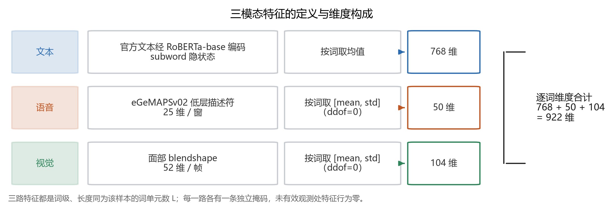
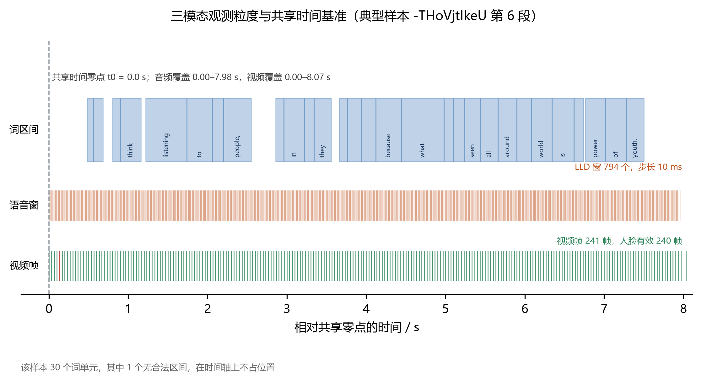
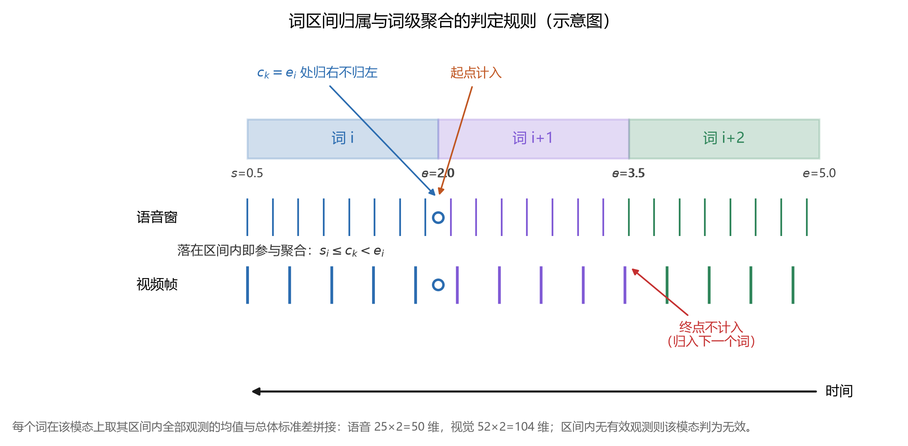
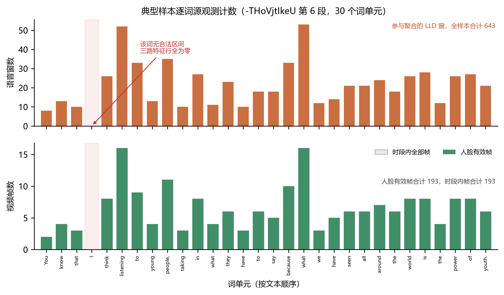
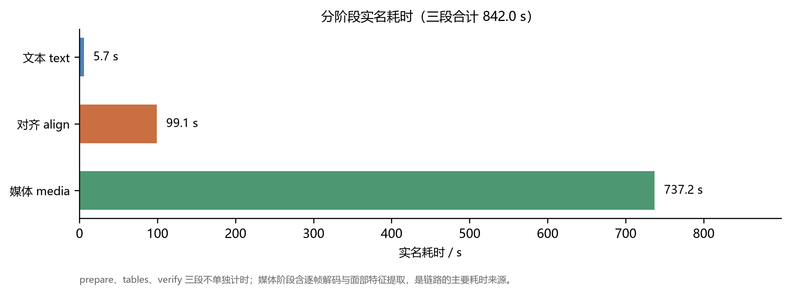
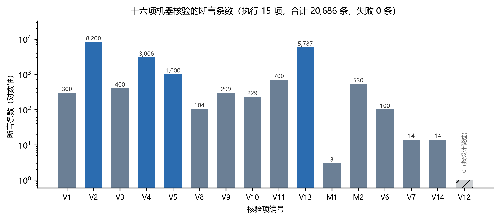
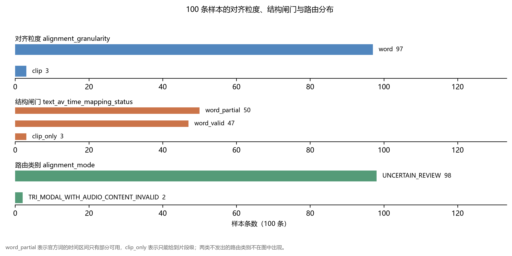
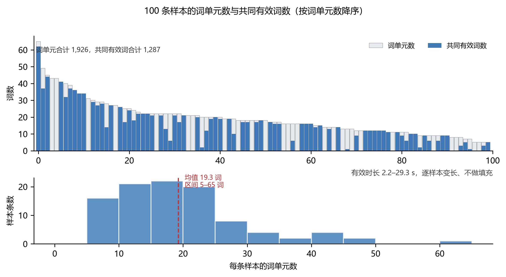
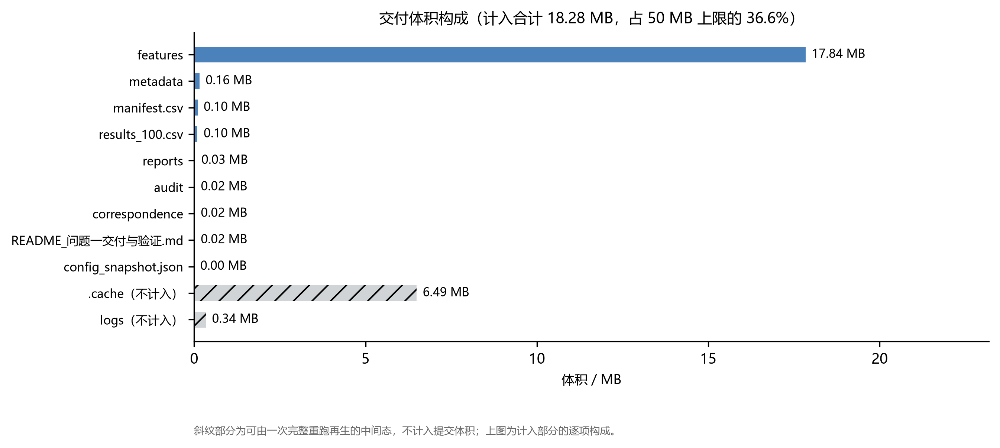
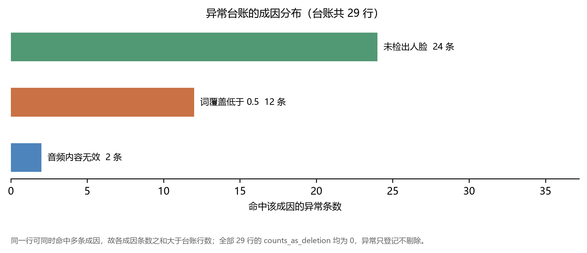

# 问题一 三模态特征提取与时序对齐

# 1 特征提取与时序对齐整体方案

## 1.1 任务、输入与总体设计

附件 1 给出 100 条短视频片段及其英文转写文本，标注表为 label-100.xlsx，每条片段的目录下含同名 .mp4 视频与 .wav 音频。本问要求把这批素材转换为时序可核验的三模态特征文件，并给出特征文件规范、一张覆盖全部 100 条样本的汇总表、至少一个典型样本的对应关系，以及方案的复现方式。三种模态的观测粒度互不相同：语音的低层描述符按固定窗长与步长逐窗计算，视频帧带有各自的呈现时间戳，官方文本以词为单位，但不携带时间信息。

若把三者归并到同一组等分时间槽，槽内会混入插值值与零填充值，而这些位置实际上没有观测。本文按模态保留原始粒度，只在词这一级建立公共时间参照：以样本音频的呈现起点为共享时间零点，逐词区间取自冻结的强制对齐结果，三模态各设一条词级有效掩码，数组长度逐样本可变、不做填充，有效位置由掩码声明，长度由显式字段给出。交付内容为 100 个 NPZ 特征文件（文本 768 维、语音 50 维、视觉 104 维，逐词合计 922 维）、两份各 100 行的汇总表、29 条异常登记与 3 个典型样本的逐词对应表。

三种模态各自的输入、特征与聚合方式列于图 1-1 与表 1-1。文本取官方文本经 RoBERTa 编码后的逐词表示，语音取声学低层描述符，视觉取逐帧的面部混合系数；三路都是词级序列，长度同为该样本的词单元数，每一路各有一条独立掩码。



**图 1-1 三模态特征的定义与维度构成**

**表 1-1 三模态特征提取口径**

| 模态 | 词级特征形状 | 词级维度 | 原生观测 | 原生维度 | 提取工具与口径 |
|---|---|---|---|---|---|
| 文本 text | (L, 768) | 768 | RoBERTa 子词 | 768 | roberta-base 末层隐状态按词池化（子词归属见 roberta_word_token_*） |
| 语音 audio | (L, 50) | 50 | openSMILE LLD 窗 | 25 | eGeMAPSv02 LowLevelDescriptors，逐窗 25 维；词级取 [均值, 总体标准差(ddof=0)] |
| 视觉 vision | (L, 104) | 104 | MediaPipe blendshape 帧 | 52 | FaceLandmarker 逐帧 52 维 blendshape；词级取 [均值, 总体标准差(ddof=0)] |

相关工作为上述选择提供参照：RoBERTa 给出文本表示[1]；openSMILE 与 GeMAPS 给出语音低层描述符的提取口径[2,3]；MediaPipe 给出逐帧面部表示[4]；whisper 给出语音识别与词级时间[5]，WhisperX 在此基础上处理长音频的词级对齐[6]。本方案使用 stable-ts 2.19.1 与 whisper base.en 的冻结权重做强制对齐，不训练任何模型，全部结论落在可机检的结构性质上。16 项机器核验中执行 15 项，共 20 686 条断言，无失败；交付体积 19 164 936 B；异常只登记不删除，100 个样本全部保留。

## 1.2 共享时间零点与半开区间

输入为附件 1 的 100 条片段，标签表 label-100.xlsx 给出每条片段的标注。100 条样本的词单元数在 5 至 65 之间，本批合计 1926 个词单元，均值 19.3；原始有效时长在 2.2 s 至 29.3 s 之间。样本长度不一致是数据本身的性质：补齐到最长样本会引入大量没有观测的位置，把这些位置标为缺失又会与真正未采集到的数据混淆。

同一样本的音频与视频来自同一次录制，存在共同的呈现起点，本文逐样本记录并核验该共享时间零点 t0。三模态各自解码、各有自己的流起点，共享零点因此不能省略：本文要求音频覆盖起点与视频覆盖起点都等于该零点，并由 V5 逐样本断言。所有时间量表示为相对 t0 的半开区间（式 1-1）。采用半开区间可使相邻词首尾相接，既不重叠也不留空隙。

$$[s_i,\,e_i),\qquad s_i<e_i,\qquad e_i\leq s_{i+1}\quad\text{(adjacent words)} \tag{1-1}$$

一个原始观测是否属于第 i 个词，取决于它的时间标签是否落在该区间内（式 1-2）。语音取该窗的时间标签，视觉取该帧的呈现时间戳；两者落入同一词时按实际观测参与聚合，不做重采样。词的时间区间与特征的时间标签属于两类不同的量，落盘字段分别命名为 starts、ends 与 centers。

$$k\in\mathcal{K}_i\quad\text{if}\quad s_i\leq c_k<e_i \tag{1-2}$$

本次输入的实际粒度见图 1-2：典型样本的音频覆盖 7.98 s、视频覆盖 8.07 s，语音窗按 10 ms 步长逐个给出，视频帧按 33.3 ms 一帧给出，词区间则宽窄不一。三条带共用一根时间轴，这是后续跨模态对应的前提。



**图 1-2 三模态观测粒度与共享时间基准**

本批 100 条样本的共享零点恒为 0，音频覆盖起点与该零点相等（V5 的 1000 条断言）。视频侧另有三条结构性质由 V5 断言：首帧支撑区间的起点等于首帧时间戳、末帧支撑区间的终点等于视频覆盖终点、相邻帧的支撑区间首尾相接，即 end[k] 等于 start[k+1]。

词单元与空白块的切分只依赖官方文本，与音频、视频无关，因此词单元数是文本的确定函数，可以硬断言：本批 1926 个词单元、1932 个空白块。音频与视频的时间轴一致性另有一处外部交叉核对：ffprobe 读到的容器时长与解码覆盖时长在 0.15 s 容差内相容（V6 的 100 条断言）。容器时长只用于核对，不参与时间轴构造，时间轴一律由解码得到的呈现时间戳与采样计数决定。

## 1.3 文本模态特征

文本输入始终取 label-100.xlsx 中的官方 text，不用语音识别结果替换。官方文本是本问的给定输入，替换会改变题目所问的对象；语音识别结果在本方案中只用于构造逐词时间，不参与文本内容。

词单元的切分是一个可独立复算的确定函数。先按 Unicode 空白把官方文本切成块，本批共 1932 个空白块；再把纯标点块并入相邻词，得到 1926 个词单元，即含字母或数字的块各自成词。V3 会重跑该函数并逐元素比对词表、词字符起点与词字符终点，共 400 条断言。块与词是多对一的关系，本方案把这一层映射显式落盘：每个空白块归属哪个词单元记入 aligner_slot_to_word_index，长度 1932、值域 [0, 1926)，块数与词数分别用独立字段声明。

文本向量由 RoBERTa-base 给出，权重取 revision e2da8e2f811d1448a5b465c236feacd80ffbac7b，加载时关闭池化层。子词切分与词单元并不一一对应，故先取子词位置的隐状态，再按 tokenizer 给出的词编号池化为长度为 L 的 768 维序列。词到子词的归属同样落盘，记在 roberta_word_token_indptr 与 roberta_word_token_indices 中，便于逐词回溯到具体的子词。单条样本的 token 上限为 80，本批 100 条样本均未触顶。

## 1.4 语音模态特征

语音从原 MP4 的音轨解码得到，解码器为 PyAV，重采样参数为 format=fltp、layout=mono、rate=16000，即 16 kHz 单声道 float32。这一步同时产出音频的呈现覆盖区间，写入 NPZ 的 audio_presentation_coverage_sec 字段。

声学特征取 openSMILE 2.6.0 的 eGeMAPSv02，特征层级为 LowLevelDescriptors，逐窗输出 25 维低层描述符，包括响度、频谱通量、梅尔倒谱系数、基频及其抖动与闪烁等。计算固定 num_workers=1、multiprocessing=False，并行计算会让输出不确定，而本问要求逐字节可复现。

时间标签一律读 openSMILE 的返回值，不按窗长与步长自行推算。openSMILE 会把首窗的起点夹到切片起点、末窗的终点夹到切片终点，因此首窗宽度与其余窗不同（1 s 静音实测为 96 窗，首窗为 [0, 0.02]）。此外 eGeMAPSv02 内部同时含 60 ms 与 20 ms 两种窗、步长 10 ms，部分描述符还做了 3 帧平滑。基于这两点，落盘字段的准确称呼是低层描述符的输出时间标签及归词代表时刻。本方案把实测的窗长与步长写入 lld_frame_len_sec 与 lld_frame_step_sec，并由 V5 断言窗中心等于首末时刻的均值、窗起点单调不减。

## 1.5 视觉模态特征

视频逐帧解码同样使用 PyAV，帧的时间取真实呈现时间戳，不用按帧序号除以帧率这类近似，也不用容器属性给出的近似毫秒值。由于解码给出的时间戳与容器声明之间可能存在差异，V6 另以 ffprobe 做一次外部交叉核对，核对的是二者相容。

面部特征取 MediaPipe FaceLandmarker 的 52 维混合系数，运行模式为 VIDEO，每帧取一张人脸并输出混合系数。每处理一条样本都新建一个 landmarker 并在结束时关闭，复用同一实例会导致内部时间戳基线重置，使逐帧判定失效。未检出人脸的帧在落盘时记为无效，不参与聚合，也不以零向量代替。

本批全量硬锚点为视频帧 23 241 帧、人脸检出帧 16 806 帧、未检出人脸的样本 24 条，三项由 M1 每次全量重跑逐项核对。24 条未检出人脸的样本仍照常产出三模态文件，其视觉模态在多数词上判为无效，判无效的依据是覆盖该词的帧里人脸有效数为 0；这些样本仍有视频，只是其上没有可用的人脸观测。

## 1.6 跨模态时间对应与路由裁决

跨模态时间对应的核心问题是官方文本能落到时间轴上的程度。官方文本不带逐词时间戳，把它摆到时间轴上只有两条途径：假设语速均匀，将文本均摊到一组等分时间槽；或者用强制对齐器把官方文本对齐到实际波形。本方案取后者，逐词区间取自一次冻结的 stable-ts 强制对齐结果，并在对齐不足以支撑词级位置时如实退化到片段级。

对齐结论需要区分两个层次。官方词区间在时间轴上是否合法可以由程序判定；官方文本内容是否与视频中实际讲话对应只能由人工听辨判定。若把两者写在同一个字段中，就会出现把人工判断记为机器结论的情况。本文把两者分设为两个独立字段，其中内容对应一律记为 not_asserted，内容断言字段 content_assertion 全部取 0。结构一层的判据是区间是否合法、是否单调、是否落在覆盖范围内、时长是否为正；内容一层的判据在本文中只有一条可以机检，即波形逐采样为零的数字静音，其余样本一律不作断言。

每个样本最终归入一个路由类别。类别词表共五类，本方案只产生其中三类，见表 1-2。不产生的两类为 TRI_MODAL_WORD_VALID 与 AV_VALID_TEXT_UNALIGNED，两者的成立条件都包含人工听辨结论，本方案只判定其中可由程序判定的部分，相应样本归入兜底类 UNCERTAIN_REVIEW。

**表 1-2 路由类别、可判性与本批条数**

| 判定类别 | 机器可判 | 本批条数 | 判据 |
|---|---|---|---|
| TRI_MODAL_WORD_VALID | 否——含人工听辨结论 | 0 | 要求「已确认文本内容与讲话对应」，属人工听辨结论；机器只能判区间合法 |
| TRI_MODAL_WITH_AUDIO_CONTENT_INVALID | 是 | 2 | 时间轴可信且 int16 波形逐采样全零 |
| AV_VALID_TEXT_UNALIGNED | 否——含人工听辨结论 | 0 | 要求「已确认文字与讲话明显不对应」，属人工听辨结论；ASR 距离与对齐概率反推不出 |
| UNCERTAIN_REVIEW | 是 | 98 | 其余情况（兜底） |
| EXTRACTION_OR_TIMELINE_ANOMALY | 是 | 0 | 身份/解码/共享时间轴不可靠 |

这两类不产生的判据写在 metadata/route_policy.json 的 never_emitted 字段中，完整条件随包提交，核验时逐条重放，本批的三类计数因此可复算。结构与内容两个层次的取值分布见表 1-3。

**表 1-3 路由相关字段及其取值分布**

| 字段 | 取值分布（本批 100 条） | 语义 |
|---|---|---|
| alignment_granularity | word 97、clip 3 | 该样本的时序组织粒度（词级 / 片段级） |
| text_av_time_mapping_status | word_partial 50、word_valid 47、clip_only 3 | 结构闸门（机器可判）：官方词的时间区间够不够用 |
| text_audio_correspondence | not_asserted 98、no_speech 2 | 内容确认：文本与实际讲话是否对应；本套代码一律 not_asserted，唯一例外是位精确可证的数字静音 |
| word_time_basis | own_forced_alignment 97、none 3 | 词区间来源；own_forced_alignment = 至少一个词的区间来自本次冻结对齐运行 |
| content_assertion | 取 1 的条数 0 | uint8；1 仅当存在外部人工证据，本套恒为 0 |
| audio_speech_valid | -1 98、0 2 | 有语音的证据等级：0 = 已确认数字静音，−1 = 证据不足。**从不取 1** |

表 1-3 中，text_av_time_mapping_status 反映时间区间在结构上是否可用，属机器可判，本批为 word_partial 50 条、word_valid 47 条、clip_only 3 条；text_audio_correspondence 反映内容是否对应，本批除 2 条位精确可证的数字静音记为 no_speech 外全部为 not_asserted。audio_speech_valid 只取 0 与 −1，从不取 1；content_assertion 取 1 的前提是存在外部人工证据，本方案全部取 0。据此，存在对齐区间只说明时间上给出了位置，并不说明该位置的文本内容已与语音对应。

对齐粒度由结构闸门决定，本批 word 97 条、clip 3 条，逐样本取值见 results_100.csv 的 alignment_granularity 列。逐词时间的来源另有一列声明：word_time_basis 取 own_forced_alignment 的 97 条，表示逐词区间来自本次冻结对齐运行；取 none 的 3 条表示没有可用的逐词时间，只有片段级位置。

## 1.7 词级聚合与有效性语义

词级特征由落入该词的观测的均值与总体标准差拼接而成（式 1-3）。标准差采用总体口径（ddof=0），以避免单观测词出现 0/0。由此逐词维度分别为文本 768、语音 25×2=50、视觉 52×2=104，三者相加为 922（式 1-4）。归属与聚合的规则见图 1-3。

$$\mathbf{x}^{(m)}_i=\left[\ \operatorname{mean}_{k\in\mathcal{K}^{(m)}_i}\mathbf{z}_{m,k}\ ,\ \operatorname{std}_{k\in\mathcal{K}^{(m)}_i}\mathbf{z}_{m,k}\ \right],\qquad |\mathcal{K}^{(m)}_i|\geq1 \tag{1-3}$$



**图 1-3 词区间归属与词级聚合的判定规则**

$$D=d_{\mathrm{text}}+2d_{\mathrm{audio}}+2d_{\mathrm{vision}}=768+2\times25+2\times52=922 \tag{1-4}$$

区间内没有有效观测时该词在该模态上判为无效，特征行全部置零。另有三类情形同样判为无效：词区间非法或时长为零；观测中存在非有限值；观测数与落盘索引不一致。这三条也是 V4 的判据，本文不以邻近观测代替无效词，也不跳过该维度。文本、语音、视觉各有一条词级有效掩码，三条掩码相互独立、不互相代偿，共同有效词数由三条掩码取合取得到（式 1-5）。

$$V=\sum_{i=0}^{L-1}\left[v^{(\mathrm{text})}_i\wedge v^{(\mathrm{audio})}_i\wedge v^{(\mathrm{vision})}_i\right] \tag{1-5}$$

V 即落盘的 valid_length 字段。本批 1926 个词单元中，有非零区间即结构合法的为 1719 个，零时长为 207 个，两者相加等于词单元数（V13 的硬断言）。逐样本的共同有效词数见 results_100.csv 的 valid_length 列，本批合计 1287，逐样本取值在 0 至 62 之间。

有效性在落盘时按层次分别命名，避免一个字段承担多种含义。第一层是模态是否存在，由 text_present、audio_present、video_present 表示。第二层是是否有实际观测，由 audio_observation_valid、vision_feature_valid 表示。第三层是观测中是否有人声，由 audio_speech_valid 表示，取值只可能是 0 或 −1：0 表示已确认波形逐采样为零，−1 表示证据不足，本批不写 1。第四层是特征是否可用，由 face_feature_valid 与三条词级掩码表示。第五层是共享时间轴是否可信，由 audio_visual_time_valid 表示。分层之后，静音不等于没有音频，未检出人脸不等于没有视频，文本与音频内容不一致也不等于文本或音频不存在。

对齐参数 remove_instant_words 取 False，即保留零时长的瞬时词。丢弃它们会使槽数少于官方词数，每个官方词都有槽这一结构性质随之失效。保留的代价是说话人为空的片段会产生一批零时长词，本批共 207 个，分布在 53 个样本上，其中 3 条样本的全部词都为零时长。对齐结果只提供结构信息，不说明官方文本内容确实与视频中实际讲话一致，后者属于人工听辨结论，本文不作断言。

## 1.8 总体处理流程

代码按 prepare、text、align、media、tables、verify 六个阶段组织，每阶段产出一份阶段报告，支持断点续跑。六个阶段与赛题四项要求的对应关系为：text、align、media 三阶段对应特征提取与时序对齐整体方案，产出 features/ 下的 100 个 NPZ；tables 阶段对应特征文件规范与全量结果汇总；q1v2_correspondence.py 对应的独立模块产出典型样本验证；verify 阶段对应可复现性说明。总体流程见图 1-4，图中同时标出三路观测按词区间汇合的位置。


**图 1-4 问题一总体流程（S0–S5 依次为 prepare、text、align、media、tables、verify；text、align、media 三路取到的观测在 tables 阶段按词区间汇合）**

六个阶段的职责与产物分别是：prepare 定位附件 1 的 100 条片段、核对视频与文本的 SHA-256、冻结配置；text 由官方文本切出 1926 个词单元并给出 768 维逐词表示；align 解码 16 kHz 单声道波形并运行冻结的强制对齐器，得到逐词区间；media 在同一份波形上计算 25 维低层描述符，在逐帧画面上计算 52 维混合系数；tables 汇总出 manifest.csv 与 results_100.csv，各 100 行；verify 执行 16 项机器核验。

三处约束贯穿全部阶段：运行期不使用网络，模型资产先预取并记录校验值；任何情况下不删除样本或标签，异常只入台账；交付物不含身份信息。三条约束各自都有对应的机器核验项，分别见第 3.2 节、第 4.6 节与第 3.6 节。

# 2 典型样本验证

## 2.1 样本选取与判据

典型样本由脚本按固定判据自动选取，判据记录在 correspondence/_meta.json 的 selection 字段中：词单元数在 [10,30] 区间；人脸有效率不低于 0.90；三模态共同有效词占比不低于 0.80；满足上述条件者按同时含 2 个以上语音窗与 2 个人脸帧的词数降序选取，同分按样本键升序。选取结果见表 2-1，三个样本的词单元数分别为 30、27、29，人脸有效率均在 0.90 以上。

**表 2-1 典型样本选取结果**

| 样本编号 | 词单元数 L | 多源观测词数 | 语音有效词数 | 视觉有效词数 | 人脸有效率 | 三模态共同有效词数 | 源观测复算核验 | 对应表文件 |
|---|---|---|---|---|---|---|---|---|
| -THoVjtIkeU$_$6 | 30 | 29 | 29 | 29 | 0.996 | 29 | 通过（CSR 逐元素复算相等） | -THoVjtIkeU___6_correspondence.csv |
| -dxfTGcXJoc$_$6 | 27 | 27 | 27 | 27 | 0.997 | 27 | 通过（CSR 逐元素复算相等） | -dxfTGcXJoc___6_correspondence.csv |
| -wny0OAz3g8$_$7 | 29 | 27 | 28 | 27 | 0.950 | 27 | 通过（CSR 逐元素复算相等） | -wny0OAz3g8___7_correspondence.csv |

## 2.2 逐词对应关系

表 2-2 给出第一个典型样本全部 30 个词单元的对应关系，包括文本片段、对应语音时段与窗数、对应视频帧段与帧数，以及三模态特征行在该词上的有效性。逐词的源观测计数另绘于图 2-1。

**表 2-2 典型样本逐词对应表**

| 词序 | 文本片段 | 语音时段(s) | 语音窗数 | 人脸帧数 | 视频帧PTS跨度(s) | 时段内总帧数 | 三模态特征行 T/A/V | 备注 |
|---|---|---|---|---|---|---|---|---|
| 0 | You | [0.480000, 0.560000) | 8 | 2 | 0.500000–0.533333 | 2 | 1/1/1 | — |
| 1 | know | [0.560000, 0.680000) | 13 | 4 | 0.566667–0.666667 | 4 | 1/1/1 | — |
| 2 | that | [0.800000, 0.900000) | 10 | 3 | 0.800000–0.866667 | 3 | 1/1/1 | — |
| 3 | I | — | 0 | 0 | — | 0 | 1/0/0 | 无合法区间，不凑观测 |
| 4 | think | [0.900000, 1.160000) | 26 | 8 | 0.900000–1.133333 | 8 | 1/1/1 | — |
| 5 | listening | [1.220000, 1.740000) | 52 | 16 | 1.233333–1.733333 | 16 | 1/1/1 | — |
| 6 | to | [1.740000, 2.060000) | 33 | 9 | 1.766667–2.033333 | 9 | 1/1/1 | — |
| 7 | young | [2.060000, 2.200000) | 13 | 4 | 2.066667–2.166667 | 4 | 1/1/1 | — |
| 8 | people, | [2.200000, 2.550000) | 35 | 11 | 2.200000–2.533333 | 11 | 1/1/1 | — |
| 9 | taking | [2.860000, 2.960000) | 10 | 3 | 2.866667–2.933333 | 3 | 1/1/1 | — |
| 10 | in | [2.960000, 3.220000) | 27 | 8 | 2.966667–3.200000 | 8 | 1/1/1 | — |
| 11 | what | [3.220000, 3.340000) | 11 | 4 | 3.233333–3.333333 | 4 | 1/1/1 | — |
| 12 | they | [3.340000, 3.560000) | 23 | 6 | 3.366667–3.533333 | 6 | 1/1/1 | — |
| 13 | have | [3.660000, 3.760000) | 10 | 3 | 3.666667–3.733333 | 3 | 1/1/1 | — |
| 14 | to | [3.760000, 3.940000) | 18 | 6 | 3.766667–3.933333 | 6 | 1/1/1 | — |
| 15 | say | [3.940000, 4.120000) | 18 | 5 | 3.966667–4.100000 | 5 | 1/1/1 | — |
| 16 | because | [4.120000, 4.440000) | 33 | 10 | 4.133333–4.433333 | 10 | 1/1/1 | — |
| 17 | what | [4.440000, 4.980000) | 53 | 16 | 4.466667–4.966667 | 16 | 1/1/1 | — |
| 18 | we | [4.980000, 5.100000) | 12 | 3 | 5.000000–5.066667 | 3 | 1/1/1 | — |
| 19 | have | [5.100000, 5.240000) | 14 | 5 | 5.100000–5.233333 | 5 | 1/1/1 | — |
| 20 | seen | [5.240000, 5.440000) | 21 | 6 | 5.266667–5.433333 | 6 | 1/1/1 | — |
| 21 | all | [5.440000, 5.660000) | 21 | 6 | 5.466667–5.633333 | 6 | 1/1/1 | — |
| 22 | around | [5.660000, 5.900000) | 24 | 7 | 5.666667–5.866667 | 7 | 1/1/1 | — |
| 23 | the | [5.900000, 6.080000) | 18 | 6 | 5.900000–6.066667 | 6 | 1/1/1 | — |
| 24 | world | [6.080000, 6.340000) | 26 | 8 | 6.100000–6.333333 | 8 | 1/1/1 | — |
| 25 | is | [6.340000, 6.620000) | 28 | 8 | 6.366667–6.600000 | 8 | 1/1/1 | — |
| 26 | the | [6.620000, 6.740000) | 12 | 4 | 6.633333–6.733333 | 4 | 1/1/1 | — |
| 27 | power | [6.760000, 7.020000) | 26 | 8 | 6.766667–7.000000 | 8 | 1/1/1 | — |
| 28 | of | [7.020000, 7.280000) | 27 | 8 | 7.033333–7.266667 | 8 | 1/1/1 | — |
| 29 | youth. | [7.280000, 7.500000) | 21 | 6 | 7.300000–7.466667 | 6 | 1/1/1 | — |

表注：末列 T/A/V 为该词三模态特征行的有效性三元组，1 表示该模态在此词上有真实观测、特征行参与聚合，0 表示判为无效、特征行全部为零。



**图 2-1 典型样本逐词源观测计数**

表中的语音窗数与人脸帧数是实际参与聚合的观测数，与时段内总帧数一列不同，后者包含未检出人脸的帧，这一区别对应 word_vision_valid 的含义。图 2-1 把两者并列画出，该样本的人脸有效帧与时段内帧在多数词上重合，重合的原因是这条样本的人脸检出率接近 1。

一段观测被多个词共享属正常现象：词 listening 的区间宽 0.52 s，落入的语音窗有 52 个、人脸帧有 16 个，只要时间标签落在区间内即计入聚合，依据是落点而非对原始观测重新采样。无效词如实留空：词 I 的词时间有效性为 0，CSR 为空，三路特征行全部为零，备注记无合法区间，该词占一行而非被删除。语音窗步长 10 ms 短于视频帧间隔，两者在同一词上的时间跨度起点相近而长度不同，这不是对齐误差。

## 2.3 对齐时间线

图 2-2 将表 2-2 的对应关系绘于同一时间轴。上栏三条带自下而上分别为视频帧、语音窗与词区间，下栏为逐词的源观测计数。词区间带在约 0.7 s 处的空隙对应词 I，该词无合法区间，故在时间轴上没有位置。


**图 2-2 典型样本的对齐时间线**

## 2.4 对应关系的独立复算

表 2-2 由 NPZ 重新计算得到，未另行编写。对每个词按式 (1-2) 独立重选索引集合，与落盘的 CSR 下标集合逐元素比较。三个样本的全部词（30、27、29 个，含无效词）均相等，结果记录在 correspondence/_meta.json 的 csr_check 中。

这一复算只读成品 NPZ 的原始观测序列与索引结构，不读视频、不加载任何模型，因此它检验的是聚合口径与归属结构两件事，而不依赖提取过程是否重现。此外，逐词对应表本身也由该脚本从 NPZ 生成，人工只负责选定样本，不介入数值。

# 3 方案可复现性说明

## 3.1 运行环境与依赖版本

全链路在 CPython 3.13.9 下运行，工作区取仓库之外的纯 ASCII 路径，原因是 openSMILE 的 Python 绑定与 MediaPipe 都会把配置或权重路径交给原生层，非 ASCII 路径会在这一层出错。依赖版本与逐包是否被本问链路直接调用列于表 3-1，该表由 environment.json 与对代码的静态扫描共同给出。

**表 3-1 运行环境与依赖**

| 包 | 本机实测版本 | 问题一链路直接 import | 未被直接 import 时的角色 |
|---|---|---|---|
| av | 18.1.0 | 是 | — |
| librosa | 1.0.0 | 否 | 本问链路不调用；该包由整机环境快照记录 |
| mediapipe | 0.10.35 | 是 | — |
| numpy | 2.2.6 | 是 | — |
| openai-whisper | 20250625 | 否 | 运行期传递依赖：stable_whisper.load_model() 加载的即 whisper 检查点 |
| openpyxl | 3.1.5 | 否 | 运行期传递依赖：pandas.read_excel 读 label-100.xlsx 的引擎 |
| opensmile | 2.6.0 | 是 | — |
| pandas | 3.0.6 | 是 | — |
| stable-ts | 2.19.1 | 是 | — |
| torch | 2.14.0+cpu | 是 | — |
| torchaudio | 2.11.0+cpu | 否 | 本问链路未直接调用（随 torch 音频栈装入） |
| transformers | 5.17.0 | 是 | — |

环境快照是整机快照，其中部分版本与参考实现记录不同，例如 transformers 取 5.17.0、torch 取 2.14.0+cpu，而参考实现记录为 4.57.6 与 2.8.0。本方案选择不降级：降级会与同一仓库中问题二、问题三的链路冲突，而音频与视觉两条通路走的是 PyAV、openSMILE 与 MediaPipe 的冻结配置，与 torch、transformers 的版本无耦合；文本通路的词单元口径则由 V3 在本机复算命中，与主流行无关。差异本身记录在 environment.json 的 version_differences_from_reference 中，随交付提交。

## 3.2 模型资产与校验值

模型资产的身份由 SHA-256 锁定，核验时逐字节比对，见表 3-2。四项资产各有对应的探针：RoBERTa 的 6 个文件逐个比对校验值并做掩码补全指纹；MediaPipe 比对权重校验值并逐个核对输出的枚举名单，另用真实帧跑一次检出；openSMILE 比对配置校验值并核对 25 个特征名的顺序；whisper 比对检查点校验值。四项探针合计 14 条断言，由 V7 执行。

**表 3-2 模型资产与校验值**

| 资产 | 文件 | SHA-256（前 16 位） | 说明 |
|---|---|---|---|
| RoBERTa 文本编码 | model.safetensors | 5bde1d28afb363d0… | 6 个文件逐个校验，任一不符即报错 |
| whisper 强制对齐 | base.en.pt | 25a8566e1d0c1e22… | base.en，与 stable-ts 配套 |
| MediaPipe 面部 | face_landmarker.task | 64184e229b263107… | 预取一次后离线加载（本次 downloaded_this_run=False） |
| openSMILE 配置 | eGeMAPSv02.conf | ef451953badced2e… | eGeMAPSv02 LowLevelDescriptors，25 维，顺序已冻结 |

运行期不使用网络。RoBERTa 以 local_files_only=True 加载，MediaPipe 的权重预取一次后离线加载，语音识别检查点以本地路径传入；若传模型名，缓存缺失时会触发联网下载。冻结的文本模型本体体积较大，无法随交付提交，本文对其固定版本、来源与校验值，交付物内嵌 config_sha256、roberta_model_sha256、mediapipe_model_sha256 与 opensmile_config_sha256 四个字段，使每份特征文件都能自证来源。

## 3.3 核心参数

对齐侧参数固定在 config_snapshot.json 中，随交付提交：语言取 en；remove_instant_words 取 False，即保留瞬时词；failure_threshold 取空值，即不因单条失败中断全量；regroup 与 stream 均取 False，即不做二次分段、不做流式处理。对齐器为 stable-ts 2.19.1，声学模型为 whisper base.en 的冻结检查点，对齐来源记为 q1v2_own_stable_ts_run。

提取侧参数：文本模型为 FacebookAI/roberta-base，revision 取 e2da8e2f811d1448a5b465c236feacd80ffbac7b，隐层维度 768，单条样本 token 上限 80；语音重采样为 16 kHz 单声道，特征集 eGeMAPSv02，特征层级 LowLevelDescriptors，维度 25，num_workers=1、multiprocessing=False；视觉模型为 MediaPipe FaceLandmarker，运行模式 VIDEO，每帧取 1 张人脸，混合系数 52 维，每样本新建并关闭实例；逐词统计量取均值与总体标准差，标准差自由度取 0。

数值精度上保持 float32，不降为 float16。降精度会使 V4 的可回溯重算在 1e−5 的相对容差下失效。体积问题改用无损压缩解决，压缩后的数值解压后逐位相同，位精确锚点不受影响。

## 3.4 运行流程与命令

复现按六个阶段依次执行，每阶段可独立重跑，已完成的样本按缓存跳过。分阶段实名耗时见图 3-1，其中媒体阶段含逐帧解码与面部特征提取，是链路的主要耗时来源。



**图 3-1 分阶段实名耗时**

核心命令如下，依次为安装依赖、全量重跑六个阶段、导出典型样本逐词对应表、重跑核验、扫描并清理交付物中的身份信息。

```
pip install -r code/requirements-q1v2.txt
python code/run_q1v2_all.py --stage=all --isolate
python code/q1v2_correspondence.py
python code/run_q1v2_all.py --stage=verify
python code/package_check.py --sanitize
```

work 与 isolate 两个开关的作用是隔离工作区与子进程：媒体阶段在独立子进程中运行，避免原生库的全局状态跨阶段残留。断点续跑的判据是缓存文件的新旧顺序，由 V8 检查缓存、产物与汇总表三者的时间先后，防止以旧缓存生成新表。

## 3.5 机器核验与断言总账

核验共 16 项，编号为 V1 至 V14 与 M1、M2，检验内容与断言数列于表 3-3，其中 15 项执行，V12（与外部对照文件对拍）默认跳过。16 项合计 20 686 条断言，无失败。各项的断言规模见图 3-2。

**表 3-3 机器核验项与断言数**

| 编号 | 检验内容 | 断言数 | 失败 |
|---|---|---|---|
| V1 | 双向集合相等（输入/登记/两张表/产物/日志） | 300 | 0 |
| V2 | NPZ schema 自洽（字段/形状/dtype/掩码一致） | 8200 | 0 |
| V3 | 词单元可重建（1926 口径的独立复算） | 400 | 0 |
| V4 | 词级聚合可回溯重算（CSR 回捞 + 独立重选） | 3006 | 0 |
| V5 | 时间轴一致性（共享 t0 / 支撑区间 / 覆盖交叠） | 1000 | 0 |
| V8 | 产物新鲜度（缓存 → 产物 → 表） | 104 | 0 |
| V9 | 跨样本查重（重复必须可解释） | 299 | 0 |
| V10 | 异常只标注不删除（counts_as_deletion ≡ 0） | 229 | 0 |
| V11 | 路由可复算（纯函数重放逐字段比对） | 700 | 0 |
| V13 | 对齐结构：文本层硬断言 + 对齐器规模对照实现 | 5787 | 0 |
| M1 | 媒体全量硬锚点（帧数 / 人脸帧 / 零面部样本数） | 3 | 0 |
| M2 | 受保护基线未变（既有交付未被破坏） | 530 | 0 |
| V6 | 外部 ffprobe 交叉核对（解码覆盖 vs 容器声明） | 100 | 0 |
| V7 | 权重真实性（RoBERTa / MediaPipe / openSMILE / whisper） | 14 | 0 |
| V14 | 数字静音位精确复现（覆盖/窗数/逐采样全零） | 14 | 0 |
| V12 | 与对照路由对拍 | 0 | 0 |



**图 3-2 十六项机器核验的断言条数**

核验按对象分四类。自洽类检验产物内部与产物之间是否一致：V1 检查输入、登记表、两张汇总表、产物与日志五方集合相等，各 100 且各出现一次；V2 检查 100 个 NPZ 的字段、形状、数据类型与掩码是否自洽，共 8200 条断言；V3 检查词单元可由官方文本重建；V4 检查词级聚合可由原始观测回溯重算。外部锚类用外部工具或资产指纹交叉核对：V6 用 ffprobe 核对解码覆盖与容器声明，V7 用四项探针核对权重真实性。过程类检查链路是否按预期推进：V8 检查产物新鲜度，V9 检查跨样本查重且重复必须可解释，V10 检查异常只标注不删除，V11 用落盘标量重放路由纯函数并比对 7 个字段。结构类给出确定量的硬断言：V13、V14 与 M1。

V4 共 3006 条断言，用 CSR 结构回捞源观测重算均值与总体标准差并与落盘值比对（相对容差 10⁻⁵），另按式 (1-2) 独立重选索引再比一次，同时检验了聚合口径与归属结构。V13 的硬断言只建立在客观量上：词单元 1926、空白块 1932、映射失败 0、无槽词 0，以及结构合法词 1719 加零时长词 207 等于词单元数。M1 为三项全量硬锚点：视频帧 23 241 帧、人脸检出帧 16 806 帧、未检出人脸样本 24 条。M2 确认 530 个受保护文件未发生实质改动。V14 完整解码 2 条数字静音样本，采样点数 96 872 与 91 227，确认 int16 逐采样为零；该检验跨越解码、重采样与特征窗划分，是复现是否成功的端到端锚点。

V13 中有一条软区间（非断言项）超出范围：含零时长词的样本数实测为 53，记录的软区间为 [30,44]。原因是本方案固定 remove_instant_words=False 保留瞬时词，说话人为空的片段必然产生一批零时长词，其中全部词都为零时长的样本有 3 条，即 -mJ2ud6oKI8 的第 1、2 段与 -ri04Z7vwnc 的第 1 段。该软区间用于观察，不参与通过与否的判定；与之并列的对照值 37 来自一次旧的对齐记录，两者不可互相引用。对齐器产出的槽数为 1929，比词单元数多 3，该数值取决于本次对齐运行，不作为断言。可断言的是文本层的确定函数与零失败性质，即 1926 个词单元、1932 个空白块、映射失败为 0 与无槽词为 0。

核验器本身另受两条约束。其一，不得把自己单次运行的结果断言为客观约束：V7 中关于词嵌入离散程度的一项原本以初始化取值作判据，现改为实测回归带加掩码补全指纹，并在文档中注明这是回归基线。其二，不得把匹配到的身份串写进报告：扫描命中处只记已隐去的字符数，不记原文，避免把泄漏写进证据。

## 3.6 独立复现与提交合规

除上述核验外，本文另做了一次独立复现：清空全部中间态，从原始 mp4 重新执行六个阶段，产物与首次运行逐字节一致，manifest.csv 摘要与 NPZ 内嵌的 config_sha256 均未变化。

身份信息方面，交付物扫描覆盖 435 个文件，含逐个 NPZ 内的 11 826 条字符串，零命中；扫描的范围是 data/q1_v2 与 code/q1v2_*.py。该扫描不覆盖项目根目录下的既有文档，因此本次新增的论文与说明文档由构建脚本另行扫描，结果同样为零命中。

体积方面，问题一 v2 交付体积为 19 164 936 B，若计入代码与问题二、三的产物，合计 42 331 339 B，在 50 MB 的两种读法下均满足要求：宽松读法按 50×1024² 计为 52 428 800 B，严格读法按 50×10⁶ 计为 50 000 000 B。此处按替换核算：v2 是问题一的重建版本，交付时替换旧的问题一产物而不是并存；若两份问题一产物叠加提交，合计 58 460 524 B，两种读法均超出。两种核算并列于表 4-3。体积口径与 code/package_check.py 一致，同样排除缓存目录与日志目录。

# 4 特征文件规范与全量结果汇总

## 4.1 存储格式与读取方式

每个样本对应一个 .npz 文件，以 numpy 的压缩格式保存。文件统一以 numpy.load(..., allow_pickle=False) 读取，包内不含 pickle 对象，读取过程不执行任何反序列化代码，跨机器复现时不受 pickle 版本差异影响。

数组按样本自身的长度存放，不做统一长度。逐样本变长意味着不能整批堆叠成张量，下游须按掩码处理不等长输入，换来的是每个位置都对应真实观测。

## 4.2 字段与数组组织

单个 NPZ 含 85 个字段，按作用分为八组：身份与版本、资产身份、对齐身份、路由与声明、状态位、词单元与词区间、三路词级特征与四条掩码、原生观测序列与索引结构。字段的作用与形状列于表 4-1。

**表 4-1 特征文件规范摘要**

| 项 | 值 | 说明 |
|---|---|---|
| schema_version | q1v2-feature-v1.0 | NPZ 内嵌，防与旧版产物混淆 |
| NPZ 字段数 | 85 | 含标量、掩码、特征、原生序列、CSR 溯源五类 |
| NPZ 读取方式 | numpy.load(..., allow_pickle=False) | 无 pickle，读取不执行任何反序列化代码 |
| manifest.csv 列数 | 59 | 含执行期三列（内存/耗时/错误） |
| results_100.csv 列数 | 56 | manifest 去掉执行期三列 |
| 表行数 | 100 / 100 | 两份表各恰 100 行，键集合相等（V1 断言） |
| 三模态共同有效词数 valid_length | 逐样本一列 | text_word_valid ∧ word_audio_valid ∧ word_vision_valid |

三路词级特征都是 float32，长度同为该样本的词单元数 L：text_word_feat 为 (L,768)，word_audio_feat 为 (L,50)，word_vision_feat 为 (L,104)。四条词级掩码 word_time_valid、text_word_valid、word_audio_valid、word_vision_valid 都是长度 L 的 uint8，逐字段独立取值，掩码取 0 处特征行为零。原始观测序列 raw_audio_lld_values 为 (K_a,25)、raw_video_blendshape_values 为 (K_v,52)，分别带自己的时间标签与逐模态掩码。

索引结构记录逐词特征对原始观测的引用关系。audio_word_feature_indptr 与 _indices、vision_word_feature_indptr 与 _indices 以 CSR 形式记录每个词引用了哪些原始观测，使逐词特征可由原始观测回捞重算。V4 依靠这组索引完成 3006 条可回溯重算断言。三路特征之外，NPZ 还保存了逐样本的词表 words、词字符区间、词起止时刻与子词归属，因此从任一特征行都能回退到具体的文本片段与时间位置，再回退到源视频。

全量汇总另有两张表：manifest.csv 含 59 列，比 results_100.csv 多出执行期内存、耗时与错误三列；results_100.csv 含 56 列，是本问交付的汇总表。两份表各恰 100 行且键集合相等（V1 的 300 条断言）。两张表的列按样本与来源、产物身份、模态与长度、对应关系、存在与有效、计数与覆盖、执行分成七组。

## 4.3 填充规则与掩码语义

本方案不做填充。逐样本变长，词级数组的第一维为该样本自身的词单元数 L；有效位置由掩码声明，掩码取 0 处特征行为零，语义上明确表示该处没有观测；长度由字段给出，text_sequence_length、audio_observation_length、video_frame_count 给出各模态观测长度，valid_length 给出共同有效词数。

变长表示的可核验性强于定长填充。补齐到统一长度后，填充位置的零值与真实的零观测无法区分，按位置进行的统计不再对应真实数据；变长表示中不存在填充位置，只是下游须按掩码处理不等长输入。掩码本身的语义也在核验范围内：V2 断言掩码长度与各数组第一维一致，且掩码取 0 的位置特征值为非数、掩码取 1 的位置特征值有限且时段终点大于起点。

三条词级掩码相互独立，互不代偿。某一条模态在某个词上无效，其余两条仍可取值，共同有效词数按合取计算（式 1-5），因此该数受最短模态限制，取值偏保守。本批共同有效词合计 1287，占词单元总数的 66.8%。

## 4.4 全量结果汇总

覆盖全部 100 条样本的汇总表见表 4-2，含样本编号、模态类型、原始有效时长、特征维度与对齐粒度五项。100 条样本全部为三模态，逐词特征维度合计均为 922。表注给出三栏紧凑记法的约定。

**表 4-2 100 条样本的特征文件汇总**

| 样本编号 | 模态类型 | 原始有效时长(s) | 特征维度 | 对齐粒度 |
|---|---|---|---|---|
| -3g5yACwYnA$_$13 | TAV | 5.500 | 922 | W |
| -3g5yACwYnA$_$2 | TAV | 9.367 | 922 | W |
| -3g5yACwYnA$_$3 | TAV | 14.367 | 922 | W |
| -3g5yACwYnA$_$9 | TAV | 8.800 | 922 | W |
| -3nNcZdcdvU$_$5 | TAV | 7.867 | 922 | W |
| -571d8cVauQ$_$0 | TAV | 5.167 | 922 | W |
| -571d8cVauQ$_$5 | TAV | 15.267 | 922 | W |
| -6rXp3zJ3kc$_$8 | TAV | 12.800 | 922 | W |
| -9y-fZ3swSY$_$0 | TAV | 6.900 | 922 | W |
| -9y-fZ3swSY$_$4 | TAV | 2.800 | 922 | W |
| -9y-fZ3swSY$_$8 | TAV | 4.967 | 922 | W |
| -AUZQgSxyPQ$_$2 | TAV | 22.500 | 922 | W |
| -HeZS2-Prhc$_$2 | TAV | 8.233 | 922 | W |
| -HwX2H8Z4hY$_$2 | TAV | 3.967 | 922 | W |
| -HwX2H8Z4hY$_$5 | TAV | 5.633 | 922 | W |
| -HwX2H8Z4hY$_$6 | TAV | 3.333 | 922 | W |
| -HwX2H8Z4hY$_$9 | TAV | 7.733 | 922 | W |
| -I_e4mIh0yE$_$1 | TAV | 7.600 | 922 | W |
| -I_e4mIh0yE$_$3 | TAV | 9.133 | 922 | W |
| -MeTTeMJBNc$_$0 | TAV | 9.333 | 922 | W |
| -MeTTeMJBNc$_$13 | TAV | 5.400 | 922 | W |
| -MeTTeMJBNc$_$7 | TAV | 10.500 | 922 | W |
| -NFrJFQijFE$_$1 | TAV | 5.720 | 922 | W |
| -NFrJFQijFE$_$2 | TAV | 6.840 | 922 | W |
| -RfYyzHpjk4$_$11 | TAV | 5.233 | 922 | W |
| -RfYyzHpjk4$_$2 | TAV | 5.500 | 922 | W |
| -RfYyzHpjk4$_$8 | TAV | 4.567 | 922 | W |
| -THoVjtIkeU$_$12 | TAV | 14.867 | 922 | W |
| -THoVjtIkeU$_$2 | TAV | 4.267 | 922 | W |
| -THoVjtIkeU$_$6 | TAV | 8.067 | 922 | W |
| -UUCSKoHeMA$_$0 | TAV | 7.867 | 922 | W |
| -UacrmKiTn4$_$10 | TAV | 7.333 | 922 | W |
| -UacrmKiTn4$_$4 | TAV | 4.733 | 922 | W |
| -UuX1xuaiiE$_$0 | TAV | 3.700 | 922 | W |
| -UuX1xuaiiE$_$1 | TAV | 10.333 | 922 | W |
| -UuX1xuaiiE$_$3 | TAV | 4.100 | 922 | W |
| -UuX1xuaiiE$_$6 | TAV | 8.100 | 922 | W |
| -a55Q6RWvTA$_$3 | TAV | 22.133 | 922 | W |
| -aNfi7CP8vM$_$7 | TAV | 8.667 | 922 | W |
| -aqamKhZ1Ec$_$0 | TAV | 11.000 | 922 | W |
| -dxfTGcXJoc$_$0 | TAV | 20.533 | 922 | W |
| -dxfTGcXJoc$_$1 | TAV | 16.133 | 922 | W |
| -dxfTGcXJoc$_$2 | TAV | 16.667 | 922 | W |
| -dxfTGcXJoc$_$6 | TAV | 12.733 | 922 | W |
| -egA8-b7-3M$_$1 | TAV | 10.233 | 922 | W |
| -egA8-b7-3M$_$13 | TAV | 4.167 | 922 | W |
| -egA8-b7-3M$_$16 | TAV | 5.533 | 922 | W |
| -egA8-b7-3M$_$17 | TAV | 7.267 | 922 | W |
| -egA8-b7-3M$_$18 | TAV | 8.367 | 922 | W |
| -egA8-b7-3M$_$20 | TAV | 6.633 | 922 | W |
| -egA8-b7-3M$_$26 | TAV | 6.000 | 922 | W |
| -egA8-b7-3M$_$6 | TAV | 6.233 | 922 | W |
| -egA8-b7-3M$_$9 | TAV | 5.067 | 922 | W |
| -hnBHBN8p5A$_$6 | TAV | 6.381 | 922 | W |
| -hnBHBN8p5A$_$7 | TAV | 7.341 | 922 | W |
| -iRBcNs9oI8$_$3 | TAV | 5.606 | 922 | W |
| -iRBcNs9oI8$_$6 | TAV | 2.870 | 922 | W |
| -iRBcNs9oI8$_$7 | TAV | 4.071 | 922 | W |
| -iRBcNs9oI8$_$8 | TAV | 8.075 | 922 | W |
| -iRBcNs9oI8$_$9 | TAV | 3.403 | 922 | W |
| -lzEya4AM_4$_$5 | TAV | 7.667 | 922 | W |
| -lzEya4AM_4$_$6 | TAV | 14.767 | 922 | W |
| -mJ2ud6oKI8$_$1 | TAV | 6.073 | 922 | C |
| -mJ2ud6oKI8$_$2 | TAV | 5.706 | 922 | C |
| -mJ2ud6oKI8$_$6 | TAV | 2.236 | 922 | W |
| -mJ2ud6oKI8$_$8 | TAV | 4.171 | 922 | W |
| -mJ2ud6oKI8$_$9 | TAV | 7.007 | 922 | W |
| -mqbVkbCndg$_$0 | TAV | 6.500 | 922 | W |
| -qDkUB0GgYY$_$6 | TAV | 4.667 | 922 | W |
| -ri04Z7vwnc$_$0 | TAV | 2.794 | 922 | C |
| -ri04Z7vwnc$_$2 | TAV | 6.006 | 922 | W |
| -ri04Z7vwnc$_$5 | TAV | 3.504 | 922 | W |
| -s9qJ7ATP7w$_$0 | TAV | 6.867 | 922 | W |
| -s9qJ7ATP7w$_$1 | TAV | 4.767 | 922 | W |
| -s9qJ7ATP7w$_$4 | TAV | 4.400 | 922 | W |
| -s9qJ7ATP7w$_$5 | TAV | 8.533 | 922 | W |
| -s9qJ7ATP7w$_$6 | TAV | 2.467 | 922 | W |
| -s9qJ7ATP7w$_$7 | TAV | 6.933 | 922 | W |
| -s9qJ7ATP7w$_$8 | TAV | 3.267 | 922 | W |
| -t217m2on-s$_$2 | TAV | 5.667 | 922 | W |
| -t217m2on-s$_$7 | TAV | 17.167 | 922 | W |
| -tANM6ETl_M$_$3 | TAV | 6.733 | 922 | W |
| -tPCytz4rww$_$10 | TAV | 4.767 | 922 | W |
| -tPCytz4rww$_$11 | TAV | 5.467 | 922 | W |
| -tPCytz4rww$_$12 | TAV | 11.833 | 922 | W |
| -tPCytz4rww$_$16 | TAV | 7.200 | 922 | W |
| -tPCytz4rww$_$18 | TAV | 6.633 | 922 | W |
| -uywlfIYOS8$_$4 | TAV | 6.033 | 922 | W |
| -vxjVxOeScU$_$4 | TAV | 9.100 | 922 | W |
| -wMB_hJL-3o$_$7 | TAV | 6.033 | 922 | W |
| -wny0OAz3g8$_$0 | TAV | 3.333 | 922 | W |
| -wny0OAz3g8$_$1 | TAV | 6.833 | 922 | W |
| -wny0OAz3g8$_$2 | TAV | 6.667 | 922 | W |
| -wny0OAz3g8$_$3 | TAV | 6.133 | 922 | W |
| -wny0OAz3g8$_$5 | TAV | 6.900 | 922 | W |
| -wny0OAz3g8$_$7 | TAV | 8.067 | 922 | W |
| -wny0OAz3g8$_$9 | TAV | 6.200 | 922 | W |
| -yRb-Jum7EQ$_$1 | TAV | 29.267 | 922 | W |
| -yRb-Jum7EQ$_$5 | TAV | 13.167 | 922 | W |
| -yRb-Jum7EQ$_$6 | TAV | 11.243 | 922 | W |

表注：模态类型一栏的 TAV 表示文本、语音、视觉三模态俱全（100 条均为三模态）；特征维度一栏的 922 为该样本的逐词合计维度，即文本 768 加语音 50 加视觉 104；对齐粒度一栏的 W 与 C 分别表示词级与片段级。三栏取值域小或逐样本恒定，故按此约定记成紧凑形式。

全量结果的分布特征见图 4-1 与图 4-2。对齐粒度以词级为主，100 条中 97 条给出逐词位置，3 条只能给到片段级；结构闸门一栏显示，给出逐词位置的样本中 47 条全部官方词都有合法区间，50 条只有部分官方词可用。词单元数在 5 至 65 之间，均值 19.3，共同有效词数逐样本低于词单元数，缺口主要来自零时长词与未检出人脸两类情形。逐样本的词单元数、语音窗数、视频帧数、共同有效词数、人脸有效率与路由判定等完整列见 results_100.csv。



**图 4-1 100 条样本的对齐粒度、结构闸门与路由分布**



**图 4-2 100 条样本的词单元数与共同有效词数**

## 4.5 交付体积核算

交付体积按计入提交与不计入提交两档核算，见表 4-3 与图 4-3。语音与视觉的原始观测缓存与执行日志可由一次完整重跑再生，不计入提交体积。计入部分中，100 个 NPZ 特征文件占 17.84 MiB，其余各项合计不足 0.5 MiB。

**表 4-3 体积核算**

| 口径 | 字节 | 说明 |
|---|---|---|
| 问题一 v2 计入提交 | 19,164,936 | features/ + 两张表 + audit/ + metadata/ + reports/；.cache/ 与 logs/ 为可重建中间态，不计入 |
| 提交白名单合计（含代码） | 42,331,339 | 白名单当前指向 data/q1_v2；本行即替换后的合计，无需再加一遍 v2 |
| 其中 data/q1_delivery（不计提交） | 16,129,185 | v1（旧 50 槽架构）留在盘上但不计提交；仅在「叠加」一栏用到 |
| 替换核算合计 | 42,331,339 | 宽松读法 过线；严格读法 过线 |
| 叠加核算合计（反面） | 58,460,524 | 两份 Q1 都留着：宽松读法 超线；严格读法 超线 |
| 红线（宽松 50×1024²） | 52,428,800 | — |
| 红线（严格 50×10⁶） | 50,000,000 | — |



**图 4-3 交付体积构成**

## 4.6 异常登记

所有异常记入 audit/anomaly_ledger.csv，共 29 条，每条含异常类型、涉及样本、判据与是否计为删除，其中 counts_as_deletion 全部为 0（V10 的 229 条断言）。表 4-4 列出全部 29 条，图 4-4 按成因给出分布。

**表 4-4 异常台账（29 条，全量）**

| 样本编号 | 路由判定 | 官方词数 | 人脸有效率 | 异常说明 | 计为删除 |
|---|---|---|---|---|---|
| -HwX2H8Z4hY$_$2 | UNCERTAIN_REVIEW | 7 | 0.210 | word_coverage_below_0.5 | 0 |
| -HwX2H8Z4hY$_$9 | UNCERTAIN_REVIEW | 22 | 0.000 | no_face_detected | 0 |
| -NFrJFQijFE$_$1 | UNCERTAIN_REVIEW | 16 | 0.000 | no_face_detected | 0 |
| -NFrJFQijFE$_$2 | UNCERTAIN_REVIEW | 18 | 0.000 | no_face_detected | 0 |
| -iRBcNs9oI8$_$3 | UNCERTAIN_REVIEW | 8 | 0.000 | no_face_detected\|word_coverage_below_0.5 | 0 |
| -iRBcNs9oI8$_$7 | UNCERTAIN_REVIEW | 9 | 0.000 | no_face_detected | 0 |
| -iRBcNs9oI8$_$6 | UNCERTAIN_REVIEW | 5 | 0.000 | no_face_detected\|word_coverage_below_0.5 | 0 |
| -iRBcNs9oI8$_$9 | UNCERTAIN_REVIEW | 5 | 0.000 | no_face_detected | 0 |
| -iRBcNs9oI8$_$8 | UNCERTAIN_REVIEW | 21 | 0.000 | no_face_detected\|word_coverage_below_0.5 | 0 |
| -lzEya4AM_4$_$5 | UNCERTAIN_REVIEW | 19 | 0.000 | no_face_detected | 0 |
| -lzEya4AM_4$_$6 | UNCERTAIN_REVIEW | 43 | 0.000 | no_face_detected | 0 |
| -mJ2ud6oKI8$_$1 | TRI_MODAL_WITH_AUDIO_CONTENT_INVALID | 13 | 0.000 | TRI_MODAL_WITH_AUDIO_CONTENT_INVALID\|no_face_detected\|word_coverage_below_0.5 | 0 |
| -mJ2ud6oKI8$_$2 | TRI_MODAL_WITH_AUDIO_CONTENT_INVALID | 11 | 0.000 | TRI_MODAL_WITH_AUDIO_CONTENT_INVALID\|no_face_detected\|word_coverage_below_0.5 | 0 |
| -571d8cVauQ$_$0 | UNCERTAIN_REVIEW | 12 | 0.000 | no_face_detected | 0 |
| -571d8cVauQ$_$5 | UNCERTAIN_REVIEW | 43 | 0.000 | no_face_detected | 0 |
| -UacrmKiTn4$_$10 | UNCERTAIN_REVIEW | 18 | 0.000 | no_face_detected | 0 |
| -UacrmKiTn4$_$4 | UNCERTAIN_REVIEW | 14 | 0.000 | no_face_detected | 0 |
| -hnBHBN8p5A$_$7 | UNCERTAIN_REVIEW | 13 | 0.000 | no_face_detected\|word_coverage_below_0.5 | 0 |
| -hnBHBN8p5A$_$6 | UNCERTAIN_REVIEW | 13 | 0.235 | word_coverage_below_0.5 | 0 |
| -qDkUB0GgYY$_$6 | UNCERTAIN_REVIEW | 16 | 0.000 | no_face_detected | 0 |
| -HeZS2-Prhc$_$2 | UNCERTAIN_REVIEW | 16 | 0.000 | no_face_detected | 0 |
| -MeTTeMJBNc$_$0 | UNCERTAIN_REVIEW | 21 | 0.000 | no_face_detected | 0 |
| -MeTTeMJBNc$_$13 | UNCERTAIN_REVIEW | 14 | 0.000 | no_face_detected | 0 |
| -MeTTeMJBNc$_$7 | UNCERTAIN_REVIEW | 31 | 0.000 | no_face_detected | 0 |
| -UUCSKoHeMA$_$0 | UNCERTAIN_REVIEW | 18 | 0.000 | no_face_detected | 0 |
| -ri04Z7vwnc$_$0 | UNCERTAIN_REVIEW | 8 | 0.000 | no_face_detected\|word_coverage_below_0.5 | 0 |
| -ri04Z7vwnc$_$2 | UNCERTAIN_REVIEW | 16 | 0.350 | word_coverage_below_0.5 | 0 |
| -ri04Z7vwnc$_$5 | UNCERTAIN_REVIEW | 8 | 1.000 | word_coverage_below_0.5 | 0 |
| -yRb-Jum7EQ$_$6 | UNCERTAIN_REVIEW | 19 | 1.000 | word_coverage_below_0.5 | 0 |



**图 4-4 异常台账的成因分布**

异常阈值只用于登记与后续处理提示，不作为删除样本或标签的理由，100 个样本全部保留。24 条未检出人脸的样本仍照常产出三模态文件，其视觉模态在多数词上判为无效；另有 12 条样本的词覆盖率低于 0.5，即官方文本只有不到一半的词能找到合法区间，这 12 条中多数同时属于未检出人脸一类。台账以行为单位逐条记录，同一行可同时命中多条成因，故图 4-4 中各成因条数之和大于台账行数。

# 本问结论

本文把附件 1 的 100 条片段转换为时序可核验的三模态特征文件：以共享时间零点与半开区间建立公共参照，逐词区间取自冻结的强制对齐，三模态各设一条有效掩码并取合取得到共同有效词数，数组逐样本变长、没有填充。文本 768 维、语音 50 维、视觉 104 维，逐词合计 922 维。

交付含 100 个 NPZ、两份各 100 行的汇总表、29 条异常登记与 3 个典型样本的逐词对应表，体积 19 164 936 B。16 项机器核验执行 15 项，共 20 686 条断言无失败；异常只登记不剔除，100 个样本全部保留；内容对应关系不作断言，content_assertion 全部取 0。

本方案的能力边界也一并如实记录：逐词时间依赖对齐器，207 个零时长词不携带真实时间信息，只表示该处无语音；24 条样本未检出人脸，其视觉模态在多数词上无效；共同有效词数受最短模态限制，任一模态在某词上无效该词即不计入，处理偏保守；3 条样本只能给出片段级对齐粒度，粗于其余 97 条。这些限定都按实际能力落盘，未以填充值或邻近观测掩盖。

# AI 使用声明

本部分借助 AI 编程助手完成题面复核、方案设计、程序实现、核验脚本编写、统计汇总与文档整理。核验实际执行 16 项机器检验中的 15 项，共 20 686 条断言，本文数字对应保存的产物、配置与校验记录。复核包括 NPZ 逐字段 schema 比对、词级聚合的独立重算、媒体全量硬锚点、加权真实性探针与身份扫描；这些工作属于程序核验与 AI 自查。具体使用过程及已确认的人工参与范围见配套说明。

# 参考文献

[1] Liu Y, Ott M, Goyal N, et al. RoBERTa: A Robustly Optimized BERT Pretraining Approach. arXiv:1907.11692, 2019.

[2] Eyben F, Wöllmer M, Schuller B. openSMILE: The Munich Versatile and Fast Open-Source Audio Feature Extractor. ACM Multimedia, 2010: 1459–1462.

[3] Eyben F, Scherer K R, Schuller B W, et al. The Geneva Minimalistic Acoustic Parameter Set (GeMAPS) for Voice Research and Affective Computing. IEEE Transactions on Affective Computing, 2016, 7(2): 190–202.

[4] Lugaresi C, Tang J, Nash H, et al. MediaPipe: A Framework for Building Perception Pipelines. arXiv:1906.08172, 2019.

[5] Radford A, Kim J W, Xu T, et al. Robust Speech Recognition via Large-Scale Weak Supervision. ICML, 2023: 28492–28518.

[6] Bain M, Huh J, Han T, et al. WhisperX: Time-Accurate Speech Transcription of Long-Form Audio. INTERSPEECH, 2023: 4489–4493.
